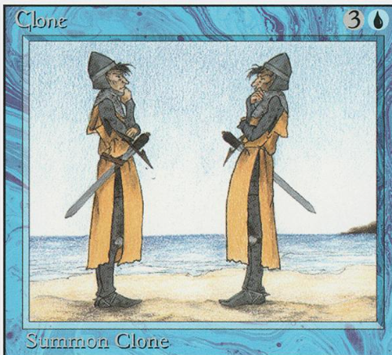

---
# Note this is SUPER weird, I try to make this work for ALL my thingies so there might be some behavioural clatches in the
# initial HEADER :) Lets try to keep it small :)
title: "💦 Symlinked Themes Compared (🏆)"
date: 2023-01-28T21:17:43+01:00
draft: false
tags:
- symlink
- hugo
- WOW
# Categories is feinitely used by STACK framework:
categories:
- symlink
- hugo
- category
- important
keywords:
- tech
- hugo
- symlink
- comparative
- theme
- themes
# ANANKE :)
featured_image: clone-mtg-vintage.png # /images/gohugo-default-sample-hero-image.jpg
image: clone-mtg-vintage.png
images:
- tranquilpeak-showcase.png
- clone-mtg-vintage.png
- zzo-screenshot.png
# tranquilpeak-only: https://github.com/kakawait/hugo-tranquilpeak-theme/blob/master/docs/user.md#image
thumbnailImage: https://www.etrurio.com/wp-content/uploads/2019/12/pistacchi-scaled.jpg
---




I tried many modules this weekend. Note that different themes have different words and key/vals in the above stanza so I better not confuse them.
For instance, this page has a `featured_image` which only works with Ananke, and a `image` which probably works with other themes.

What I've tried so far:

## Symlinking across all pages.

* so far only tried one - definitely golang won't notice the changed symlinked file.
* Notice that STACK is currently in a DIFFEERENT place. Let me move it for a second.

## My Hugo websites I've tried so far

All the code is in different directories of my GH repo: https://github.com/palladius/ricc.rocks/

| Theme + PermaCompare | Website     | Stars |  Description |
| ----------- | ----------- | ------ | ---- |
| [🙉](https://ricc.rocks/posts/papermod-analysis-page/) PaperMod | [ricc.rocks](https://ricc.rocks/) |⭐️⭐️⭐️⭐️   | Super sleek. Essential but damn, so good in its essence! |
| Bootstrap   | [hugo-bootstrap-ricc-rocks](https://hugo-bootstrap-ricc-rocks.netlify.app/) | ⭐️⭐️⭐️⭐️⭐️ | Just amazing |
| Stack       | [hugo-stack.ricc.rocks](https://hugo-stack.ricc.rocks) |⭐️⭐️⭐️⭐️⭐️ | played A LOT with it. Note its in a different repo |
| ----------- | ----------- | ------ | ----  |
| ZZO         | [ricc-zzo.netlify.app)](https://ricc-zzo.netlify.app/en/) | ⭐️⭐️⭐️⭐️ | Ha le icone come le voglio io, molto giocoso, ma essenziale. Mi piace un tot!  |
| TranquilPeak | https://tranquilpeak.netlify.app/ | ⭐️⭐️⭐️⭐️? | testing on 2nd wave.. |

(*) Permacompare: permalink in prod to the comparison page :)

* **PaperMod**: it works! https://ricc.rocks/ not explored much yet. Comparison page: https://ricc.rocks/posts/papermod-analysis-page/
* **Stack**: First, has [math](https://dev.stack.jimmycai.com/p/math-typesetting/). https://hugo-stack.ricc.rocks  then I just love it!
* **Bootstrap**: https://hugo-bootstrap-ricc-rocks.netlify.app/
* 🚧 [WIP] **Tranquilpeak**.  https://tranquilpeak.netlify.app/
* 🚧 [WIP] **ZZO**. https://ricc-zzo.netlify.app/en/

Lost the battle:

* **Coder**: Naah, too simple for me.
* Ananke. Too simple - https://hugo-ananke.netlify.app/

## Latest info

Here: https://github.com/palladius/ricc.rocks


## Photo Albums

* Only XXX seems to have decent photo albums. However, people are saying "i wish your theme was as good as Photoswipe" so I believe I might just get [**PhotoSwipe**](https://photoswipe.com/) to work with anything else: see [HugoPhotoSwipe](https://github.com/GjjvdBurg/HugoPhotoSwipe).
* maybe check https://github.com/liwenyip/hugo-easy-gallery but i dont think its worht it. (505 ⭐️).
* Or just code it (I wish it was Ruby and not Golang): https://hugocodex.org/add-ons/image-gallery/
* or use this [awesome library](https://github.com/mfg92/hugo-shortcode-gallery): demo in https://matze.rocks/images/#gallery-filter=Landscape


## ZZO


* install: https://zzo-docs.vercel.app/
* GH theme: https://github.com/zzossig/hugo-theme-zzo
* Ricc version: https://ricc-zzo.netlify.app/

Features:

```
Multiple Skins(dark, light, solarized, ...)
Mobile menu
Search
Search Engine Optimization(SEO)
Multilingual (i18n)
Responsive design
Customizable UI
RSS
Gallery
Fast code highlighting
Talks page
Showcase page
Publication Page
Resume Page
Presentation Page
```

## TranquilPeak


* GH: https://github.com/kakawait/hugo-tranquilpeak-theme
* 861 stars / 515 forks
* DemoSite:
* license: GPL
* install: https://github.com/kakawait/hugo-tranquilpeak-theme/blob/master/docs/user.md

How to sue the image btag (finally!): https://github.com/kakawait/hugo-tranquilpeak-theme/blob/master/docs/user.md#image


PLUS

* nice graphics
* built in galleries

MINUS

* says FS doesnt support symlinks for images. But it does support them for posts
* Fishy in content/posts/ organization. If I move content in or out dirs, it disappears. Weird. (Maybe there's a good reason for it, but seems like a bug wrt to other themes where you can move things accross EVERYTHING within content/ )


## PaperMod

I spent little time so far - but its just my fault, not his :)

Docs: https://github.com/adityatelange/hugo-PaperMod/

NEUTRAL:

* supports [many icons](https://adityatelange.github.io/hugo-PaperMod/posts/papermod/papermod-icons/#social-icons), but unsure how to use them
* [Supports Maths](https://adityatelange.github.io/hugo-PaperMod/posts/math-typesetting/), but unsure on how to make it work/
* emoji are nice, once enaled you can do 🙈 :see_no_evil: 🙉 :hear_no_evil: 🙊 :speak_no_evil:

BAD 😩:

* too simple. Doesnt have something about me as a blogger, its just a pure (sleek) container for news. Nothing about Riccardo, just my articles.

## Bootstrap

* Image docs: https://hbs.razonyang.com/v1/en/docs/image-processing/#resizing-images Plenty of good stuff here, also I found a bug and the guy fixed it in 24h - AMAZING.
* Gallery docs: https://hbs.razonyang.com/v1/en/docs/shortcodes/gallery/


# Old stuff


## Ananke ⭐️⭐️

Status: [](https://app.netlify.com/sites/hugo-ananke/deploys)
Old:
* [hugo-ananke.netlify.app](https://hugo-ananke.netlify.app)
* Historically the first ive tried. Havent explored much

GOOD 😍:

* TODO

BAD 😩:

* **too simple**. Eg, contact form is amongst posts (seriously?)
* no image gallery Im afraid
