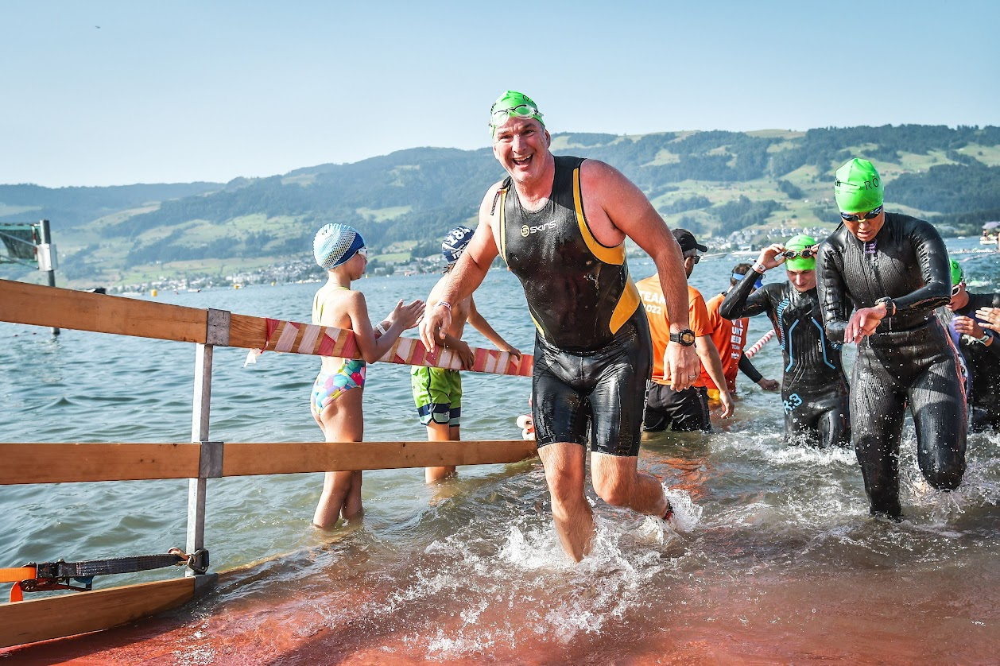

---
# Note this is SUPER weird, I try to make this work for ALL my thingies so there might be some behavioural clatches in the
# initial HEADER :) Lets try to keep it small :)
title: SYML 💦 Riccardo Sport history 2
date: 2023-01-30T21:17:43+01:00
draft: false
tags:
- personal
- sport
- symlink
# paperMod
#canonicalURL: https://medium.com/google-cloud/setting-cloudbuild-with-pulumi-in-python-330e8b54b2cf
# ANANKE :)
featured_image: /images/riccardo/riccardo-smiles-swim-ironman.jpeg
image: /images/riccardo/riccardo-bike-mallorca.jpg
#image: imagez/riccardo-smiles-swim-ironman.jpeg
#image: images/feature2/color-palette.png
Categories:
- symlink
- GDoc
images:
- /images/riccardo/riccardo-smiles-swim-ironman.jpeg
---
Since I was a kiddo, I thouroughly sucked at sport.

Then, one day, something changed.

## 2010: My first Marathon

I moved to Ireland, where you need to drink 14-15 pints a week to keep training and I started getting weight. It was 2008, I was still young and 32. But *Gino* was growing.

The gym wasn't, enough, I decided I would do the most incredible thing in my life: **I'd run a full Marathon**. I started with 10k and a half marathon, but then it was there: the Connemarathon, the hardest Marathon in the world (they told me - it wasn't - but enough to scare me and set to purpose).

## 2012: My first Olympic Triathlon

## 2015: My first (half) Ironman

## 2017: My first (full) Ironman

## 2019: My second (full) Ironman

## June 2022: A mediocre half-Ironman (Rapperswil, 🇨🇭)

Here I was tranquil like a peak; however, my performance was SO BAD that I was able to swim 2km in more than 30m (!).

Luckily, I got a green cap for free :)
