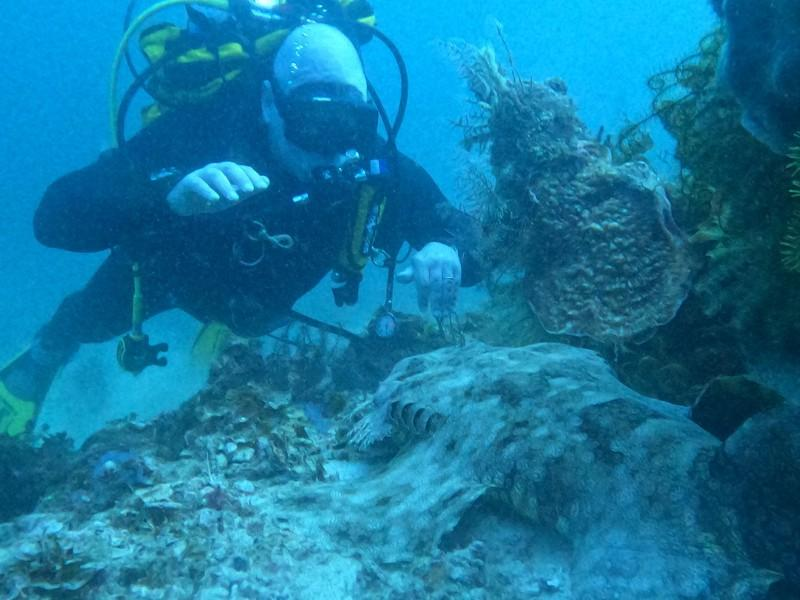
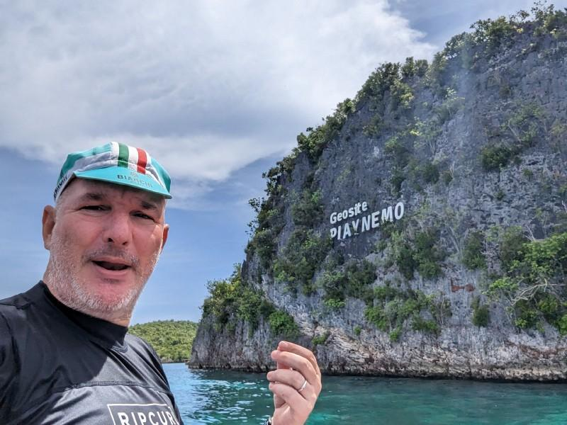
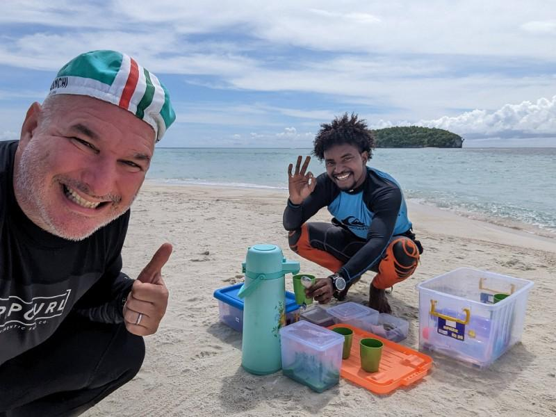

---
# ce ne sono 2 di queste maledette indonesie
title: "My Scuba 🤿 holiday in Indonesia 2022"
date: 2023-01-30T21:17:43+01:00
draft: false
tags:
- personal
- sport
- scuba
- rubyonrails
canonicalURL: https://medium.com/p/cf851f0f588/edit
hidden: false
# ANANKE :)
#featured_image: /images/hugo-cocktail.jpg
featured_image: "scuba--jo09uvup59g.jpg"
# /images/scuba--tnomzk5zfnr.jpg
#image: images/scuba--tnomzk5zfnr.jpg
image: "scuba--jo09uvup59g.jpg" # tartaruyga
#image: images/hugo-cocktail.jpg
#image: imagez/riccardo-smiles-swim-ironman.jpeg
#image: images/feature2/color-palette.png
Categories:
#- symlink
- holidays
#- rajaamapt
- rubyonrails
- code
images:
- scuba--rn7opz2oo.jpg
# - /scuba--rn7opz2oo.jpg
# - images/scuba--tnomzk5zfnr.jpg
# - /images/scuba--tnomzk5zfnr.jpg
# - hugo-cocktail.jpg
# - /images/riccardo/riccardo-smiles-swim-ironman.jpeg
# - "scuba--4kl75dqag8l.jpg"
# - "scuba--4rx3qr0wnkk.jpg"
# - "scuba--4s5obbog0je.jpg"
# - "scuba--7qqeh3owtge.jpg"
# - "scuba--92kef42brna.jpg"
# - "scuba--jo2nuuxek58.jpg"
# - "scuba--jo09uvup59g.jpg"
# - "scuba--ks67tanqqui.jpg"
# - "scuba--n82h94fc7s.jpg"
# - "scuba--tnomzk5zfnr.jpg"
---
Self: [https://medium.com/p/cf851f0f588/edit](https://medium.com/p/cf851f0f588/edit)
Status: draft
Version: **0.1**

Note: this is a [GDoc export].
---

<!--
{{with .Resources.GetMatch "scuba--rn7opz2oo.jpg"}}
  
{{end}}
-->

# My Scuba Diving experience in Raja Ampat..

.. and how I couldn't resist coding a Ruby on Rails scooby app

---

In October '22, my ❤️ wife allowed me to go scuba diving by myself in Raja Ampat, consider the paradise for divers.

A beautiful and rare animal who could be extinct in a few decades, and beside him a beautiful sea turtle in[ Sauwandarek](https://www.google.com/maps/place/Sauwandarek+Village/@-0.5858766,130.6122214,13.42z/data=!4m13!1m7!3m6!1s0x2d5c3eaaccb47097:0x7851bd844c4cdf44!2sIsole+Raja+Ampat!3b1!8m2!3d-1.0320468!4d130.5052176!3m4!1s0x0:0xf11684dad6130be3!8m2!3d-0.5903592!4d130.6023098) village

### The trip

This is Raja Ampat, west of Indonesia

### The bungalow

This is Wai island

## My typical day

I would wake up between 5 and 6. At 5, the light would strat spreading, and at 530 the electricity would be available

-  05:00

#### The app

I started scuba diving in the morning and

#### The diving

Riccardo saying hi to a Wobbegong!

#### Around Wai island

aaa

Congee and I in Piaynemo

Pyaynemo, the must go-to destination for your RA trip.

#### The learning

#### Conclusions

