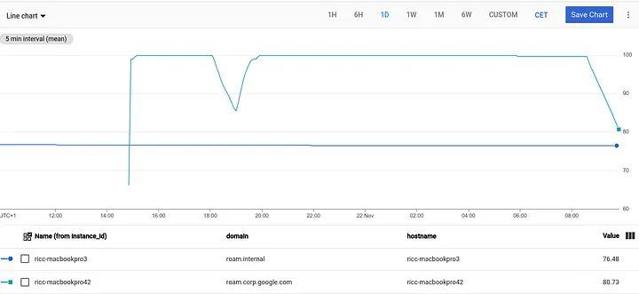
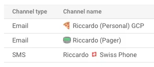

[See original article on Medium](https://medium.com/google-cloud/my-macs-battery-on-google-cloud-monitoring-with-sms-if-its-low-a1ccd70485fe)

<!-- this works:  -->


This article shows how you can easily inject a generic key/value into Google Cloud Monitoring and set up alerts on it. I use it to alert on disk space, and now also low battery!

This morning I was in London, and I forgot my charger at home. With plenty of time but 🪫 little battery, I thought: hey! I need to have a way to predict when my battery is low! And I need to do it in a totally overkill way!

<!--more-->

My battery was at 42%, which seemed a subtle indication my idea was worth blogging. Googling around, I found an article which gave me the tip on how to script my Mac’s battery (note this only works for a Macbook).

Ugly code here (hey! I’m in an airport with no charger, do you want Unit tests too?!?)

```:battery-life.rb
#!/usr/bin/env ruby

# Note1. buridone is currently not used. It's for a more efficient use to extrapolate all info from a single file read.
# Note2. This does NOT work on M1. I've just fixed this in the github repo sakura. Find the updated 0.2 code there.
def processMacCapacity(buridone)
  ret = {}
  ret[:debug] = 'Will fill numerator and denominator until I nail it.'
  ret[:capacity_pct] = 142 # clearlly wrong
  # `ioreg -l -w0 | grep AppleRawMaxCapacity`.split
  # => ["|", "|", "\"AppleRawMaxCapacity\"", "=", "4320"]
  ret[:AppleRawMaxCapacity] = `ioreg -l -w0 | grep AppleRawMaxCapacity`.split[4].to_i
  ret[:AppleRawCurrentCapacity] = `ioreg -l -w0 | grep AppleRawCurrentCapacity`.split[4].to_i
  #  => ["\"StateOfCharge\"=41"]
  ret[:StateOfCharge] = `ioreg -l -w0 | grep BatteryData`.split(',').select{|e| e.match /StateOfCharge/ }[0].split('=')[1].to_i
  ret[:AppleDesignCapacity] = `ioreg -l -w0 | grep BatteryData`.split(',').select{|e| e.match /DesignCapacity/ }[0].split('=')[1].to_i

  # derived values..
  # this should be your battery life i guess?x
  ret[:BatteryCapacityPercent] = ret[:AppleRawCurrentCapacity]*100.0/ret[:AppleRawMaxCapacity]
  ret[:battery_health] =  ret[:AppleRawMaxCapacity]*100.0/ret[:AppleDesignCapacity]

  return ret
end

def real_program
  capacity_hash = processMacCapacity(`ioreg -l -w0 | grep Capacity`)
  deb "capacity_hash: '''#{white capacity_hash}'''"
  if $DEBUG
    capacity_hash.each{|k,v|
      puts "[DEB] #{k}:\t#{v}"
  }
  end
  puts "1. 🔋 BatteryLife % 🔌🪫: #{capacity_hash[:BatteryCapacityPercent].round(2)}"
  puts "2. 🔋 BatteryHealth % 🛟: #{capacity_hash[:battery_health].round(2)}"
end

def main(filename)
  deb "I'm called by #{white filename}"
  init        # Enable this to have command line parsing capabilities!
  real_program
end

main(__FILE__)
```


I know, I call the same command 10 times and I could cache it. This is for the next iteration!

The best part of this is, not only I get my battery life, it also gives me my battery durability — so when I need to change battery. Woohoo!

There you go, let’s try it out, let me just remove the cable so you dont get a boring 100%.


*Battery level is 98%. Unfortunately 14% of my battery potential seems gone 😢*

Battery is 98%, yay! Unfortunately seems like ~14% of my battery is gone. Luckily I don’t pay for its repair :)

## Step 2: push this metric to the ☁ ️(GCP)

Now, I want a script which emits my metric from CLI. So I can say something like `push-to-gcp <METRIC_NAME> <METRIC_VALUE>`.

I’ve coded my disk space a month ago, let me abstract it into some more reusable code (always Ruby): [palladius/sakura :: bin/gcp-write-metric](https://github.com/palladius/sakura/blob/master/bin/gcp-write-metric) .

```:gcp-write-metric-excerpt.rb
#!/usr/bin/env ruby

# full script here: https://github.com/palladius/sakura/blob/master/bin/gcp-write-metric

require 'google/cloud/monitoring'
require 'socket' # for hostname
require 'openssl'
require 'colorize' # makes life worth living

# I want to know server side who called me
def gethostname
  Socket.gethostname
end

def magic_cloud_console_url(project_id)
  'https://console.cloud.google.com/monitoring/metrics-explorer?project=#{project_id}&pageState=%7B%22xyChart%22:%7B%22dataSets%22:%5B%7B%22timeSeriesFilter%22:%7B%22filter%22:%22metric.type%3D%5C%22custom.googleapis.com%2Friccardo-disc-free-pct%5C%22%20resource.type%3D%5C%22gce_instance%5C%22%22,%22minAlignmentPeriod%22:%2260s%22,%22aggregations%22:%5B%7B%22perSeriesAligner%22:%22ALIGN_MEAN%22,%22crossSeriesReducer%22:%22REDUCE_NONE%22,%22alignmentPeriod%22:%2260s%22,%22groupByFields%22:%5B%5D%7D,%7B%22crossSeriesReducer%22:%22REDUCE_NONE%22,%22alignmentPeriod%22:%2260s%22,%22groupByFields%22:%5B%5D%7D%5D%7D,%22targetAxis%22:%22Y1%22,%22plotType%22:%22LINE%22%7D%5D,%22options%22:%7B%22mode%22:%22COLOR%22%7D,%22constantLines%22:%5B%5D,%22timeshiftDuration%22:%220s%22,%22y1Axis%22:%7B%22label%22:%22y1Axis%22,%22scale%22:%22LINEAR%22%7D%7D,%22isAutoRefresh%22:true,%22timeSelection%22:%7B%22timeRange%22:%221h%22%7D%7D'
end

def write_generic_metric(project_id, metric_label, metric_value)
  metric_service_client = Google::Cloud::Monitoring.metric_service
  project_path = metric_service_client.project_path project: project_id

  full_hostname = gethostname()
  hostname = full_hostname.split('.')[0]
  host_domain = full_hostname.split('.')[1,10].join('.')

  series = Google::Cloud::Monitoring::V3::TimeSeries.new
  series.metric = Google::Api::Metric.new type:   "custom.googleapis.com/#{metric_label}",
                      labels: {
                        "my_key" => metric_label,
                        "hostname" =>  hostname,
                        "domain"   =>  host_domain,
                        #"app_verison" =>  $APP_VERSION, # found out you dont want to slice and dice metric when you change version... but you might want it.
                      }

  resource = Google::Api::MonitoredResource.new type: "gce_instance"
  resource.labels["project_id"] = project_id
  resource.labels["instance_id"] = hostname # "1234567890123456789"
  resource.labels["zone"] = "europe-west6-a" #  Zurich - "us-central1-f"
  series.resource = resource

  point = Google::Cloud::Monitoring::V3::Point.new
  point.value = Google::Cloud::Monitoring::V3::TypedValue.new double_value: metric_value # get_disk_space

  now = Time.now
  end_time = Google::Protobuf::Timestamp.new seconds: now.to_i, nanos: now.nsec
  point.interval = Google::Cloud::Monitoring::V3::TimeInterval.new end_time: end_time
  series.points << point

  metric_service_client.create_time_series name: project_path, time_series: [series]

  puts "📉 Successfully wrote time series '#{metric_label.colorize :yellow}'=#{metric_value.to_s.colorize :cyan} on #{project_id.colorize :red} for '#{hostname}'"
end


def main
  metric = ARGV[0]
  value = ARGV[1].to_f

  write_generic_metric(project_id, metric, value)
end

main()
```

Ok! Now let’s try it out.


*Caption:* Created the timeseries ‘prova’ (test in italian) with meaningful number 123! Wow!


Created the timeseries ‘prova’ (test in italian) with meaningful number 123! Wow!
Note you need to specify the project_id via ENV var (coming soon, the — `project` option, or better the project_id auto
inferral from `gcloud` config).

Let’s now glue the two scripts and upload the two Macbook info and see on the DevConsole:

```:gcp-write-mac-battery-values-on-project.sh
#!/bin/bash

# Latest script here: https://github.com/palladius/sakura/blob/master/bin/gcp-write-mac-battery-values-on-project

PROJECT_ID=${1:-CHANGEME}

echo "Pushing now metrics to project_id=$PROJECT_ID:"

macbook-battery | while read BL AH METRIC BLEH VALUE ; do
    PROJECT=$PROJECT_ID gcp-write-metric  "$METRIC" "$VALUE"
done
```

This script requires a project_id in ARGV, then it does the work for you, knowing the fields which are useful from macbook-battery are coming from values 3 and 5 (yes, a JSON encoding/parsing would be less error prone!). Let’s call it:


Caption: Meanwhile I went home, and launched this on my other M1 Mac. Always, boringly, attached to the current. Destined to an infinite life between 99 and 100%. Wait — this Mac, although charged, is on hold until 80%. Maybe cells optimization? I’m impressed.

Once everything works, you need to “productionize it”, which means setting up a Cron job (actually, [launchd](https://www.launchd.info/)).
I use `bash -lc` to leverage PATH and other goodies from my `.bashrc` but I hope you’re a better scripter and can make it work without that
 cumbersome import. Also make sure to add PATH correctly (I usually fail a few times before I get it right).

```:crontab
$ crontab -e
[…]
PATH=/sbin:/bin:/usr/sbin:/usr/bin:~/git/sakura/bin/
3/5 * * * * bash -lc '/Users/ricc/path-to/sakura/bin/gcp-write-mac-battery-values-on-project your-project-id'
[…]
```

## Step3: View metric and Create dashboard

Let’s now head to the Metrics Explorer here and check a fake GCE metric:

* Go to https://console.cloud.google.com/monitoring/metrics-explorer
* In “Select a metric” > Type “Battery” and see the options fall from many to two:


Caption: Here are my two metrics, CamelCased too!

# Select **BatteryLife**. This should take you to a nice dashboard (possibly empty if you just created this — be patient). Use the time control to go back in time or zoom until you get the desired view.
# Since this signal comes from (possibly) multiple Macs, select “group by” -> **hostname**. You could see something like this:



Caption: See battery for last day. My Mac (3) at home is always plugged in, the one at work (42) goes to meeting rooms from time to time. To be honest i unplugged it twice just to get a nice screenshot — cheater!

* Now click “Save Chart” and enjoy.

Bingo! You can have a dashboard where you see side by side both **BatteryLife** and **BatteryHealth**.


## Step4. Set alerting when battery is low

Now let’s get an alert when the battery is below 14% (42 divided by π).

* Open https://console.cloud.google.com/monitoring/alerting
* Click “+ Create Policy” (see [sample JSON output](https://gist.github.com/palladius/5c109015324fc6bffbfce2f58525760f))
* “Select Metric” as above (type BatteryLife)
* *[optional] You may add a filter on the computer you care about: hostname = “my-favorite-mac”*
* Adjust TransformData parameters if you wish.
* Click “Create Policy” -> Configure Alert trigger
* ConditionType: Threshold
* Position: Below threshold
* Threshold value: 14 (or value of your choice, like 20).
* click Create Policy
* Finally, configure your **Notification Channels** ([documentation](https://cloud.google.com/monitoring/support/notification-options)), where I’ve set up previously my email and swiss phone:



Caption: What life would be without emojis?

* [optional] You can add some Policy User Labels. I enjoy using labels at all time (eg env=prod, scope=personal, ..).
* [optional] You can fill in the Documentation like a Playbook. I always try to write something meaningful as part of SRE methodology (“no alert is good if it’s not actionable”). The action here is to attach your Mac to a power source.
* Finally review the values and click Review Alert:


## Conclusions

In this brief article, we’ve seen how you can script a meaningful metric from your machine, and inject it to Cloud Monitoring from command line.

It’s very easy to slice and dice these values (in this case aggregate by hostname), then dashboard and alert on them.


Caption: plug it to have battery or unplug it to see a nice graph?


The sky is just the limit now. You can do something silly like counting your Chrome Tabs and alert when they’re more than 42 with some silly messages like “A message from the Galaxy: restart Chrome!”

```>bash
brew install chrome-cli # only-once install
PROJECT_ID=my-project-123 gcp-write-metric mac-chrome-cli-ntabs $(chrome-cli list tabs | wc -l)
```

*Note: in the code I use “gce_instance” when I should be really using “global” metric ([docs](https://cloud.google.com/monitoring/api/resources)). I loved GCE Instance as it already has hostname and GCP zone baked in, but it’s incorrect (I tell GCP that’s a VM in the cloud, which is not). New code to support this is being developed in this amazing script: 🌸 [gcp-write-metric-done-well](https://github.com/palladius/sakura/blob/master/bin/gcp-write-metric-done-well)*
