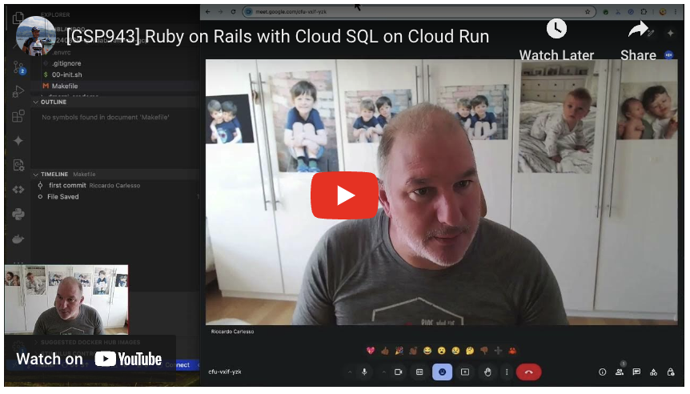

([Originalartikel auf Medium](https://medium.com/@palladiusbonton/ruby-on-rails-with-postgresql-on-cloud-run-bdaaf0b26e0b))

Kennen Sie Cloud Skills Boost (früher bekannt als Qwiklabs)?

In diesem Video führe ich Sie durch die Schritte, die in Ruby on Rails mit PostgreSQL auf Cloud Run auf der Cloudskillsboost-Website beschrieben sind. Dabei stoße ich auf ein paar Hindernisse und behebe sie.

Außerdem werde ich Ihnen meine spezielle und persönliche Toolchain als ehemaliger Bash/Perl-Entwickler vorstellen, die auf Sie vielleicht etwas eigenartig wirken mag.

Wenn Sie sofort loslegen möchten, finden Sie hier meinen endgültigen Code auf GitHub [Link zum Code](https://github.com/palladius/20240809-qwiklab-rails-on-gcp) und das RoR Codelab [Link zum Codelab](https://www.cloudskillsboost.google/focuses/20047).

Hier ist mein Rails-Video!

## **Über Skillsboost**

Skillsboost (früher bekannt als Qwiklabs) ist eine Möglichkeit, sich selbst mit Google Cloud vertraut zu machen, indem man "Labs" durchführt. Diese Labs sind zeitlich begrenzt, Google erstellt alle Ressourcen für Sie und löscht sie am Ende des Labs wieder.

Um die Labs zu absolvieren, gibt es ein Guthabensystem. Sie können $$ bezahlen, um Guthaben zu erhalten, oder Sie erhalten einige kostenlos, indem Sie einfach unser Innovator Champion Programm abonnieren (ja, völlig kostenlos!). Damit sollten Sie in der Lage sein, ~10 Labs kostenlos zu absolvieren, auch mit Gemini (ich habe sie ausprobiert, sie machen eine Menge Spaß!).

Unser Codelab finden Sie hier: https://www.cloudskillsboost.google/focuses/20047

## **Riccardos Ansatz für Skillsboost**

Es gibt eine Reihe von Möglichkeiten, ein Lab durchzuführen, aber ich sehe hauptsächlich zwei:

1. Sie führen Code in der Cloud aus. Dies ist die einfachste Variante, die jeder nutzt. Sie verwenden eine Kombination aus Cloud Shell und Cloud Editor (falls Vim nicht ausreicht).
2. Sie führen Code lokal aus. Dies ist etwas schwieriger einzurichten, aber dann können Sie Ihren gesamten nützlichen Code zur späteren Verwendung/zum Hacken lokal speichern. Ich habe einige Jahre damit verbracht, eine Toolchain dafür zu schreiben, die Codelabba, proceed_if_error_matches und andere Tools verwendet. Wie Sie sich vorstellen können, glaube ich, dass ich der einzige Erdbewohner bin, der seine Codelab-Skripte irgendwo lokal speichert. Bin ich in guter Gesellschaft? Bitte melden Sie sich bei mir und erzählen Sie mir, wie Sie es anders machen!

Wie Sie in meinem Video sehen können, wende ich beide Methoden an, um Ihnen sowohl die Vor- als auch die Nachteile aufzuzeigen.

## **Was ist ein Friction Log?**

Ein Friction Log ist ein Google Doc, in dem Sie Ihre Erfahrungen, Ihre Emotionen und sogar Ihren Ärger (mithilfe von Farbcodes) gegenüber dem Entwickler eines Codes/einer Ressource beschreiben. Die Idee dahinter ist, dass Sie Ihr Dokument dann mit dem Implementierer teilen und Code- und Dokumentationsfehler darin verfolgen. Meine verrückte Idee ist es, daraus ein Video zu machen!

## **Meine "codelabba" Toolchain**

Es ist an der Zeit, meine persönliche Toolchain zu erklären. Normalerweise habe ich eine Reihe von Git-Repos unter `~/git/`, von denen eines Open Source ist. Natürlich spreche ich von palladius/sakura.

* `00-init.sh`: Das Initialisierungsskript, das allen meinen Codelabba-Projekten gemeinsam ist und sich auf ENV-Variablen wie PROJECT_ID, REGION usw. bezieht.

* `.envrc`: Dieses Skript wird von `direnv` unterstützt, einem Tool, das mir von Rob Edwards vorgeschlagen wurde, und enthält alle meine ENV-Variablen. Sie können es sich als den Hydratisierungsteil von 00-init und allem anderen vorstellen, dank Ruby/Python-Bibliotheken zur Verwaltung von .env*-Dateien. Ich habe mich auch bemüht, diese Datei mit Pulumi sofort einsatzbereit zu machen (indem ich die Standard-ENV-Namen von Pulumi übernommen habe) und sie so kompatibel wie möglich mit Google Cloud Codelabs zu gestalten.

* `proceed_if_error_matches`: Dies ist das einfachste und intelligenteste Skript, das ich je geschrieben habe. Es verwandelt sequenzielle Bash-Skripte mit `set -euo pipefail` in Bash-Terraform-ähnliche Skripte. Stellen Sie sich vor, Sie müssen: (1) einen Bucket erstellen (2) eine ACL darauf setzen (3) Dateien in den Bucket hochladen. Es ist naheliegend, dass Sie drei sequenzielle Skripte haben, die von Zeit zu Zeit fehlschlagen können, und es dauert seine Zeit, bis Sie jede Zeile korrigiert haben. Wenn Sie fertig sind, möchten Sie mit der nächsten Zeile fortfahren, aber stellen Sie sich vor, was passiert: Sie können nicht an (2) arbeiten, weil (1) mit einer lästigen Meldung wie "Bucket existiert bereits" fehlschlägt. Also dachte ich mir: Was wäre, wenn ich NUR bestimmte Fehlermeldungen filtern könnte, die ich als Strings erfasse? Das ist der Grund für diese Datei.

* `codelabba.rb` (proprietär) Dies ist ein Ruby-Skript, das ich noch nie öffentlich gemacht habe. Aber fragen Sie mich in den Kommentaren, und vielleicht nehme ich mir etwas Zeit, es zu bereinigen und als Open Source zu veröffentlichen. Es erstellt im Grunde ein Skelett für meine Codelabs, und ich habe es beim zweiten oder dritten Mal erfunden, als ich ein Qwiklab-Codelab gemacht habe, genau aus den Gründen, die ich oben geschrieben habe.

* `XX-blah-blah.sh` ([Beispiel](https://github.com/palladius/20240809-qwiklab-rails-on-gcp)) Dies sind Skripte, die in der Reihenfolge 01, 02, 03, ... ausgeführt werden sollen, so dass sie eine Geschichte erzählen. Stellen Sie sich das Ganze als ein "Bash Python Notebook" vor. Ich weiß, das ist der tiefgründigste Satz, den Sie heute lesen werden :)

Code: https://github.com/palladius/20240809-qwiklab-rails-on-gcp

## Fazit

Das ist ein großes Experiment für mich! War es eine gute Idee? Eine schreckliche Idee? Lassen Sie es mich in den Kommentaren wissen!

*(Generated by Geminocks: https://github.com/palladius/ricc.rocks/tree/main/gemini prompt_version=1.4)*