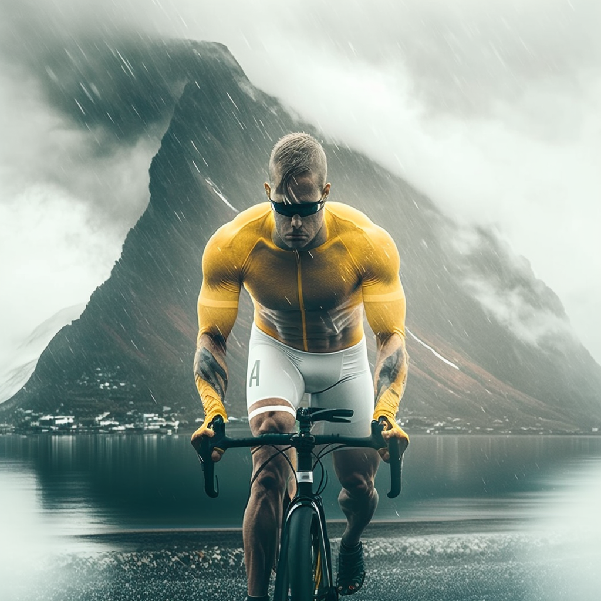
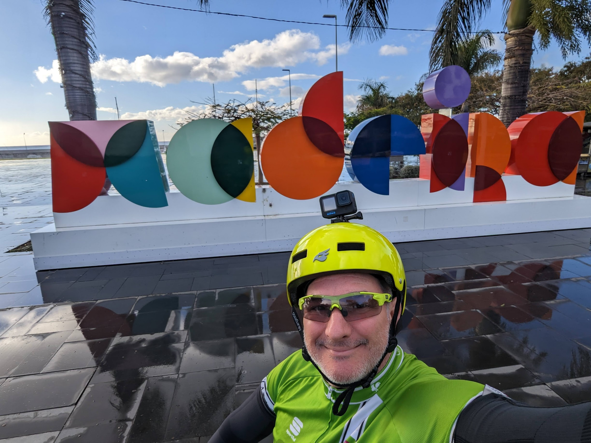


In diesem Artikel erfahren Sie alles über Radfahren auf Madeira, meinen verrückten Freund Riccardo und wie ich meine erste Brille seit 30 Jahren bekommen habe.


<!-- this works too!

-->


(Bild erstellt mit [Midjourney](https://cdn.discordapp.com/attachments/1008571102328541215/1075832031499534436/Riccardo_A_beautiful_muscly_yellow_man_cycling_in_a_mountainous_6a0f25ff-c910-4842-80d0-16f6a74f6026.png) )

<!-- ## Why Madeira in February? -->

Ich habe eine Heilige Frau (Kate) geheiratet, die es mir von Zeit zu Zeit erlaubt, eine Woche lang alleine zu reisen, während ihre Familie nach Zürich kommt und bei den Kindern hilft. Dieses Jahr geschah es im Februar: zu früh, um auf Mallorca Rad zu fahren, also fragte ich meinen Freund Mike nach einem schönen Ort, an den ich fahren könnte, und er schlug Madeira vor.

An Weihnachten beschloss mein Freund Riccardo ('Ridge'), sich mir anzuschließen.

Mallorca ist immer noch Nebensaison und ein bisschen zu kalt, daher schien Madeira die perfekte Wahl - bis auf die Anstiege. Meine Güte, die Anstiege!

Aus midjourney:

<tt>/imagine Brazillian muscly software engineer types on his Mac laptop in a foresty island watching the sunset by the port. realistic, cinematic</tt>

## Sa 11: nur ein Blick umher

Ich lande gegen 11 Uhr und werde sofort von einem Pastel de Nata in der lokalen Bar (genial zwischen dem Flugzeug und der Gepäckausgabe gelegen) begrüßt, und ich sehe Werbung für "Blandey's Weinverkostung". Es wird meine nächste Aufgabe sein, Ridge in die Weinverkostung einzubeziehen und ein paar Flaschen Madeiras "Porto" mit nach Hause zu bringen (es ist kein Porto! Nur um es dir leicht zu machen, es ist Likörwein mit Säure und oxidiert, so dass er das Öffnen über Jahre hinweg übersteht, anders als Porto, das innerhalb weniger Wochen nach dem Öffnen konsumiert werden muss).

Sobald ich im Hotel bin, hole ich mein Fahrrad bei [Happy Bikes](https://www.happybikes.pt/) ab (praktischerweise 200 m vom Hotel entfernt). Der superfreundliche Besitzer hilft mir, Ridges Fahrrad zu meinem Hotel zu bringen, während ich meines mitbringe.
Ich bekomme ein Enduro-Bike (75 Euro), da Ridge sparen möchte und Happy Bikes nur ein billiges MTB (45 Euro) hat.
Der gyroskopische Sattel ist etwas Neues für mich, und ich verliebe mich total in ihn!

Als nächstes besuche ich [Blandy's](https://www.google.com/maps/place/Blandy's+Wine+Lodge+(former+Adegas+de+S%C3%A3o+Francisco)/@32.6449894,-16.9240557,15z/data=!4m6!3m5!1s0xc6060086c82670f:0xc55073cc6045c67!8m2!3d32.6478698!4d-16.9106236!16s%2Fg%2F1q5bprx89), um einen passenden Termin für Ridge und mich für Montag oder Dienstag zu finden.

Schließlich gehe ich im **[Terra](https://www.google.com/maps/place/TERRA+-+Food+Concept/@32.6489523,-16.9112022,17z/data=!3m1!4b1!4m6!3m5!1s0xc606167302d50ed:0xb4be6622c761d352!8m2!3d32.6489523!4d-16.9090135!16s%2Fg%2F11rvdjk0jg)** essen, dem einzigen superteuren Restaurant auf Madeira, aber auch so verdammt gut :) Schau dir die Bilder auf meinem [Instagram-Post](https://www.instagram.com/p/Coje6JRsBGh/) an.

Dann schlafe ich ein bisschen betrunken von dem fantastischen Wein, den ich gerade getrunken habe, und treffe Ridge gegen 21:30 Uhr auf einen kleinen Drink, bevor wir schlafen gehen. Großer Tag morgen!

## So 12: Schlammiges Mountainbiken

<!-- Strava activity: https://www.strava.com/activities/8550514540 (52,28km in 4h47m) -->

Wir fahren mit Helvio und Helder von [madeiraaltitude](https://madeiraaltitude.com/) (sie haben einen tollen Job gemacht, daher möchte ich ihnen gerne etwas kostenlose Werbung machen, wenn es dir nichts ausmacht). Das Wetter ist total beschissen.

Wir fahren superhoch zu einem Restaurant ITMON, *Abrigo do Poiso*. Dort trinken wir Kaffee, *undrink*, und ziehen uns um. Schließlich fahren wir auf den Gipfel der Insel, *Vereda do Areeiro*. Es regnet wie verrückt, es ist windig, das Wetter könnte nicht miserabler sein. Helvio bringt mir (dem Neuling) bei, wie man mit einem MTB abfährt, wie man den gyroskopischen Sattel benutzt und im Grunde mit Schlamm und verrückten Abfahrten überlebt. Das ist NICHT das, wofür ich mich angemeldet habe, das ist das, was du bekommst, wenn du deinen sadistischen Freund bittest, sich am ersten Tag um das Radfahren zu kümmern.

Das Wetter bleibt 3-4 Stunden lang miserabel, bis wir gegen 14 Uhr einen wunderschönen Blick auf den [Miradour da Portela](https://www.google.com/maps/place/Miradouro+da+Portela/@32.7359716,-16.8670002,13.46z/data=!4m6!3m5!1s0xc6066a5847f65b7:0xc8615cd8407ff70a!8m2!3d32.7471903!4d-16.8259209!16s%2Fg%2F11c74xx22v) erreichen. Die Aussicht ist fantastisch, und wir sehen die erste Sonne. In der Nähe gibt es ein fantastisches Restaurant (Restaurant Portela a Vista), in dem wir alle mehr Fleisch und Pommes essen, als unser Magen verarbeiten kann, für nur 66 Euro. FANTASTISCH. Das ist der erste Moment, in dem ich anfange, das Leben zu genießen. Wir sind so dreckig, dass uns alle Kunden ansehen, als hätten wir einen Aussätzigen oder eine Pest mitgebracht. Ich bin begeistert davon.

Dann machen wir eine letzte (betrunkene) Abfahrt nach Praya do Machico, zurück zum Meer. Helvios Sohn wartet auf uns, um uns nach Hause zu fahren. Ridge und ich sind TOT. Glücklich tot. Was wir heute gemacht haben, ist absolut unglaublich.

Dann stelle ich fest, dass ich nur ein Paar Schuhe habe, die jetzt komplett mit Schlamm durchnässt sind, und so ist es auch mit meiner anderen Ausrüstung. Ich dusche im Hotel mit meinen Schuhen und wasche sie mit bloßen Händen (keine Seife, nur eine lange Massage auf der gesamten Oberfläche), dann verbringe ich 60 Minuten damit, Dawson Creek auf dem iPad zu schauen (urteilt nicht über mich!), während mein Föhn meine Schuhe trocknet.

Dann trinken wir noch ein paar Drinks und essen etwas mit Ridge, bevor wir im Bett sterben.

## Mo 13: Richtung Westen! Cabo Girão

Ich konnte ein paar GPX-Dateien auf meinem schrecklichen Garmin 830 (ich meine, mein 520 ist alt, aber funktioniert perfekt - mein schickes 820 wartet seit 2020 darauf, 13 Apps zu synchronisieren, und ist immer noch da, verstopft) bekommen, das mir der gute alte **Rui** von Happy Bikes gegeben hat.

Wir beschließen, nach Westen in Richtung **Riberira Grande** zu fahren, bis der Akku des E-Bikes bei 50 % ist, und dann zurückzuradeln. Glücklicherweise ist der Akku bei 50 % in der Nähe einer wunderschönen Klippe, der höchsten Klippe Europas, höre ich (und Google bestätigt): *Das Kap Girão westlich von Funchal ist bekannt als die höchste Steilküste Europas und die zweithöchste der Welt!*

Wir halten für ein paar Fotos an, wir können nicht glauben, dass es kostenlos ist. Der einzige negative Punkt ist, dass ein schrecklicher Sänger draußen um Geld bettelt - er singt schlimmer als eine *Banshee*. Wir wissen jetzt, wofür das Geld ist.

Zurück zu Hause essen wir ein super schnelles/billiges Mittagessen im Zentrum, dann fahren wir zu Blandy's, um eine ernsthafte Weinverkostung zu machen und die Geschichte der Weinherstellung auf Madeira zu entdecken. Ein paar bemerkenswerte Fakten:

* Madeira-Likörwein hält im Gegensatz zu Porto nach dem Öffnen jahrelang, eher wie ein Gin. Das liegt daran, dass er bereits oxidiert ist und sehr gut mit Sauerstoff lebt (genau wie meine Lunge).
* Eine der 7 Rebsorten des Madeira-Weins ist Verdelho. Die Reiseleiterin sagt mir, dass dies eine andere Rebsorte ist als der spanische Verdejo oder der italienische Verdicchio. Ich glaube ihr nicht, also google ich es: Sie hat Recht 🤓.

Schließlich ein kleines Nickerchen, und dann stürmen wir die Stadt für die Partyzeit!

## Di 14: Ridge führt

Heute mache ich den Fehler, Ridge die Route entscheiden zu lassen. Es beginnt mit einem völlig unzumutbaren 15 % Anstieg, gerade als ich mein Frühstück verdaue, was mich dazu bringt, Riccardo bis zur 15. Generation hinauf zu verfluchen (ja, das Fluchen über Generationen ist proportional zum Gefälle, wir sind schließlich Italiener!).

Um ganz fair zu sein, nach diesem anfänglichen Aufruhr werden die Dinge viel besser und wir sehen atemberaubende Ausblicke und nur wenige Autos. Gut gemacht, Ridge!

In der Zwischenzeit schreibe ich meiner Frau eine SMS, um die romantische Überraschung, die ich für Kate versteckt habe, auszupacken und auf ihr Kissen zu legen. Verdammt, romantische und gleichzeitig prahlerische Italiener! 🤪

Um Riccardo für die tolle Fahrt zu danken, bringe ich ihn zum Terra für ein kleines und romantisches Mittagessen. Wir treffen zwei sehr interessante Paare:

* zwei nette Deutsche, die in Luxemburg gelebt haben und jetzt versuchen wollen, auf Madeira zu leben (WFH). Jan kennt die italienische Kultur ziemlich gut, da seine Mutter in Padoa lebt.
* eine nette russisch-kasachische Familie mit einer wundervollen 1-jährigen Tochter, die ebenfalls hier lebt und Pelmeni verkauft (nur Spaß, sie haben nur einen Freund, der Pelmeni nach Hause liefert).

Am Nachmittag machen wir ein kleines Nickerchen, und heute Abend ROCKEN wir! Es ist unsere letzte Nacht zusammen, also wollen wir sie sinnvoll gestalten. Wir treffen uns in *zona velha* auf einen Aperitif, dann gehen wir in ein gemütliches Restaurant, um etwas Fisch zu essen.

## Mi 15: einsam, regnerisch, Ostseite

Ich bin als einsamer Mann aufgewacht

Ridge ist heute Morgen früh abgereist und hat mich mit einem voll geladenen E-Bike allein zurückgelassen.

Heute fahre ich die 70 km lange Strecke nach Osten zum Flughafen; es soll nach 13:00 Uhr regnen, also habe ich 3+ Stunden trockene Fahrt.

Die Aussicht ist absolut majestätisch, aber nach 30 Minuten fängt es an zu regnen und es macht weniger Spaß.

Also komme ich an dieser fantastischen Klippe an, und nach meiner dritten Dusche beschließe ich, zurück ins Hotel zu fahren und den Tag zu beenden. Ich bin nicht so begeistert von Regen, besonders in einem Gelände, das ich nicht kenne, auf einem Fahrrad, das ich nicht kenne, zu viel zu testen für ein nasses Gelände mit 15 % Abfahrten.



Ich nehme mir den Nachmittag frei, bringe meine 3 Flaschen Madeira-Likörwein zurück in den Laden, damit sie sie zum Flughafen bringen und ich den Wein nach der Sicherheitskontrolle abholen kann (ein großer *Bazza*!).
Dann bringe ich mein E-Bike zurück zu [Happy Bikes](https://www.happybikes.pt/). Ich muss sagen, sie haben wirklich einen tollen Job gemacht!

## Do 16: Funchal sonniger Chillen

Heute scheint es gegen 13:00 Uhr zu regnen, und ich möchte keine 2-stündige Radtour mehr eilig machen. Ich beschließe dann, einfach durch die Stadt zu schlendern und schöne sonnige Fotos zu machen, um sie meiner Familie zu zeigen.

Das ist meine einzige Möglichkeit, sie nach Funchal zu bringen: einfach einen sonnigen Tag sehen :)

## Fr 17: Entspannt angehen

<!-- midjourney

/imagine Brazillian muscly software engineer types on his Mac laptop in a foresty island watching the sunset by the port. realistic, cinematic

-->

## Sa 18: Karneval beginnt, ich fahre nach Hause

Leider fängt die Stadt heute an, richtig zu feiern, und es ist Zeit für mich, nach Hause zu fahren.

Ich wache auf, frühstücke, nehme ein Taxi zum Flughafen und fliege zurück.

Ich konnte meine 3 Flaschen Malvasia Landy's am Flughafen bekommen und 14 Euro sparen, außerdem habe ich 6 *Pasteis de nata* für die Familie gekauft.

*(Generated by Geminocks: https://github.com/palladius/ricc.rocks/tree/main/gemini prompt_version=1.4)*