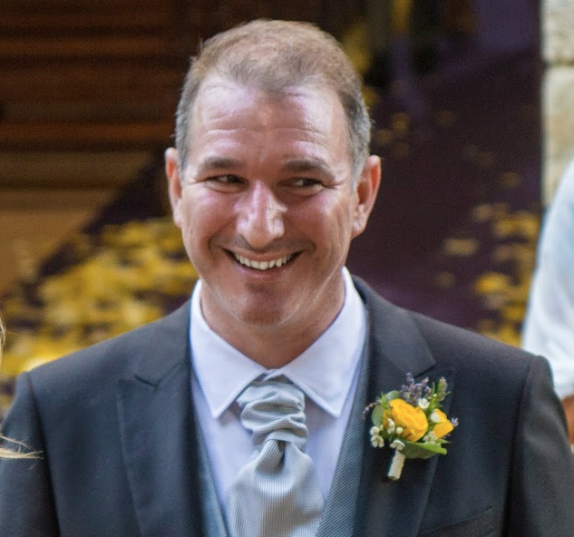

---
# Generated by Geminock v1.6 . cache_key='866434cc7b4b5018f27e2a5f636a581bc4bef8fd07067eb7ffb93cf74b0e9853-fr.yaml'
geminock_ver: '1.6'

#🚧 Testing moving ABOUT from singleton to translated.
title: "🇫🇷 [Geminocks] À propos de moi" # It / EN
description: "This is the Hugo/ZZO version of Riccardo Rocks ring: https://ricc.rocks/"
type: "about"
date: "2023-02-01"
#This is the ZZO version of Riccardo Rocks ring: https://ricc.rocks/
image: /gallery/riccardo-sport/zurich-descent-wineyard-lake.jpeg
meta_image: image.png
tags:
- personal
- site
- italy
- ricc
- me
- geminocks
- French
# 
# 🚧 under construction 🚧
# 
---

*TODO(Ricc): This is currently under `posts/`. You ned to add the logic to copy this under ZZO/{LANG}/about/ . Maybe you could add a carlessian-geminocks-target-folder but it might add too much to complexity.*

Salut! Je suis Riccardo, et on me surnomme <tt>Palladius</tt> ou simplement Ricc.

## Travail

Je suis Developer Advocate pour [Google Cloud](http://cloud.google.com/). Ce blog contient des sujets personnels et professionnels : du sport aux voyages, en passant par la famille et la technologie.

Je suis chez Google depuis 11 ans, et je n'ai jamais trouvé le moyen de raconter ce voyage extraordinaire. Il doit comporter un contenu riche, un drame italien et des photos sympas. Ce dernier point me prend du temps à écrire. Certains de mes

* Linkedin: <https://www.linkedin.com/in/riccardocarlesso/>
* Page officielle Google: <https://cloud.google.com/developers/advocates/riccardo-carlesso>

Je parle de SRE, d'opérations, de la culture chez Google, de GenAI et de Ruby.

## Personnel

Je suis italien, sauf que je suis surtout à l'heure. J'ai vécu en Italie pendant 32 ans, puis j'ai déménagé en Irlande (2008), et en 2011, j'ai déménagé en Suisse où je vis actuellement avec ma femme Kate, gentille et attentionnée, et mes deux enfants extraordinaires : *AJ* et *Sebowski*. Vous pouvez nous trouver sur [Instagram](https://www.instagram.com/palladius/), ou dans la [galerie familiale](/fr/gallery/riccardo-family/).

Bien sûr, je vis en Suisse.



## Loisirs

Pour citer Graham, *j'avais l'habitude d'avoir des loisirs, maintenant j'ai des enfants*. Mes loisirs tournaient autour du sport, de la musique, des voyages, de la technologie et comprenaient :

* Jouer du **piano** (surtout des morceaux de Genesis de l'époque Peter Gabriel, ou Dream Theater)
* Faire des **triathlons** (j'ai terminé deux **Ironman** complets, tous deux à Zurich, et 5-6 demi-distances autour de l'EMEA).
* Jouer à **Magic the Gathering** (sur Arena ou avec mes enfants, avec des effets désastreux - mais au moins Ale apprend à compter jusqu'à 20 !)
* **Cuisiner** avec mon Thermomix (on dit que c'est de la triche). Et bloguer sur la cuisine américaine à l'italienne.
* **Voyager**. Je tiens un tableur des pays visités pour moi et mon ami Andrea. Actuellement, nous en sommes à environ 61. Andrea me déteste depuis que j'ai fait une croisière dans les Caraïbes et que j'en ai gagné +5 en une semaine.
* **L'informatique**. J'adore Ruby on Rails, Linux, les scripts bash et le fait de mélanger la famille et le codage. Vous ne me croyez pas ?
  * Voyez [aj-alphabet-dev.palladi.us](http://aj-alphabet-dev.palladi.us/alfabeto?alphabet=it&cells_per_row=6&locale=en&predilige=portrait) pour savoir comment apprendre l'alphabet à vos enfants avec des images connues.
  * Voyez 🚧 [PuffinTours](https://puffintours-prod-rjjr63dzrq-ew.a.run.app/) 🚧 où je stocke nos voyages (en cours) et la possibilité pour ma femme de voter pour moi. (Elle m'appelle puffin).

## Ce site


Ce site est construit avec Hugo (bien sûr je préférerais Jekyll, mais j'ai suivi l'exemple de mes collègues) avec [ZZO](https://github.com/zzossig/hugo-theme-zzo) ([docs](https://zzo-docs.vercel.app/zzo)). Si vous vous demandez pourquoi j'ai choisi ce thème, c'est après avoir passé quelques week-ends à essayer 5 thèmes différents. Les leçons tirées de cette expérience sont ici :


Leçons tirées :

* <https://github.com/palladius/ricc.rocks>. Le fichier Readme contient des liens vers tous les sites alternatifs, comme Ananke,
  Boostrap, Stack, Papermod, et Coder. Stack était le préféré de ma femme, Bootstrap était mon préféré, jusqu'à ce que je découvre qu'il avait un problème de smishing dont je ne me souviens plus. J'ai donc opté pour ZZO, qui me rappelle le **zzo vuoi?** italien, ce qui est amusant.

Sites alternatifs :

* Ananke: <https://hugo-ananke-vecchiume.netlify.app/>
* Bootstrap: <https://hugo-bootstrap-ricc-rocks.netlify.app/>
* Comparaison des liens symboliques: <https://hugo-bootstrap-ricc-rocks.netlify.app/posts/posts/2023-01-29-symlinked-themes-compared.d/>

*(Generated by Geminocks: https://github.com/palladius/ricc.rocks/tree/main/gemini prompt_version=1.4)*