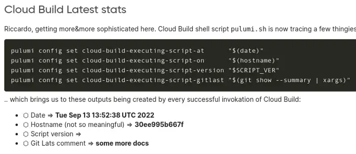

---
# Generated by Geminock v1.6 . cache_key='4dad3ca9941a91c01b8f0aaf37214cfaa1e22b53c47d93a9f1bec2a1e20dfd89-it.yaml'
geminock_ver: '1.6'

# Note this is SUPER weird, I try to make this work for ALL my thingies so there might be some behavioural clatches in the
# initial HEADER :) Lets try to keep it small :)
title: "🇮🇹 ♊ [Geminocks] Impostare un trigger ⬣ Cloud Build con 🧹Pulumi in 🐍 Python"
date: 2022-09-22T21:17:43+01:00
draft: false
tags: [symlink, GCP, pulumi, CloudBuild, Medium, geminocks, Italian]
# paperMod
canonicalURL: https://medium.com/google-cloud/setting-cloudbuild-with-pulumi-in-python-330e8b54b2cf
# ANANKE :)
featured_image: /images/gohugo-default-sample-hero-image.jpg
image: /images/mtg-clone.jpg
---

Articolo originale qui:  https://medium.com/google-cloud/setting-cloudbuild-with-pulumi-in-python-330e8b54b2cf

TODO(7feb23): aggiungere questo video come embed: https://www.youtube.com/watch?v=5jhWVNN8P_M (creato il 6feb23)

Un paio di settimane fa, mi sono innamorato di **Pulumi**. Ha tutto ciò che volevo da Terraform: facile da configurare, gestione della configurazione semplice, una bella interfaccia utente gratuita e, soprattutto... supporto linguistico! Pulumi è la migliore invenzione dopo la pizza Buffalo e ha solo un problema... [nessun supporto per Ruby](https://github.com/pulumi/pulumi/issues/132) :/

Ad ogni modo, sono così innamorato di ⬣ GCP (che ammetto che mi paga lo stipendio), Cloud Build, Cloud Deploy e in generale delle pipeline CI/CD su Google Cloud che volevo provarlo. Cercando su Google "Cloud Build Pulumi" ho trovato questo bell'articolo per JavaScript, che non è nelle mie corde.

## Il codice

Il mio codice è qui: https://github.com/palladius/pulumi/tree/main/examples/python-gcp-cloudbuild-auto-trigger

Nota: 👍 Il codice finalmente viene compilato correttamente. Evviva!

## Cosa c'è di così speciale nel codice?

Il codice consente a qualsiasi progetto Pulumi che potresti avere su GCP (in Python 🐍) di impostare un trigger per l'autoaggiornamento. Un push al repository git attiverà un processo di compilazione che, in caso di successo, effettuerà l'accesso come te a Pulumi ed emetterà un aggiornamento con il nuovo codice.

Quindi, se, ad esempio, esegui il commit di una modifica che aggiunge un bucket GCS al codice, in un paio di minuti quel bucket GCS verrà creato e il file README.md verrà aggiornato con i parametri del builder:

In grassetto puoi vedere 3 parametri aggiornati dallo stesso Cloud Build!

Il mio codice supporta **Github** (così com'è) e **Bitbucket** (codice al 99% lì come funzionava prima!) per il momento.

Ho anche personalizzato il messaggio secondo l'articolo di Laura, anteponendo un "[built with Cloud Build]" al messaggio git ("slash N fix", in questo caso):

## Cosa significa Pulumi?

Ho provato Google Translate, sembra che possa significare scopa (🧹) in hawaiano o birmano (🇲🇲, ora Myanmar). Fino ad allora, userò la prima emoji, finché qualcuno non mi dimostrerà che ho torto.

Modifica: il mio amico Aaron di Pulumi conferma la scopa e indica [questo articolo](http://joeduffyblog.com/2018/06/18/hello-pulumi/).

##  Prossimi passi
La mia 📝 per il futuro include:

* Avere un'impostazione corretta della password/stato su GCP tramite HSM o GCS.
* Trasformare in un modulo in modo che qualsiasi progetto pulumi tu possa avere, puoi semplicemente richiamare questo codice con 4-5 variabili (utente github, repository github, directory di compilazione pulumi, credenziali, ..). Devo ancora vedere se questo è fattibile anche tra lingue diverse (non 🐍).

## Riferimenti

Codice originale (Cloud Build + Node.js): https://www.pulumi.com/docs/guides/continuous-delivery/google-cloud-build/

Il mio codice (python): https://github.com/palladius/pulumi/tree/main/examples/python-gcp-cloudbuild-auto-trigger

*(Generated by Geminocks: https://github.com/palladius/ricc.rocks/tree/main/gemini prompt_version=1.4)*