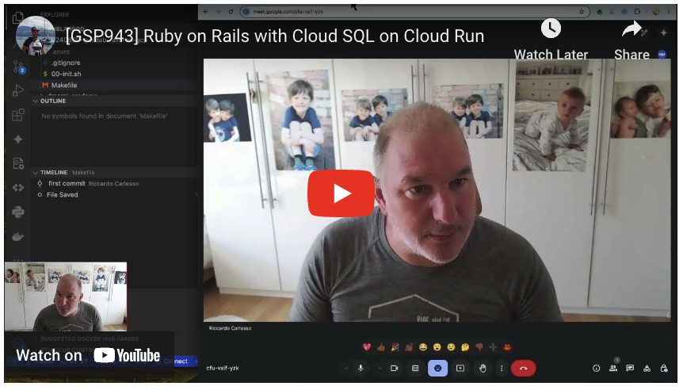

---
# Generated by Geminock v1.5 . cache_key='3dc88c2143973ec8dad3a58b0ed4b82c2c2d1448a85358201ac5163e1f7927fe-it.yaml' 
title: "🇮🇹♊ [Geminocks] Migliora il tuo gioco Rails con Cloud Run: un'immersione profonda in Qwiklabs"
date: 2024-08-15  # Today's date
layout: single  # Assuming single.html for blog posts in ZZO theme
# Optional fields (change as needed)
author: Riccardo Carlesso
read_time: 3  # Minutes
# categories: Add categories if applicable (e.g., ruby, rails, gcp)
# tags: Add tags if applicable (e.g., qwiklabs, cloudrun)
Tags: [qwiklabs, cloudrun, rubyonrails, devops, gcp, googlecloud, toolchain, skillsboost, cloudskillsboost, geminocks, Italian ]
canonicalURL: https://medium.com/@palladiusbonton/ruby-on-rails-with-postgresql-on-cloud-run-bdaaf0b26e0b
# 
---

([Articolo originale su Medium](https://medium.com/@palladiusbonton/ruby-on-rails-with-postgresql-on-cloud-run-bdaaf0b26e0b))

Conosci [Cloud Skills Boost](https://www.cloudskillsboost.google/) (precedentemente noto come Qwiklabs)?

In **[questo video](https://www.youtube.com/watch?v=vpPftSHE9kM)**, ti mostro come eseguire i passaggi descritti in Ruby on Rails con PostgreSQL su Cloud Run sul sito web di cloudskillsboost, incontrando alcuni ostacoli lungo il percorso e risolvendoli.

Inoltre, mostrerò la mia particolare e personale ToolChain, da ex sviluppatore bash/perl, quindi potrebbe sembrarti peculiare.

Se sei ansioso di iniziare, ecco il mio codice finale su GitHub [link al codice](https://github.com/palladius/20240809-qwiklab-rails-on-gcp) e il Codelab di RoR [link al codelab](https://www.cloudskillsboost.google/focuses/20047).

Ecco il mio video su Rails!

## **Informazioni su Skillsboost**

Skillsboost (precedentemente noto come Qwiklabs) è un modo per esercitarti su Google Cloud eseguendo dei "laboratori". Questi laboratori hanno un tempo limitato, Google crea tutte le risorse per te e le elimina al termine del laboratorio.

Per eseguire i laboratori, hai un sistema basato su crediti. Puoi pagare $$ per ottenerli oppure puoi ottenerne alcuni gratuitamente semplicemente iscrivendoti al nostro programma Innovator Champion (sì, tutto gratis!). Questo dovrebbe consentirti di eseguire gratuitamente circa 10 laboratori, anche con Gemini (li ho provati, sono molto divertenti!).

Il nostro Codelab è qui: https://www.cloudskillsboost.google/focuses/20047

## **L'approccio di Riccardo a Skillsboost**

Esistono diversi modi per eseguire un laboratorio, ma ne vedo principalmente due:

1. Esegui il codice nel cloud. Questo è il più semplice, quello che fanno tutti. Utilizzi una combinazione di Cloud Shell e Cloud Editor (se vim non ti basta).
2. Esegui il codice localmente. Questo è un po' più difficile da configurare, ma poi puoi conservare tutto il tuo codice utile localmente per un utilizzo/hacking futuro. Ho trascorso alcuni anni a scrivere una toolchain per questo, usando codelabba e proceed_if_error_matches e altri. Come puoi immaginare, credo di essere l'unico terrestre a conservare i miei script codelab da qualche parte localmente. Sono in buona compagnia? Contattami e dimmi cosa fai diversamente!

Come puoi vedere nel mio video, faccio entrambe le cose per mostrarti entrambi gli approcci, con i loro pro e contro.

## **Cos'è un registro delle frizioni?**

Un registro delle frizioni è un documento Google in cui descrivi a parole la tua esperienza, le tue emozioni e persino il tuo livello di rabbia (utilizzando codici colore) allo sviluppatore di un codice/risorse. L'idea è quindi quella di condividere il tuo documento con l'implementatore, tenendo traccia del codice e degli errori del documento al suo interno. La mia folle idea è quella di farne un video!

## **La mia ToolChain "codelabba"**

È giunto il momento di spiegare la mia toolchain personale. Di solito ho diversi repository git sotto `~/git/`, uno dei quali è Open Source. Ovviamente sto parlando di palladius/sakura.

* `00-init.sh`: lo script di inizializzazione, comune a tutti i miei progetti codelabba, fa riferimento a variabili ENV come PROJECT_ID, REGION e così via.

* `.envrc`: questo è alimentato da `direnv`, strumento che mi è stato suggerito da Rob Edwards e contiene tutte le mie variabili ENV. Puoi pensarlo come la parte di idratazione di 00-init e tutto il resto, grazie alle librerie Ruby/Python per gestire i file .env*. Mi sono anche sforzato di far funzionare questo file immediatamente con Pulumi (adottando i nomi ENV standard di Pulumi) e di essere il più compatibile possibile con i codelab di Google Cloud.

* `proceed_if_error_matches`: questo è lo script più semplice e intelligente che abbia mai scritto. Trasforma script bash sequenziali con `set -euo pipefail` in script bash dall'aspetto terraform. Immagina di dover: (1) creare un bucket (2) impostare un ACL su di esso (3) caricare file su di esso. È ragionevole pensare di avere tre script sequenziali, che potrebbero fallire di volta in volta e ci vuole tempo per correggere ogni riga. Una volta fatto vuoi passare al successivo, ma indovina un po'? non puoi lavorare su (2) perché (1) inizierà a fallire con qualcosa di fastidioso come "il bucket esiste già". Quindi ho pensato: e se potessi filtrare SOLO determinati messaggi di errore, che catturo come stringhe? Ecco la ragione di questo file.

* `codelabba.rb` (proprietario) Questo è uno script ruby che non ho mai rilasciato pubblicamente. Ma chiedimelo nei commenti e potrei dedicare un po' di tempo a ripulirlo e renderlo open source. Fondamentalmente crea uno scheletro per i miei codelab e l'ho inventato la seconda o terza volta che stavo realizzando un codelab Qwiklab, esattamente per i motivi che ho scritto sopra.

* `XX-blah-blah.sh` ([esempio](https://github.com/palladius/20240809-qwiklab-rails-on-gcp)) Questi sono script da eseguire in ordine: 01, 02, 03, … in modo che ti raccontino una storia. Pensala come un "notebook python Bash". Lo so, questa è la frase più profonda che leggerai oggi :)

Codice: https://github.com/palladius/20240809-qwiklab-rails-on-gcp

## Conclusioni

Questo è un grande esperimento per me! È stata una buona idea? Una pessima idea? Fammelo sapere nei commenti!

*(Generated by Geminocks: https://github.com/palladius/ricc.rocks/tree/main/gemini prompt_version=1.4)*