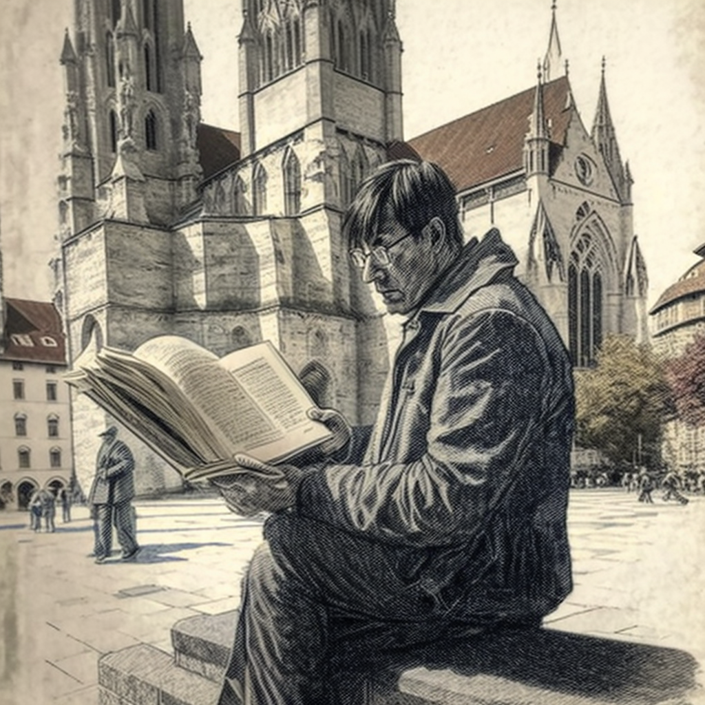

---
# Generated by Geminock v1.7 . cache_key='717322ce2a83ae5806db6e526b41eba800c9f4133787ebe1dd19c6a14159b6d4-it.yaml'
geminock_ver: '1.7'

title: "🇮🇹♊ [Geminocks] Ottenere la nazionalità svizzera 🇨🇭: imparare il tedesco 🇩🇪"
date: 2024-04-17T10:51:52Z
draft: false
tags:
- language
- switzerland
- Google
- geminocks
- Italian
# self: go/ricc-passaporto-svizzero
categories:
- life
image: /it/posts/life/learning-german-in-zurich/Riccardo_Italian_man_studying_on_a_German_spelling_book_in_front_of_Grossmunster.png
---

Sono a Zurigo da 10 anni, quindi ora posso richiedere il passaporto svizzero (ho sentito dire che una volta fatto, si ottiene un lingotto d'oro gratuito da un *caveau* nazista).

Scherzi a parte, la complessità principale qui è superare un esame di tedesco (svizzero tedesco o hoch deutsch, a scelta).

Questo articolo descrive i miei passi e le mie difficoltà. Fortunatamente, ho colleghi super intelligenti in Google che mi hanno aiutato. Questo è il mio tentativo di restituire il favore :)

<!--more-->

# 1. Ritorno a scuola!

Prima di tutto, hai bisogno di un certificato da una delle scuole abilitate:

Secondo la [pagina ufficiale della città di Zurigo](https://www.stadt-zuerich.ch/portal/de/index/politik_u_recht/einbuergerungen/kenntnisse/sprachlicheanforderungen.html) (in tedesco, ovviamente), *Tutte le persone che richiedono la naturalizzazione devono fornire prova scritta delle loro competenze linguistiche in tedesco. Il Quadro comune europeo di riferimento per le lingue (QCER) ha diversi livelli. Per la naturalizzazione, tutte le persone devono dimostrare competenze linguistiche in tedesco ai seguenti livelli:*

* orale (parlato e ascolto): livello **B1**
* scritto (scrittura e lettura): livello **A2**

Le scuole che forniscono ciò che chiedi sono queste:

1. [**Goethe Institute**](http://www.goethe.de/lrn/prj/pba/bes/gzb/deindex.html) (il più difficile). Nessuna sede in Svizzera, a quanto pare (?)
2. [TELC Ltd](https://www.telc.net/#section-0) - ?
3. [ÖSD](http://www.osd.at/) (austriaco, il secondo più difficile)
4. [Certificato di lingua Fide](http://www.fide-service.ch/)
5. [Test di lingua digitale](https://www.digitalersprachtest.ch/)

Ora:
* Il Goethe non ha una presenza in Svizzera e ho sentito dire che è il più difficile. Ciao.
* TELC ha un sito web preistorico con ancora eventi del 2013-2014 (wow), comunque li ho contattati per maggiori informazioni.
* OST dice "Esami e certificati di lingua tedesca riconosciuti a livello internazionale per bambini, ragazzi e adulti", e dato che inizia con i bambini ho la sensazione che non sarò trattato come un completo idiota (*da quanto tempo vivi in Svizzera? Cosa, 10 anni? E ancora non parli tedesco?* - seguito da uno sguardo di compassione). Hanno centri a [Frauenfeld](https://www.google.com/maps/dir/Zurich+HB,+Bahnhofplatz,+Zurigo,+Svizzera/Frauenfeld,+Svizzera/@47.550191,8.9002971,13.83z/data=!4m14!4m13!1m5!1m1!1s0x47900a08cc0e6e41:0xf5c698b65f8c52a7!2m2!1d8.5403226!2d47.3778579!1m5!1m1!1s0x479a922b7ac416d5:0xabd5ea8c4a738dc7!2m2!1d8.8987541!2d47.5535997!3e3) (36 minuti da HB) e [Niederurnen](https://www.google.com/maps/dir/Zurich+HB,+Bahnhofplatz,+Zurigo,+Svizzera/8867+Niederurnen,+Svizzera/@47.1837248,8.744133,11.39z/data=!4m14!4m13!1m5!1m1!1s0x47900a08cc0e6e41:0xf5c698b65f8c52a7!2m2!1d8.5403226!2d47.3778579!1m5!1m1!1s0x479acd0b21f91dfd:0x6eb928b1714053f3!2m2!1d9.0531505!2d47.125507!3e3) (50 minuti da HB). Ok, Frauenfeld vince :) Ok, c'è [un](https://www.osd.at/en/take-tests/find-exam-dates/?country=167&tests=00001100000&land=null&stadt=Frauenfeld&datefrom=01.06.2023&dateto=31.08.2023&centernr=null) **esame B1 il 24 giugno** - dovrebbe andare bene! Ho scritto all'organizzatore e vi dirò di più vicino alla data su https://www.osd.at/en/take-tests/find-exam-dates/pruefung/?tid=29224ZB1

# 2. Studiare per l'esame B1

Ora, ho ricevuto molti consigli dai colleghi. Alcuni consigli casuali:

* fare ascolto passivo. Suggeriscono questo sito web: TBD
* utilizzare un sistema di schede per imparare le parole. Puoi creare il tuo e sincronizzarlo da un repository al tuo sistema. [Anki](https://apps.ankiweb.net/) è il nome: hai un'app per Mac, un'app per Android e puoi modificare le tue carte e sincronizzarle con il tuo account ankiWeb :) Puoi scaricare le carte, ad esempio le carte [Goethe B1](https://ankiweb.net/shared/info/1586166030) o le carte [Goethe A1](https://ankiweb.net/shared/info/1386119660), comodamente su github per poterle forzare e costruire/sincronizzare/spingere automaticamente :P

## Anki

Dopo un'iniziale frustrazione nell'usare lo strumento, ho iniziato ad apprezzarlo. Ho installato l'app sul mio Mac, ho scaricato l'elenco di parole A1 e B1 (A1 è abbastanza facile e divertente, mentre B2 è come un gatto attaccato ai testicoli, come si dice a Bologna). L'elenco di parole è in ordine alfabetico, quindi i primi 2 giorni ho imparato tutto su *ab-qualcosa* (che mi ricorda Frankenstein Junior 😬): *ab-holen*, *ab-fall*, *ab-sendung*, *ab-norme* 🧌 - e così via.

Ho scoperto che imparo di più guardando l'etimologia (ad esempio, l'etimologia di [*holen*](https://en.wiktionary.org/wiki/holen#German) è la stessa di *to haul* - non lo dimenticherò mai!)

# 3. L'esame B1 a Frauenfeld

È andato bene. Sono stato accoppiato con una signora asiatica che parlava a malapena inglese e tedesco ma che ha lavorato MOLTO per prepararsi.
Ho improvvisato tutto. Ci è stato chiesto di organizzare insieme un viaggio con la nostra famiglia al Lago di Costanza
e ho solo applicato il buon senso che gli insegnanti sembravano apprezzare, mentre il suo tedesco era molto meglio ma stava chiaramente ripetendo qualcosa che aveva memorizzato. Non le piaceva che improvvisassi, te lo posso assicurare!

In ogni caso, sono stato promosso con il 70%, vicino al minimo per passare.

Nel complesso è stata un'esperienza terribile e adorabile allo stesso tempo.

# 4. L'esame della città di Zurigo

Ho sentito molte voci che scriverò qui:

* È molto più facile ottenere il certificato a Zurigo che nelle piccole città di montagna dove lo sciamano locale ti esamina e decide se ti adatti alla cultura (amo la fonduta, cucino la [Cuchaule](https://cookidoo.ch/recipes/recipe/fr-CH/r434981) e so pronunciare *Cuchicaschli*, e ho chiamato la polizia per un vicino rumoroso - ciao?!?)

# 5. Il dopo, scusate! .. dopo il tedesco

Da definire

*(Generated by Geminocks: https://github.com/palladius/ricc.rocks/tree/main/gemini prompt_version=1.4)*