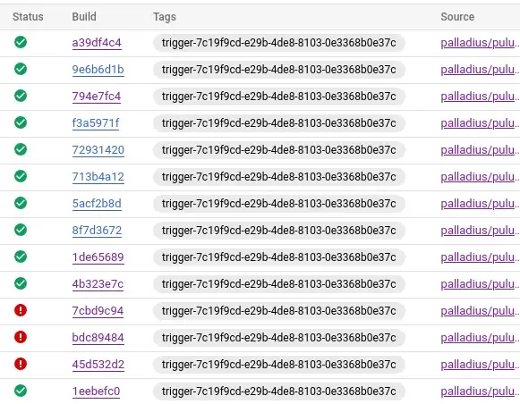

---
# Note this is SUPER weird, I try to make this work for ALL my thingies so there might be some behavioural clatches in the
# initial HEADER :) Lets try to keep it small :)
title: "♊ [Geminocks] 💦 🧹Pulumiを使って🐍Pythonで⬣ Cloud Buildトリガーを設定する 🇯🇵"
date: 2022-09-22T21:17:43+01:00
draft: false
tags: [symlink, GCP, pulumi, CloudBuild, Medium, geminocks, Japanese]
# paperMod
canonicalURL: https://medium.com/google-cloud/setting-cloudbuild-with-pulumi-in-python-330e8b54b2cf
# ANANKE :)
featured_image: /images/gohugo-default-sample-hero-image.jpg
image: /images/mtg-clone.jpg
---

元のブログ記事はこちら:  https://medium.com/google-cloud/setting-cloudbuild-with-pulumi-in-python-330e8b54b2cf

TODO(7feb23): この動画を埋め込む: https://www.youtube.com/watch?v=5jhWVNN8P_M (6feb23に作成)

数週間前、私は**Pulumi**に恋をしました。Terraformに求めていたものすべてが揃っていました。セットアップが簡単、設定管理が簡単、優れたUIが無料で提供され、そして最も重要なのは…言語サポートです！ Pulumiはバッファローピザに次ぐ最高の発明ですが、1つだけ問題があります… [Rubyのサポートがありません](https://github.com/pulumi/pulumi/issues/132) :/

とにかく、私は給料を払ってくれている⬣ GCP (認めざるを得ませんが)、Cloud Build、Cloud Deploy、そしてGoogle Cloud上のCI/CDパイプライン全般に惚れ込んでしまったので、試してみたくなりました。「Cloud Build Pulumi」でググってみると、JavaScriptの素敵な記事が見つかりましたが、これは私の好みではありませんでした。

## コード

私のコードはこちらです: https://github.com/palladius/pulumi/tree/main/examples/python-gcp-cloudbuild-auto-trigger

注: 👍 コードがついに正しくビルドされるようになりました。やったー！

## このコードのどこがそんなに特別なのですか？

このコードを使用すると、GCP 上の任意の Pulumi プロジェクト (Python 🐍) で、自己更新するためのトリガーを設定できます。git リポジトリへのプッシュによりビルドジョブがトリガーされ、ビルドが成功すると、Pulumi に自動的にログインして新しいコードで更新が実行されます。

そのため、例えば、コードに GCS バケットを追加する変更をコミットすると、数分後にはその GCS バケットが作成され、README.md がビルダーパラメータで更新されます。

太字で示されているのは、Cloud Build自体によって更新された3つのパラメータです！

私のコードは、現時点では**Github** (そのまま) と**Bitbucket** (コードは99%完成しており、最初に動作していました！) をサポートしています。

また、Lauraの記事に従ってメッセージをカスタマイズし、gitメッセージの先頭に「[built with Cloud Build]」を追加しました(この場合は「スラッシュN修正」)。

## Pulumiってどういう意味？

Google翻訳で試してみましたが、ハワイ語かビルマ語(🇲🇲、現在のミャンマー)でほうき(🧹)という意味のようです。それまでは、誰かが違うと証明するまでは、最初の絵文字を使います。

編集: Pulumiの私の友人であるAaronが、ほうきであることを確認し、[この記事](http://joeduffyblog.com/2018/06/18/hello-pulumi/)を教えてくれました。

##  次のステップ
今後の📝は次のとおりです。

* HSMまたはGCSを介してGCPに適切なパスワード/状態設定を行う。
* モジュールに変換して、どのようなpulumiプロジェクトでも4〜5個の変数(githubユーザー、githubリポジトリ、pulumi buidlディレクトリ、資格情報など)でこのコードを呼び出せるようにする。これがクロスランゲージ(非🐍)でも実行可能かどうかはまだ確認する必要があります。

## 参考文献

元のコード (Cloud Build + Node.js): https://www.pulumi.com/docs/guides/continuous-delivery/google-cloud-build/

私のコード (python): https://github.com/palladius/pulumi/tree/main/examples/python-gcp-cloudbuild-auto-trigger

*(Generated by Geminocks: https://github.com/palladius/ricc.rocks/tree/main/gemini prompt_version=1.4)*