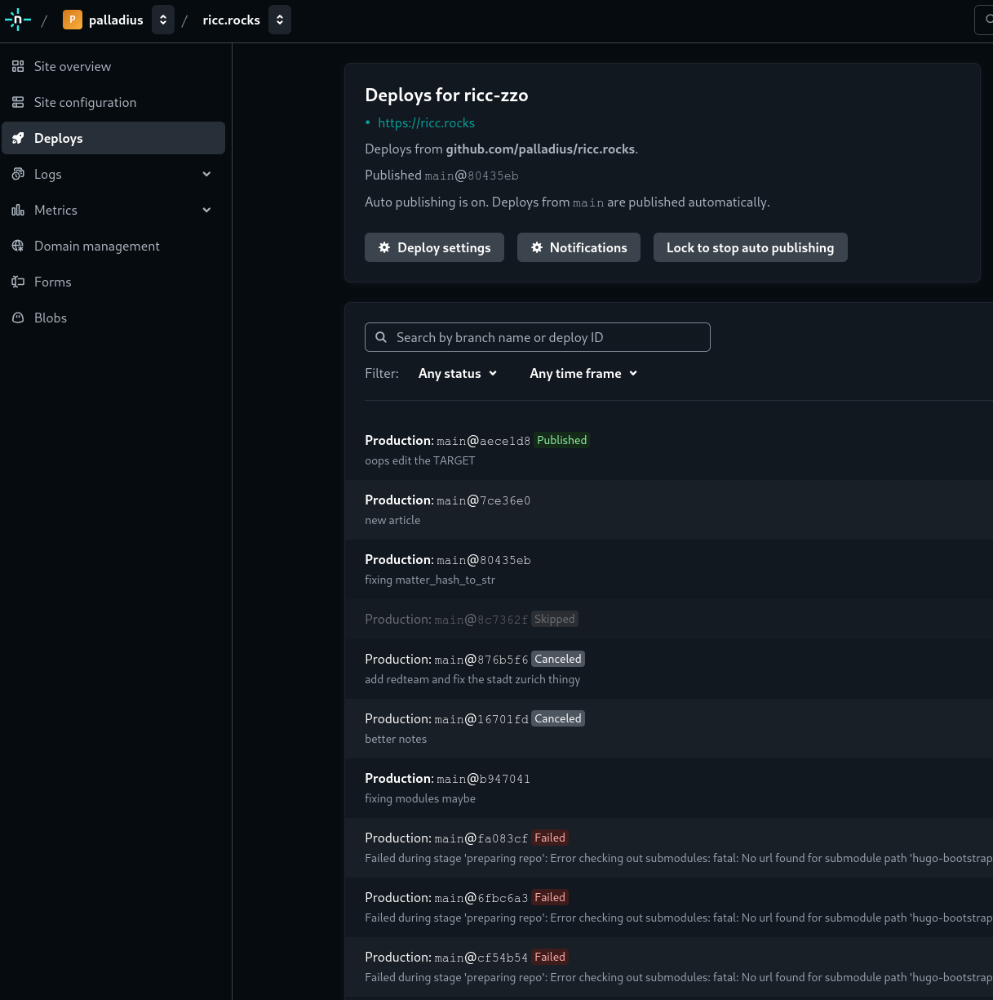

**注**: これは私にとって初めての実験です。まずHugo/markdownで書き、*その後*Mediumに移植します！


コード

🇮🇹 サイト

🇩🇪 サイト

🇫🇷 サイト

# ジェミノックス

https://ricc.rocks/ は貴重なコンテンツの隠れた宝石であり、私は全く偏見を持っていません。これは私の個人的なブログです。 🤣

中には家族写真、スポーツや趣味、そしてGoogle Cloudの記事があります。なぜでしょうか？ markdownに惚れ込み、同僚にHugoを勧められたからです。 rubyistとしては、`jekyll`を裏切っているような気分です。

## ブログの設定

非常にシンプルな設定を使用しています。

* コードの保存にGithubを使用: https://github.com/palladius/ricc.rocks
* [Netfly](https://www.netlify.com/) で自動ビルド（無料！）
* `ricc.rocks` ドメインでホスト。これだけです。

## 言語の問題

しかし、ちゃんとしたブログであれば、少なくとも英語と母国語（私の場合は🇮🇹）のバージョンが必要です。

DHHにDRYの考え方を吹き込まれたので、DRYでない生活はもう送れません。手動でコンテンツを翻訳するとどうなるでしょうか？明日コンテンツを更新すると、翻訳も更新しなければなりません。
さらに、私はいくつかの言語を話すので、これはすぐに恐ろしいことになります。LLMは翻訳が得意なので、代わりにGeminiを使って大変な作業をしてみるのはどうでしょうか？

ただし、いくつかの課題があります。Hugoのmarkdownは「Front Matter」と呼ばれるもので始まります。これはYAML形式のいくつかのキーバリューを含んでいます。
ページ全体を翻訳し、Front Matterはそのままにしておきたいです。私のLLMはこのタスクに対応できるでしょうか？ それはかなりうまくいくことがわかりましたが、…

…日本語を試すまでは！

## ジェミノックスのアーキテクチャ

ジェミノックスを実行するには、いくつかのピースを組み合わせる必要がありました。

1. `N`個のブログに投稿し、`M`個の言語に翻訳したいDRYな記事の束。
2. これを行うためのしっかりとしたプロンプト。以下を参照
3. これを行うためのしっかりとした言語（もちろん、Ruby）
4. [キャッシュ](https://github.com/palladius/ricc.rocks/tree/main/gemini/.cache) メカニズム。N個の記事をL個の言語でGeminiに呼び出し、コミットごとにNxLx1000トークンを消費したくはありません。
5. 結果が理にかなっていることを確認するためのしっかりとしたテストシステム。プロンプトをテストするためにPromptfooを選択し、hugoでサイトをローカルで再構築できるかどうかを確認します。

## Netlify

Netlifyとは何でしょうか？ それは[Hugo](https://gohugo.io/)用のページをビルド/デプロイするプラットフォームです。[jekyll](https://jekyllrb.com/)用のgithubページと非常によく似ています。もう一度言います。`jekill : hugo = ruby : go`。

私のNetlifyビルドは次のようになります。



* `git push`ごとに、netlifyは必要なコードを実行します。通常は`hugo minify`です。
* エラーが発生した場合は、どこにあるかを確認できます。最初にローカルで試すこともできます。リポジトリごとに1つの`make test`を用意するようにしました。


### プロンプト

元のプロンプトはこちらです: [gemini/etc/prompts/translate-to-another-language.prompt](https://github.com/palladius/ricc.rocks/blob/main/gemini/etc/prompts/translate-to-another-language.prompt)。

次のようになります。

```prompt
あなたは、仕事と個人の両方の目的でブログを作成する人物（「Dr Riccardo Carlesso」）のためのHugoブログアシスタントです。

あなたは英語の元のmarkdownを受け取り、日本語に逐語的に翻訳する必要があります。

Front Matterとコンテンツ：

* Front Matter（`---`と`---`の間の部分）は、以下で指定されている場合を除き、すべてのフィールドでそのままにします。
* 2番目の`---`の後にあるものはすべて日本語に翻訳します。
* geminiの出力を```blah blah```のように囲まないでください。通常のテキストを出力してください。

Front Matterでは：

* TITLE。TITLEフィールドの先頭に「♊ [Geminocks]」を追加します（まだない場合）。例：「title: [geminocks] 元のタイトル」
    * また、FrontMatterのタイトルに最も適切だと思う日本の国旗を追加してください。
    * 最終的な文字列の左右に二重引用符があることを確認してください。例：```title: "blah blah blah"```
* すべてのフロントマターフィールドを確認し、サニタイズするために少し時間をかけてください。たとえば、この間違いは避けてください（3つの不正な引用符に注意してください）：title: '💦♊ [Geminocks] Migliora il tuo gioco Rails con Cloud Run: un'immersione profonda in Qwiklabs'
* TAGS。「geminocks」と「Japanese」をタグに追加します（そのようなフィールドがある場合）。ない場合は、新しく作成します：「tags: [ geminocks, Japanese ]」。

元のコンテンツ（通常は英語）は次のとおりです。

<original_content>

{original_content}

</original_content>
```

[時間の経過に伴う進化](https://github.com/palladius/ricc.rocks/commits/main/gemini/etc/prompts/translate-to-another-language.prompt) を確認してください。

### キャッシュ

アイデアはシンプルです。入力コンテンツが変更されない場合は、キャッシュにヒットします。これには2つの目的があります。

1. お金を節約する
2. Geminiが小さなミスをした場合、キャッシュファイルの日本語のミスを修正するだけで、次のプッシュでGemini + Riccardoが編集したmarkdownが本番環境に送信されます。

必要なものがすべて含まれたYAMLから始めたので：[フランス語の例（yaml）](https://github.com/palladius/ricc.rocks/blob/main/gemini/.cache/0a1091e0349af123a464233129bf22b0674da35e3d73bbb2d4e8166f0254124a-fr.yaml)、
完全な出力も保存することにしました。ダブルチェックがはるかに簡単だからです：[同じ例（markdown）](https://github.com/palladius/ricc.rocks/blob/main/gemini/.cache/0a1091e0349af123a464233129bf22b0674da35e3d73bbb2d4e8166f0254124a-fr.yaml.txt)


## スクリプトのテスト

**LLMの出力とプロンプトの品質をどのようにテストしますか？**

**PromptFoo**の登場です！ Promptfooは、決定論的な方法とLLM的な方法（私の造語をお許しください）の両方でLLM出力の単体テストを設定できる素晴らしいライブラリです。

LLM出力が日本語に対応できることを確認したい場合（何度か混乱しました）。

言語、氏名（常に私の名前）、ファイルの内容でパラメトリックなプロンプトがあるとします。

次のように書くことができます。

```yaml

  - vars:
      language: japanese
      full_name: Riccardo Carlesso
      original_content: 'file://../../src/posts/medium/2022-09-12-GCP-CB-trigger-with-pulumi-python/index.md'
    assert:
      - type: llm-rubric
        value: |
          Front Matterには`tag:`キーが含まれており、「geminock」と「japanese」が含まれています。
      - type: llm-rubric
        value: |
          Front Matterには、二重引用符で囲まれた`title:`キーが含まれています。つまり、このタイプの行です。
          title: "<ここに情報>"
          タイトル内には日本の国旗が必要です。
```

これで、LLMはLLMコンテンツを作成（およびキャッシュ）し、これら2つのテストを実行します。これらのテストは私の経験から来ています。
Geminiが日本語に翻訳するとき、タイトルが`title: "blah blah"`の形式ではなく、`title: blah blah`の形式になる場合があることに気づきました。これは漢字ではうまく機能しないため、二重引用符で囲まれていることを確認したいのです。

これは考えられる出力です。


## 次のステップ

* まだZZOに移行することを決めていないため、ソースをより多くのHugoバージョンにコピーします（妻は別のバージョンを好み、私はおそらく[bootstrap](https://hugo-bootstrap-ricc-rocks.netlify.app/)バージョンを好みます）。さらに、ZZOは3年間更新されていません。良い兆候ではありません。


*(Generated by Geminocks: https://github.com/palladius/ricc.rocks/tree/main/gemini prompt_version=1.4)*

---
title: "[TODO] [jp] \U0001F38CGemiNoTrnsl: how I set-up auto-translation on my personal
  Hugo Blog"
date: 2024-11-11
layout: single
author: Riccardo Carlesso
read_time: 3
Tags:
- hugo
- netflify
- blog
- gcp
- googlecloud
- gemini
- geminocks
geminock:
  :alter_front_matter_version: '1.0'
  :notes: Riccardo - todo make this variable per extension and calla  proper class
    to get it. So you can have a single thingie for Main picture, and then transform
    it for all extensions.
# Generated by Geminock v.1.9 - matter_hash_to_str()
# Note this operation might have removed all previous comments. Sorry.
# If Riccardo wants to edit this, code is in: /usr/local/google/home/ricc/git/ricc.rocks/gemini/lib/gemini/translator.rb
---
