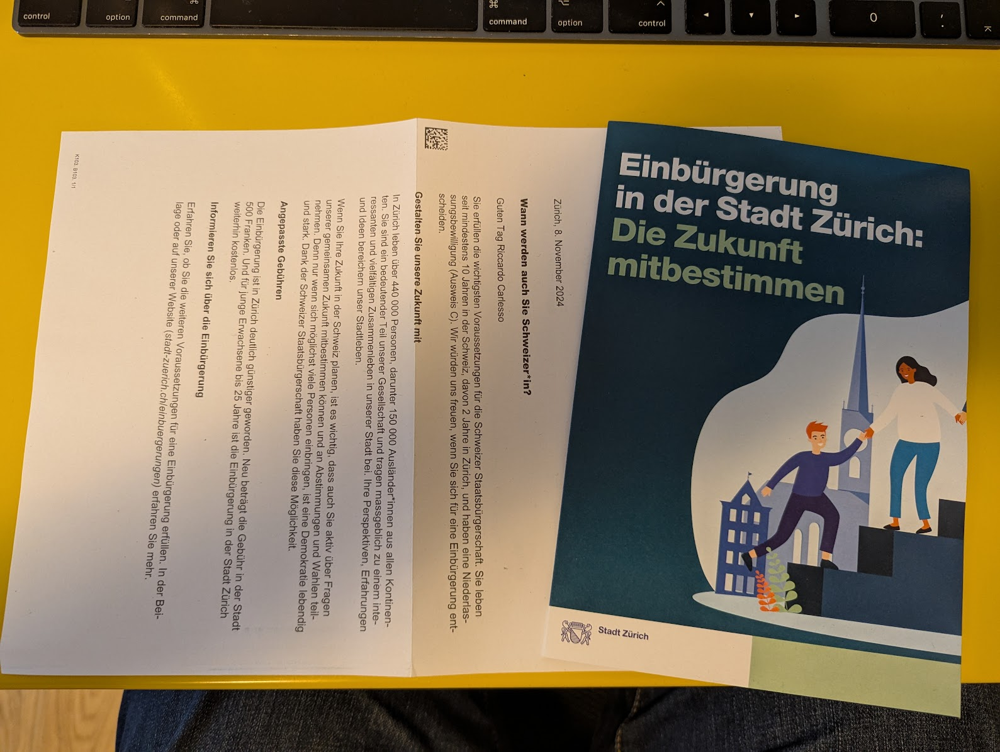

チューリッヒに10年住んでいるので、スイスのパスポートを申請できます（申請するとナチスの金庫から金の延べ棒がもらえると聞いたことがあります）。

冗談はさておき、ここで最も難しいのはドイツ語の試験に合格することです（スイスドイツ語または標準ドイツ語、どちらか選択できます）。

この記事では、私のステップと苦労について説明します。幸いなことに、Googleには非常に賢い同僚がいて、彼らは私を助けてくれました。これは私が恩返ししようとしていることです :)

<!--more-->

# 1. 学校に戻る！

まず、認定校の証明書が必要です。

[チューリッヒ市公式ページ](https://www.stadt-zuerich.ch/portal/de/index/politik_u_recht/einbuergerungen/kenntnisse/sprachlicheanforderungen.html)（もちろんドイツ語）によると、「帰化を申請するすべての人は、ドイツ語能力の書面による証明を提出する必要があります。ヨーロッパ言語共通参照枠（CEFR）にはさまざまなレベルがあります。帰化のためには、すべての人が次のレベルのドイツ語能力を証明する必要があります。」

* 口頭（話す、聞く）：レベル **B1**
* 書面（書く、読む）：レベル **A2**

必要なものを提供する学校は次のとおりです。

1. [**ゲーテ・インスティトゥート**](http://www.goethe.de/lrn/prj/pba/bes/gzb/deindex.html)（最も難しい）。スイスには拠点がないようです (?)
2. [TELC Ltd](https://www.telc.net/#section-0) - ?
3. [ÖSD](http://www.osd.at/)（オーストリア、2番目に難しい）
4. [Fide 言語証明書](http://www.fide-service.ch/)
5. [デジタル言語テスト](https://www.digitalersprachtest.ch/)

さて：
* ゲーテはスイスに拠点がなく、最も難しいと聞きました。さようなら。
* TELCのウェブサイトは古く、2013年から2014年のイベントがまだ掲載されています（驚きました）。それでも詳細情報について問い合わせました。
* OSTは「子供、青少年、大人のための国際的に認められたドイツ語試験と証明書」と言っています。子供から始まるので、完全に馬鹿にされることはないと思います（「スイスに何年住んでいますか？10年？まだドイツ語が話せないのですか？」 - そして同情の視線）。[フラウエンフェルト](https://www.google.com/maps/dir/Zurich+HB,+Bahnhofplatz,+Zurigo,+Svizzera/Frauenfeld,+Svizzera/@47.550191,8.9002971,13.83z/data=!4m14!4m13!1m5!1m1!1s0x47900a08cc0e6e41:0xf5c698b65f8c52a7!2m2!1d8.5403226!2d47.3778579!1m5!1m1!1s0x479a922b7ac416d5:0xabd5ea8c4a738dc7!2m2!1d8.8987541!2d47.5535997!3e3)（HBから36分）と[ニーダーウルネン](https://www.google.com/maps/dir/Zurich+HB,+Bahnhofplatz,+Zurigo,+Svizzera/8867+Niederurnen,+Svizzera/@47.1837248,8.744133,11.39z/data=!4m14!4m13!1m5!1m1!1s0x47900a08cc0e6e41:0xf5c698b65f8c52a7!2m2!1d8.5403226!2d47.3778579!1m5!1m1!1s0x479acd0b21f91dfd:0x6eb928b1714053f3!2m2!1d9.0531505!2d47.125507!3e3)（HBから50分）にセンターがあります。わかりました、フラウエンフェルトの勝ちです:) 6月24日に[B1試験](https://www.osd.at/en/take-tests/find-exam-dates/?country=167&tests=00001100000&land=null&stadt=Frauenfeld&datefrom=01.06.2023&dateto=31.08.2023&centernr=null)があります - いいはずです！主催者に連絡を取り、https://www.osd.at/en/take-tests/find-exam-dates/pruefung/?tid=29224ZB1 について、日にちが近づいたらもっと詳しくお伝えします。

# 2. B1試験の勉強

さて、同僚からたくさんのヒントをもらいました。ランダムなヒントをいくつか紹介します：

* 受動的なリスニングをする。彼らは次のウェブサイトを提案しています：未定
* 単語を覚えるためにカードシステムを使用する。自分で作成し、リポジトリからシステムに同期できます。[Anki](https://apps.ankiweb.net/)という名前です。Mac用アプリ、Android用アプリがあり、自分のカードを編集してankiWebアカウントに同期できます:) カードをダウンロードできます。たとえば、[ゲーテB1](https://ankiweb.net/shared/info/1586166030)カードまたは[ゲーテA1](https://ankiweb.net/shared/info/1386119660)は、フォークして自動ビルド/同期/プッシュできるようにGitHubにあります :P

## Anki

最初はツールを使うのにイライラしていましたが、好きになりました。Macにアプリをインストールし、A1とB1の単語リストをダウンロードしました（A1はかなり簡単で楽しいですが、B2はボローニャで言うように、睾丸に猫がくっついているようなものです）。単語リストはアルファベット順なので、最初の2日間は*ab-something*についてすべて学びました（ヤング・フランケンシュタインを思い出させます😬）：*ab-holen*、*ab-fall*、*ab-sendung*、*ab-normal* [🧌](https://it.wikipedia.org/wiki/Frankenstein_Junior) - などなど。

語源を見ることでより多くのことを学ぶことがわかりました（たとえば、[*holen*](https://en.wiktionary.org/wiki/holen#German)の語源は*to haul*と同じです - 決して忘れません！）。

ゲーテによるA2とB1を試してみることをお勧めします（[同じ著者](https://ankiweb.net/shared/by-author/1386119660)による）：

# [A2 Wortliste Goethe](https://ankiweb.net/shared/info/1386119660)
* [B1 Wortliste DTZ Goethe](https://ankiweb.net/shared/info/1586166030)

個人的にはB1は非常に難しいと感じましたが（AB/ANの部分、*abzahlen* / abholen / *anfahren* .. を超えることはありませんでした）、A2は適切なレベルでした。

# 3. フラウエンフェルトでのB1試験

これはうまくいきました。英語もドイツ語もほとんど話せないアジア人女性とペアになりましたが、準備に非常に熱心に取り組みました。私はある意味すべてを即興でやりました。家族とボーデン湖への旅行を一緒に計画するように頼まれ、私は常識を適用しただけでしたが、先生たちはそれを高く評価しているようでした。一方、彼女のドイツ語ははるかに優れていましたが、明らかに暗記したことを繰り返していました。彼女は私が即興でやるのが好きではありませんでした、それは確かです！

とにかく、70％で合格し、ギリギリ合格ラインでした.

全体として、それはひどくもあり、同時に素敵な経験でもありました。

# 4. チューリッヒ市の試験

たくさんの噂を聞いてきました。ここに書いておきます。

* チューリッヒで証明書を取得する方が、地元のシャーマンがあなたを審査し、文化に合うかどうかを判断する小さな山間の町よりもはるかに簡単です（私はフォンデュが好きで、[クショーレ](https://cookidoo.ch/recipes/recipe/fr-CH/r434981)を料理し、*Cuchicaschli*を発音でき、騒音のひどい隣人に警察に通報しました - ねえ？！）。

24年11月13日、試験に招集されると思った手紙を受け取りました。

しかし、Google翻訳した後、それは単にスイス市民になるための申請を試みるようにとの招待状であることに気づきました！

申し訳ありません、チューリッヒ市、早とちりでした！

# 5. 余波、すみません！.. ドイツ語の後

未定

*(Generated by Geminocks: https://github.com/palladius/ricc.rocks/tree/main/gemini prompt_version=1.4)*

---
title: "[TODO] [jp] Getting Swiss \U0001F1E8\U0001F1ED nationality: learning German
  \U0001F1E9\U0001F1EA"
date: '2024-04-17T10:51:52Z'
draft: false
tags:
- language
- switzerland
- Google
- expat
categories:
- life
image: "/en/posts/life/learning-german-in-zurich/Riccardo_Italian_man_studying_on_a_German_spelling_book_in_front_of_Grossmunster.png"
geminock:
  :alter_front_matter_version: '1.0'
  :notes: Riccardo - todo make this variable per extension and calla  proper class
    to get it. So you can have a single thingie for Main picture, and then transform
    it for all extensions.
# Generated by Geminock v.1.9 - matter_hash_to_str()
# Note this operation might have removed all previous comments. Sorry.
# If Riccardo wants to edit this, code is in: /Users/ricc/git/ricc.rocks/gemini/lib/gemini/translator.rb
---
