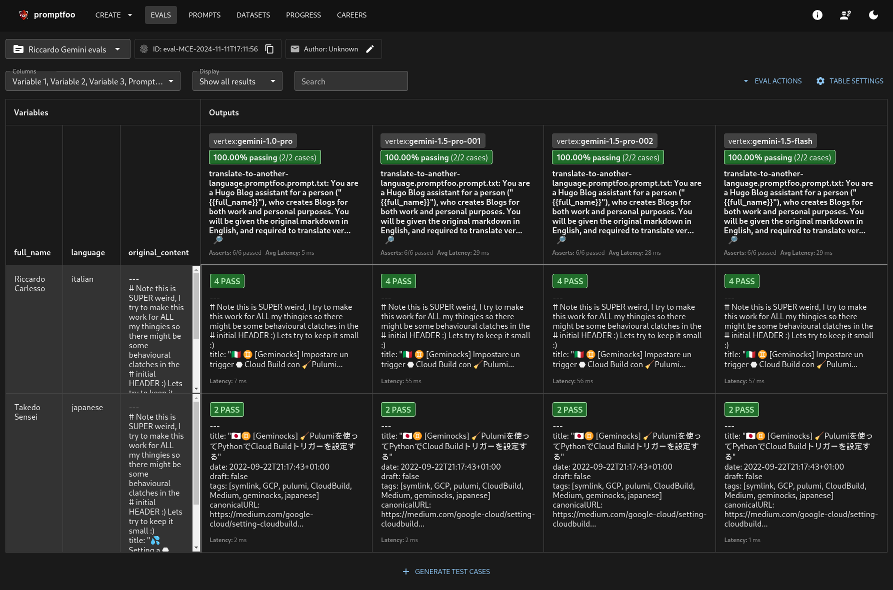

# Geminocks

https://ricc.rocks/ is an underlooked gem of precious content, and I'm not biased at all: it's my personal blog.

Inside you can find my family pics, my sport and hobbies, alongside my Google Cloud articles. Why? I just fell in love
with markdown and I've been directed by my colleagues to Hugo. As a rubyist, it feels like cheating on `jekyll`, I know.

## My Blog configuration

I use a very simple config:

* Github to store the code
* Netfly to auto-build it
* `ricc.rocks` domain to host it. And that's it.

## The language problem

However, a

TODO()


## Testing the script

**How do you test an LLM output, and the prompt quality?**

Enter **PromptFoo**! Promptfoo is an amazing library where you can set up unit tests for your LLM output both in a deterministic
and LLMistic (pardon my neologisms) way.

If I want to ensure that LLM output is able to cope with Japanese (it got confused a few times).

Imagine you have a prompt which is parametric in Language, fullname (its always my name) and file content.

Well you can write things like:

```yaml

  - vars:
      language: japanese
      full_name: Riccardo Carlesso
      original_content: 'file://../../src/posts/medium/2022-09-12-GCP-CB-trigger-with-pulumi-python/index.md'
    assert:
      - type: llm-rubric
        value: |
          The Front Matter contains a `tag:` key and it contains 'geminock' and 'japanese'.
      - type: llm-rubric
        value: |
          The Front Matter contains a `title:` key surrounded by double quotes, ie a line of this type:
          title: "<some info here>"
          Inside the title there should be a flag of Japan.
```

Now an LLM will create (and cache!) the LLM content and perform these two tests. These tests come from my experience:
I noticed that when Gemini translates to Japanese, sometimes the title is not in form `title: "blah blah"` but in format
`title: blah blah` which doesn't work well with kanjis, so I want to make sure it's in double quotes.

This is a possible output:


