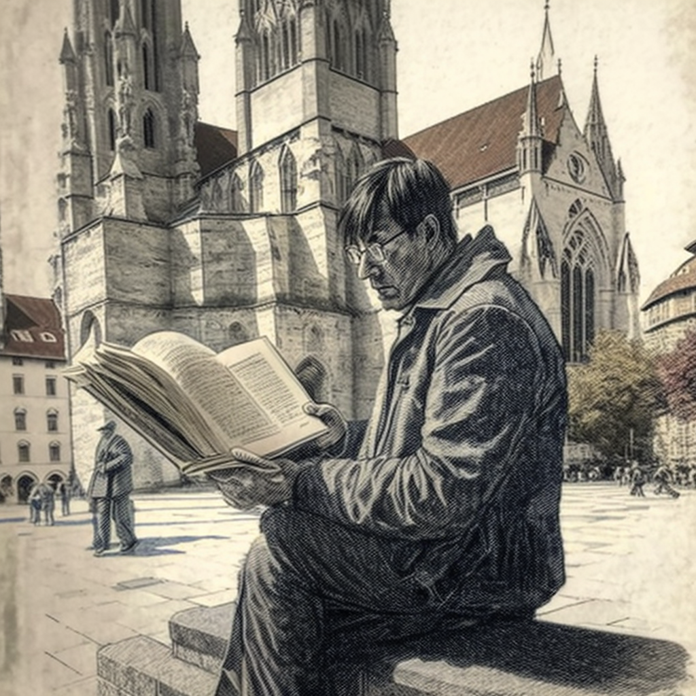
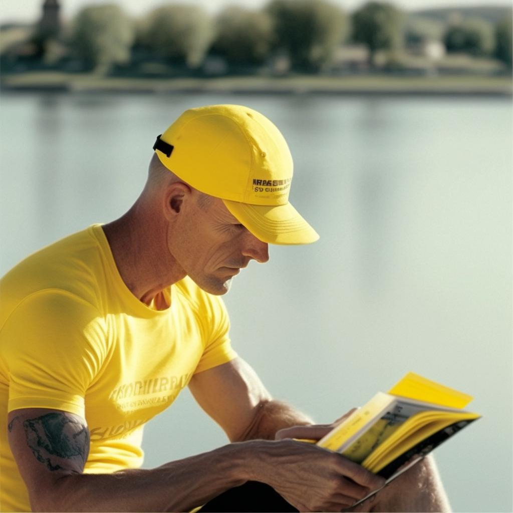
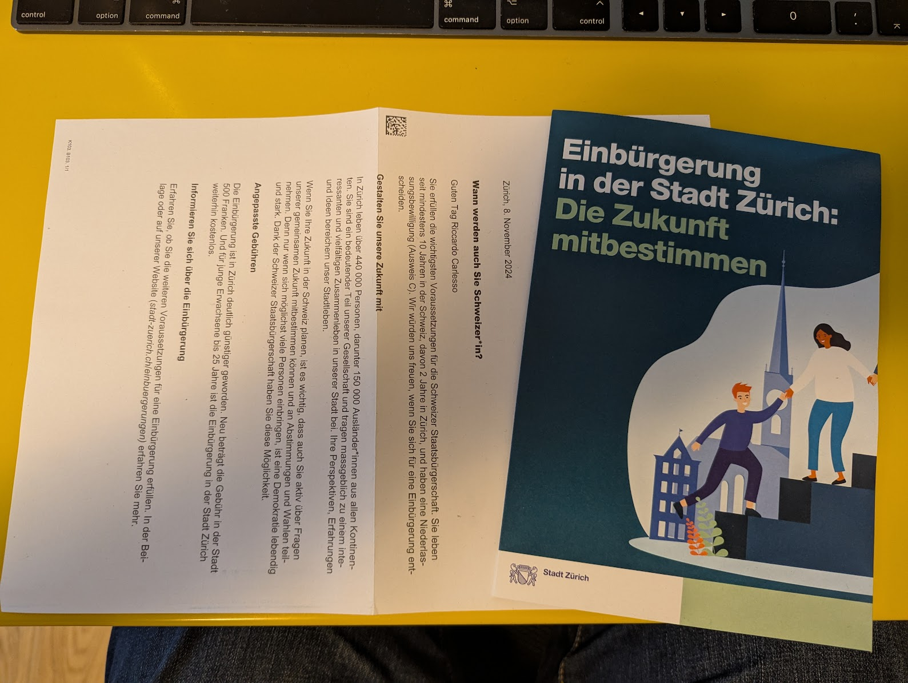

I've been in Zurich for 10 years, so now I can apply for swiss passport (I heard once you do, you get a free gold lingot from a Nazi *caveau*).

Jokes apart, the top complexity here is to pass an exam in German (Swiss German oder Hoch Deutsch, your choice).

This article describes my steps and struggles. Luckily, I have super smart colleagues in Google who helped me. This is my trying to give back :)

<!--more-->

# 1. Back to School!

First thing, you need a certificate from one of the enabled schools:

According to [Stadt Zurich official page](https://www.stadt-zuerich.ch/portal/de/index/politik_u_recht/einbuergerungen/kenntnisse/sprachlicheanforderungen.html) (in German, of course), *All persons applying for naturalization must provide written proof of their German language skills. The Common European Framework of Reference for Languages ​​(CEFR) has different levels. For naturalization, all persons must prove German language skills at the following levels:*

* oral (speaking and listening): level **B1**
* written (writing and reading): level **A2**

The schools that provide what you ask are these:

1. [**Goethe Institute**](http://www.goethe.de/lrn/prj/pba/bes/gzb/deindex.html) (hardest). No location in Switzerland, it seems (?)
2. [TELC Ltd](https://www.telc.net/#section-0) - ?
3. [ÖSD](http://www.osd.at/) (Austrian, Second hardest)
4. [Fide language certificate](http://www.fide-service.ch/)
5. [Digital language test](https://www.digitalersprachtest.ch/)

Now:
* Goethe doesn't have presence in Switzerland and I hear its the hardest. Ciao.
* TELC has a pre-Christ website with still events from 2013-2014 (wow), still I contected them for more info.
* OST says "Internationally recognized German language exams and certificates for children, young learners and adults", and since it starts with Children I have a feeling I won't be treated like a complete idiot (*how long have you been living in Sweitzerland? What, 10 years? And you still don't speak German?* - followed by a compassion gaze). they do have centers in [Frauenfeld](https://www.google.com/maps/dir/Zurich+HB,+Bahnhofplatz,+Zurigo,+Svizzera/Frauenfeld,+Svizzera/@47.550191,8.9002971,13.83z/data=!4m14!4m13!1m5!1m1!1s0x47900a08cc0e6e41:0xf5c698b65f8c52a7!2m2!1d8.5403226!2d47.3778579!1m5!1m1!1s0x479a922b7ac416d5:0xabd5ea8c4a738dc7!2m2!1d8.8987541!2d47.5535997!3e3) (36m from HB) and [Niederurnen](https://www.google.com/maps/dir/Zurich+HB,+Bahnhofplatz,+Zurigo,+Svizzera/8867+Niederurnen,+Svizzera/@47.1837248,8.744133,11.39z/data=!4m14!4m13!1m5!1m1!1s0x47900a08cc0e6e41:0xf5c698b65f8c52a7!2m2!1d8.5403226!2d47.3778579!1m5!1m1!1s0x479acd0b21f91dfd:0x6eb928b1714053f3!2m2!1d9.0531505!2d47.125507!3e3) (50m from HB). Ok, Frauenfeld wins :) Ok, there's [one](https://www.osd.at/en/take-tests/find-exam-dates/?country=167&tests=00001100000&land=null&stadt=Frauenfeld&datefrom=01.06.2023&dateto=31.08.2023&centernr=null) **B1 exam on June 24th** - should be good! I wrote to the organizer and will tell you more close to the date about https://www.osd.at/en/take-tests/find-exam-dates/pruefung/?tid=29224ZB1

# 2. Studying for the B1 exam

Now, I've got a lot of tips from colleagues. Some random tips:

* do passive listening. They suggest this website: TBD
* use a card system to learn the words. You can create your own and sync from a repo to your system. [Anki](https://apps.ankiweb.net/) is the name: you have an App for Mac, an app for Android, and you can edit your own cards and sync them to your ankiWeb account :) You can download cards, for example the [Goethe B1](https://ankiweb.net/shared/info/1586166030) cards or the [Goethe A1](https://ankiweb.net/shared/info/1386119660), conveniently on github for you to Fork and auto-build/sync/push :P

## Anki

After an initial frustration using the tgool, I came to like it. I have the app installed on my Mac, downloaded the A1 and B1 word list (A1 is quite easy and fun, while B2 is like a cat attached to your testicles, as we say in Bologna). Word list is in alpha order, so the first 2 days I've learnt all about *ab-something* (which reminds me of Young Frankenstein 😬): *ab-holen*, *ab-fall*, *ab-sendung*, *ab-normal* [🧌](https://it.wikipedia.org/wiki/Frankenstein_Junior) - and so on.

I found out I learn more by looking at the etimology (eg, etimology of [*holen*](https://en.wiktionary.org/wiki/holen#German) is the same of *to haul* - I'll never forget that!).

I suggest you to try the A2 and B1 by Goethe (by the [same author](https://ankiweb.net/shared/by-author/1386119660)):

# [A2 Wortliste Goethe](https://ankiweb.net/shared/info/1386119660)
* [B1 Wortliste DTZ Goethe](https://ankiweb.net/shared/info/1586166030)

I personally found the B1 very hard ( I never arrived past the AB/AN part: *abzahlen* / abholen / *anfahren* ..),
but the A2 was at the right level.

# 3. The B1 exam in Frauenfeld

This went well. I was paired to an asian lady who could barely speak English and German but worked A LOT to prepare.
I kind of improvised all. We were asked to organize together a trip with our family to the Bodensee
and I just applied common sense which the teachers seemed to appreciate, while her German was much better but she was clesarly repeating something she memorized. She didn't like me improvising, I can tell you!

Anyhow, I got promoted with 70%, close to the minimum to pass.

Overall it was a terrible and a lovely experience at the same time.

# 4. The Stadt Zurich exam

I've heard a lot of rumors which I'm going to write here:

* It's much easier to get your certificate in Zurich than in small mountain towns where the local shaman vets you and decide if you fit in with the culture (I love fondue, cook [Cuchaule](https://cookidoo.ch/recipes/recipe/fr-CH/r434981) and can pronounce *Cuchicaschli*, and called the police on a noisy neighbour - hello?!?)

On 13 nov 24, I received a letter where I thought I'd be convoked for my exam:

#  5. The aftermath, sorry! .. after German

TBD
