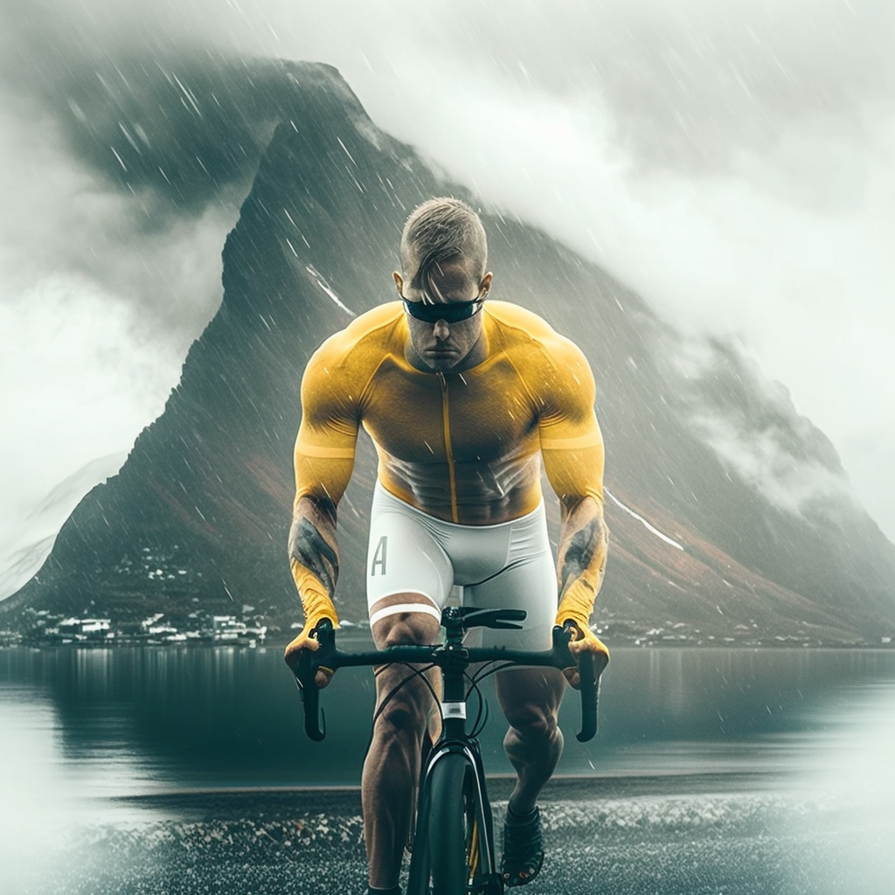


In this article you'll learn all about cycling in Madeira, my crazy friend Riccardo, and how I got my first pair of glasses in 30 years.


<!-- this works too!

-->


(Image built with [Midjourney](https://cdn.discordapp.com/attachments/1008571102328541215/1075832031499534436/Riccardo_A_beautiful_muscly_yellow_man_cycling_in_a_mountainous_6a0f25ff-c910-4842-80d0-16f6a74f6026.png) )

<!-- ## Why Madeira in February? -->

I married a saint woman (Kate) who from time to time allows me to travel solo for a week while her family comes to
Zurich and help with kids. This year it happened in February: too early to cycle in Mallorca, so I asked my friend Mike
for a nice place to go and he suggested Madeira.

On Xmas and my friend Riccardo ('Ridge') decided to join me.

Mallorca is still low season and a wee too cold, so Madeira seemed the perfect choice - except for the climbs. Gosh, the climbs!

From midjourney:

<tt>/imagine Brazillian muscly software engineer types on his Mac laptop in a foresty island watching the sunset by the port. realistic, cinematic</tt>

## Sat 11: just a look around

I land around 11 and I'm immediately welcomed by a Pastel de Nata at the local bar (geniusly located between the plane and the luggage claim), and I see publicity of "Blandey's wine tasting". It will be my next quest to involve Ridge into wine tasting and bringing home some bottles of Madeiras "porto" (it's not porto! Just to make it easy for you, it's fortified wine with acidity and oxidized, so it survives opening for years, differently from porto which needs be consumed within weeks from opening).

As sopon as I make it to the hotel, I go get my bike at [Happy Bikes](https://www.happybikes.pt/) (conveniently 200m from the hotel). The super gentle owner helps me bringing Ridge bike to my hotel while I bring mine.
I get a enduro bike (75eur), as Ridge wants to save and Happy Bikes only have one cheap MTB (45e).
The giroscopic saddle is a new thing to me, and I totally get in love with it!

Next step, I go to visit [Blandy's](https://www.google.com/maps/place/Blandy's+Wine+Lodge+(former+Adegas+de+S%C3%A3o+Francisco)/@32.6449894,-16.9240557,15z/data=!4m6!3m5!1s0xc6060086c82670f:0xc55073cc6045c67!8m2!3d32.6478698!4d-16.9106236!16s%2Fg%2F1q5bprx89) to find a congenial visit time for Ridge an I on Monday or Tuesday.

Finally I go to eat at **[Terra](https://www.google.com/maps/place/TERRA+-+Food+Concept/@32.6489523,-16.9112022,17z/data=!3m1!4b1!4m6!3m5!1s0xc606167302d50ed:0xb4be6622c761d352!8m2!3d32.6489523!4d-16.9090135!16s%2Fg%2F11rvdjk0jg)**'s, the only super-expensive restaurant in Madeira, but also so bloody worht it :) Check pics on my my [instagram post](https://www.instagram.com/p/Coje6JRsBGh/).

Then I sleep a bit drunk from amazing wine I just had, and meet Ridge around 21:30 for a small drink before going to sleep. Big day tomorrow!

## Sun 12: muddy mountain-biking

<!-- Strava activity: https://www.strava.com/activities/8550514540 (52,28km in 4h47m) -->

We go with Helvio and Helder from [madeiraaltitude](https://madeiraaltitude.com/) (they did a great job, so i feel like giving them some free publicity if you dont mind). Weather is total crap.

We start driving super-high to a restaurant ITMON, *Abrigo do Poiso*. There we drink coffee, *undrink*, and get changed. Finally we are drive to the top of the island, *Vereda do Areeiro*. It rains like hell, it's windy, the weather couldn't be miserabler. Helvio teaches me (the freshman) how to descend on a MTB, how to use the gyroscopic saddle, and basically survive with mud and crazy descents. This is NOT what I signed up for, this is what you get when you ask your sadistic friend to take care of the cycling on day 1.

The weather will stay miserable for 3-4 hours until around 2pm we reach a beautiful view, the [Miradour da Portela](https://www.google.com/maps/place/Miradouro+da+Portela/@32.7359716,-16.8670002,13.46z/data=!4m6!3m5!1s0xc6066a5847f65b7:0xc8615cd8407ff70a!8m2!3d32.7471903!4d-16.8259209!16s%2Fg%2F11c74xx22v). The view is amazing, and we see the firts sun. Nearby there's an amazing restaurant (Restaurant Portela a Vista) where we all eat more meat and chips than our stomach can process for just 66eur. AMAZING. This is the first moment I start enjoying life. We're so dirty that all customers look at us like we carried leper or pestilence. I'm delighted by it.

We do then a final (drunk) descent to Praya do Machico, back to the Ocean. Helvio's son is waiting for us to drive us home. Ridge and I are DEAD. Happily dead. What we did today is absolutely incredible.

I then realize I only have a pair of shoes which are now completely soaked in mud, and so is my other equipment. I shower in the hotel with my shoes and I was them with my bare hands (no soap, just a long massage on the whole surface), then I spend 60min watching Dawson Creek on iPad (don't judge me!) while my hair dryer dries my shoes up.

We'll then have a nice drinks and food with Ridge before dying in bed.

## Mon 13: go west! Cabo Girão

I was able to get some GPX on my horrible Garmin 830 (I mean, my 520 is old, but works perfectly - my fancy 820 is waiting since 2020 to sync 13 apps and its still there clogged) given me by good old **Rui** from Happy Bikes.

We decide to go west in the direction of **Riberira Grande**, until e-bike battery goes to 50% and then to cycle back. Fair enough! Luckily for us, battery got to 50% close to a beautiful cliff, the highest cliff in Europe, I hear (and Google confirms): *The Cape Girão to the west of Funchal is known to be the highest seacliff in Europe and the second highest in the world!*

We stop for a few pics, we can't believe it's free. The only negative note is, a horrible singer asks for money outside - he sings worse than a *banshee*. We know what the money is for, now.

Back home, we have a super quick/cheap lunch in center, then we head to Blandy's for some serious wine tasting and discovering the history of wine-making in Madeira. A few striking facts:

* Madeira fortified wine, unlike Porto, survives for years once opened, more like a gin. This is because it's already oxidized and lives bvery well with Oxygen (just like my lungs)
* One of the 7 grapes of Madeira wine is Verdelho. Tour guide tells me that this is a different grape from spanish Verdejo or Italian Verdicchio. I don't believe her, so I google it: she's right 🤓.

Finally, little nap, and we hit the city for party time!

## Tue 14: Ridge leads

Today I make the mistake of letting Ridge decide the route. It starts with totally unfeasible 15% just while digesting my breakfast which make me curse Riccardo until thr 15th generation up (yup, the generational cursing is proportional to the gradient, we're Italian after all!).

To be completely fair, after this initial turmoil, things get a lot better and we see amazing views and few cars. Well done, Ridge!

Meanwhile, I text my wife's mum to unpack the romantic present I hid for Kate and put it on her cushion. Damn, romantic yet bragging Italians! 🤪

To thank Riccardo for the great ride, I bring him to Terra for a small and romantic lunch. We meet two very interesting couples:

* two lovely Germans who lived in Luxembourg and now want to try living in Madeira (WFH). Jan knows Italian culture pretty well, as his mum lives in Padoa.
* two lovely Russian/Kazako family with a wonderful 1yr-old daughter who also live here and traffic Pelmeni (just kidding, they just have a friend who delivers pelmeni home).

In the afternoon we have a little sleep, and tonight we ROCK! It's our last night together, so we want it to be meaningful. We meet in *zona velha* for aperitives, then we hit a nice cozy restaurant for some fish.

## Wed 15: lonely, rainy east-side

I woke up a lonely man

Ridge left early this morning, leaving me alone with a fully charged ebike.

Today I take thr 70km ride east to the airport; it's expected to rain after 13:00 so I have 3+ hours of dry ride.

The views are absolutely majestic, but after 30m it starts raining and it's getting less fun.

So I get to this amazing cliff, and at my third shower I decide to go back to the hotel and call it a day. I'm not hugely into rain, particularly in a terrain I dont know, a bike I dont know, too much
to test for a wet terrain with 15% descents.



I take the afternoon off, bring back my 3 bottle sof Madeira fortified wine to the shop so they bring them to the airport and I can collect the wine after security (big *bazza*!).
I then bring back my e-bike to [Happy Bikes](https://www.happybikes.pt/). I have to say, they
really did a great job!

## Thu 16: Funchal sunny chill

Today it seems to be raining around 13:00, and I don't want to rush a 2h cycle ride again. I decided then to just walk around the town, and take nice sunny pics to show my family.

This is my only possibility to get them to come to Funchal: just see a sunny day :)

## Fri 17: Take it easy

<!-- midjourney

/imagine Brazillian muscly software engineer types on his Mac laptop in a foresty island watching the sunset by the port. realistic, cinematic

-->

## Sat 18: Carnival starts, I go home

Sadly, today the city starts seriously partying, and it's time for me to go home.

I wake up, have breakfast, get a taxi to the airport, and fly back.

I was able to get my 3 bottles of Malvasia Landy's at the airport, saving 14eur, plus I bu6 six *pasteis de nata* for the family.
