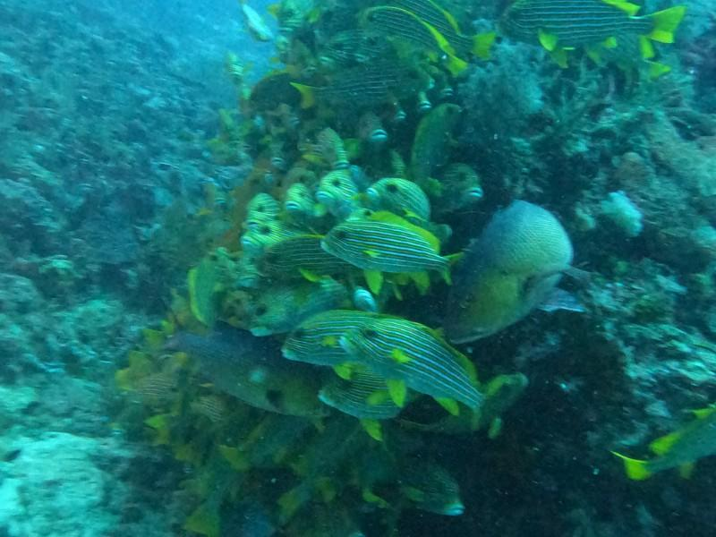

---
# Generated by Geminock v1.7 . cache_key='cd47f48772185ffc0812b75f88842535cd3927af52ef4bb220b0318ba5438231-de.yaml'
geminock_ver: '1.7'

# 🇩🇪♊ [Geminocks] Mein Tauchurlaub in Indonesien (dedupliziert!)
title: "🇩🇪♊ [Geminocks] Mein Tauchurlaub in Indonesien (dedupliziert!)"
date: 2023-01-30T21:17:43+01:00
draft: false
tags:
- geminocks
- German
- personal
- sport
- scuba
- rubyonrails
canonicalURL: https://medium.com/p/cf851f0f588/edit
hidden: false
# ANANKE :)
featured_image: "scuba--jo09uvup59g.jpg"
image: "scuba--jo09uvup59g.jpg" # tartaruga
#image: images/hugo-cocktail.jpg
#image: imagez/riccardo-smiles-swim-ironman.jpeg
#image: images/feature2/color-palette.png
Categories:
#- symlink
- holidays
#- rajaamapt
- rubyonrails
- code
images:
- scuba--rn7opz2oo.jpg
# - /scuba--rn7opz2oo.jpg
# - images/scuba--tnomzk5zfnr.jpg
# - /images/scuba--tnomzk5zfnr.jpg
# - hugo-cocktail.jpg
# - /images/riccardo/riccardo-smiles-swim-ironman.jpeg
# - "scuba--4kl75dqag8l.jpg"
# - "scuba--4rx3qr0wnkk.jpg"
# - "scuba--4s5obbog0je.jpg"
# - "scuba--7qqeh3owtge.jpg"
# - "scuba--92kef42brna.jpg"
# - "scuba--jo2nuuxek58.jpg"
# - "scuba--jo09uvup59g.jpg"
# - "scuba--ks67tanqqui.jpg"
# - "scuba--n82h94fc7s.jpg"
# - "scuba--tnomzk5zfnr.jpg"
---
Self: [https://medium.com/p/cf851f0f588/edit](https://medium.com/p/cf851f0f588/edit)
Status: Entwurf
Version: **0.1**

Hinweis: Dies ist ein [GDoc-Export].
---

<!--
{{with .Resources.GetMatch "scuba--rn7opz2oo.jpg"}}
  
{{end}}
-->

# Mein Taucherlebnis in Raja Ampat..

.. und wie ich nicht widerstehen konnte, eine Ruby on Rails Scooby-App zu programmieren

`TODO(ricc): Füge diese zwei tollen Videos irgendwie hinzu`

* https://studio.youtube.com/video/QW4XBtibFnk/edit
* https://studio.youtube.com/video/AG_IYhYl5u0/edit

---

Im Oktober '22 erlaubte mir meine ❤️ Frau, alleine in Raja Ampat tauchen zu gehen, das als Paradies für Taucher gilt! 

Ein wunderschönes und seltenes Tier, das in wenigen Jahrzehnten ausgestorben sein könnte, und neben ihm eine wunderschöne Meeresschildkröte im Dorf [Sauwandarek](https://www.google.com/maps/place/Sauwandarek+Village/@-0.5858766,130.6122214,13.42z/data=!4m13!1m7!3m6!1s0x2d5c3eaaccb47097:0x7851bd844c4cdf44!2sIsole+Raja+Ampat!3b1!8m2!3d-1.0320468!4d130.5052176!3m4!1s0x0:0xf11684dad6130be3!8m2!3d-0.5903592!4d130.6023098).

### Die Reise

Das ist Raja Ampat, westlich von Indonesien.

### Der Bungalow

Das ist die Insel Wai.

## Mein typischer Tag

Ich wachte zwischen 5 und 6 Uhr auf. Um 5 Uhr begann sich das Licht auszubreiten, und um 5:30 Uhr gab es Strom.

-  05:00

#### Die App

Ich begann morgens mit dem Tauchen und

#### Das Tauchen

Riccardo grüßt einen Wobbegong!

#### Rund um die Insel Wai

aaa

Congee und ich in Piaynemo

Pyaynemo, das Muss für Ihre RA-Reise.

#### Das Lernen

#### Fazit

*(Generated by Geminocks: https://github.com/palladius/ricc.rocks/tree/main/gemini prompt_version=1.4)*