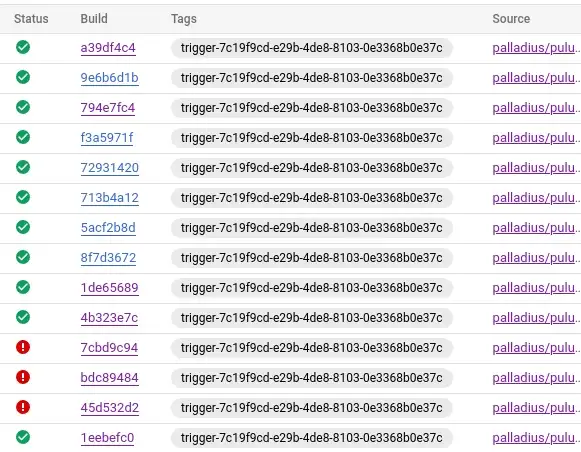
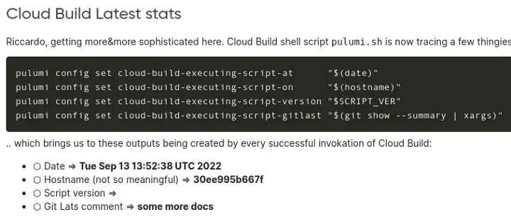
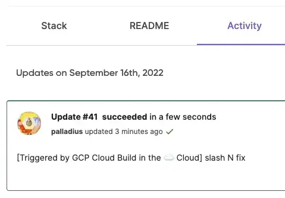

The Original article on Medium:  https://medium.com/google-cloud/setting-cloudbuild-with-pulumi-in-python-330e8b54b2cf

watch video



A couple of weeks ago, I fell in love with **Pulumi**. it has everything I wanted from Terraform: easy to set up, easy config management, a nice UI for free, and most importantly… language Support! Pulumi is the best invention after Buffalo Pizza and has only a problem.. [no Ruby support](https://github.com/pulumi/pulumi/issues/132) :/

Anyway, I’m so in love with ⬣ GCP (which happens to pay my salary, I got to admit), Cloud Build, Cloud Deploy, and in general CI/CD pipelines on Google Cloud that I wanted to give it a try. Googling “Cloud Build Pulumi” I got to this nice article for JavaScript, which is not in my chords.

## The code

My code is here: https://github.com/palladius/pulumi/tree/main/examples/python-gcp-cloudbuild-auto-trigger

Note: 👍 Code is finally building correctly. Yay!

## What is so special about the code?

The code allows any Pulumi project you might have on GCP (in Python 🐍) to set up a trigger to self-update. A push to the git repo will trigger a build job which — if successful — will login as yourself to Pulumi and issue an update with the new code.

So if, for instance, you commit a change that adds a GCS bucket to the code, in a couple of minutes that GCS bucket will be created and the README.md will be updated with builder parameters:

In bold you can see 3 parameters updated by Cloud Build itself!

My code supports **Github** (as is) and **Bitbucket** (code 99% there as it was working first!) for the moment.

I’ve also customized the message as per Laura article, prepending a “[built with Cloud Build]” to the git message (”slash N fix”, in this case):

## What does Pulumi mean?

I’ve been trying google Translate, it looks like it might mean broomstick (🧹) in hawaiaan or Burma (🇲🇲, now Myanmar). Until then, I’ll use the first emoji, until someone proves me wrong.

Edit: my friend Aaron from Pulumi confirms broom and points to [this article](http://joeduffyblog.com/2018/06/18/hello-pulumi/).

##  Next steps
My 📝 for the future includes:

* Having proper password/state setting on GCP via HSM or GCS.
* Transform into a module so whichever pulumi project you might have you can just invoke this code with 4–5 variables (github user, github repo, pulumi buidl directory, credentials, ..). I still need to see if this is viable also cross-language (non🐍).

## References

Original code (Cloud Build + Node.js): https://www.pulumi.com/docs/guides/continuous-delivery/google-cloud-build/

My code (python): https://github.com/palladius/pulumi/tree/main/examples/python-gcp-cloudbuild-auto-trigger

*Original article published on [Medium](https://medium.com/google-cloud/setting-cloudbuild-with-pulumi-in-python-330e8b54b2cf).*