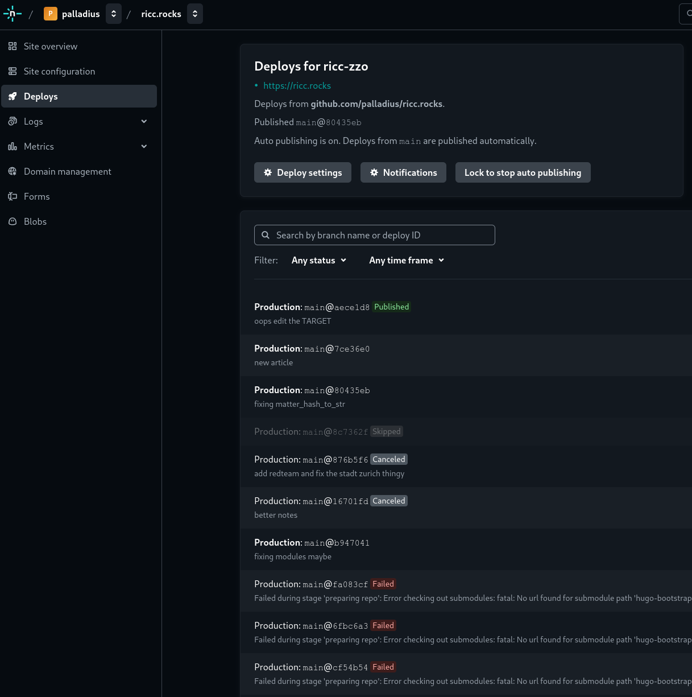

# Geminocks

https://ricc.rocks/ is an underlooked gem of precious content, and I'm not biased at all: it's my personal blog. 🤣

Inside you can find my family pics, my sport and hobbies, alongside my Google Cloud articles. Why? I just fell in love
with markdown and I've been directed by my colleagues to Hugo. As a rubyist, it feels like cheating on `jekyll`, I know.

## My Blog configuration

I use a very simple config:

* Github to store the code: https://github.com/palladius/ricc.rocks
* [Netfly](https://www.netlify.com/) to auto-build it (for free!)
* `ricc.rocks` domain to host it. And that's it.

## The language problem

However, a respected Blog should haver at least a version in English and one in your mother language (🇮🇹 in my case).

DHH infected me with DRY obsession, so now I can't live not-DRY. What if I manually translate content? Tomorrow I update the content and I have to update the translaton(s) too.
Plus I speak a few language, so this gets scary pretty fast. LLMs are good at translating, so how about I try to use Gemini instead to do the heavy lifting?

There are some challenges though: a Hugo markdown starts with the so called "Front Matter"; this contains some key values in YAML format.
I want to translate the whole page and leave the Front Matter intact. Will my LLM be up to the task? I found out it works pretty well until...
you try Jaspanese!

## Geminocks architecture

To run geminocks I had to put together a few pieces:

1. A bunch of DRY articles I want to throw to `N` blogs and translate to `M` languages.
2. A solid prompt to do this. See below
3. A solid language to do this (of course, Ruby)
4. A [caching](https://github.com/palladius/ricc.rocks/tree/main/gemini/.cache) mechanism. You don't want to call Gemini for N articles for L languages and have NxLx1000 token at every commit.
5. A solid testing system to make sure if the results make sense. I chose Promptfoo to test my prompts and I check with hugo if I can rebuild the site locally.

## Netlify

This is how Netlify looks like:



* At every commit, netlify executes the code you want, usually `hugo minify`.
* If you have an error, you can see where it sits. You can also try locally first. I tried to have one `make test` per repo.


### The prompt


### The Cache

The idea is simple: if input content doesn't change, HIT the cache. This serves two purposes:

1. Save money
2. If Gemini makes a small mistake, I just fix the japanese mistake in the cache file and the next push will send the
   Gemini+Riccardo edited markdown in prod.

Since I started with a YAMl containing all I needed: [French example (yaml)](https://github.com/palladius/ricc.rocks/blob/main/gemini/.cache/0a1091e0349af123a464233129bf22b0674da35e3d73bbb2d4e8166f0254124a-fr.yaml),
I decided to also save the full output, as it's a lot easier to double check: [same example (markdown)](https://github.com/palladius/ricc.rocks/blob/main/gemini/.cache/0a1091e0349af123a464233129bf22b0674da35e3d73bbb2d4e8166f0254124a-fr.yaml.txt)


## Testing the script

**How do you test an LLM output, and the prompt quality?**

Enter **PromptFoo**! Promptfoo is an amazing library where you can set up unit tests for your LLM output both in a deterministic
and LLMistic (pardon my neologisms) way.

If I want to ensure that LLM output is able to cope with Japanese (it got confused a few times).

Imagine you have a prompt which is parametric in Language, fullname (its always my name) and file content.

Well you can write things like:

```yaml

  - vars:
      language: japanese
      full_name: Riccardo Carlesso
      original_content: 'file://../../src/posts/medium/2022-09-12-GCP-CB-trigger-with-pulumi-python/index.md'
    assert:
      - type: llm-rubric
        value: |
          The Front Matter contains a `tag:` key and it contains 'geminock' and 'japanese'.
      - type: llm-rubric
        value: |
          The Front Matter contains a `title:` key surrounded by double quotes, ie a line of this type:
          title: "<some info here>"
          Inside the title there should be a flag of Japan.
```

Now an LLM will create (and cache!) the LLM content and perform these two tests. These tests come from my experience:
I noticed that when Gemini translates to Japanese, sometimes the title is not in form `title: "blah blah"` but in format
`title: blah blah` which doesn't work well with kanjis, so I want to make sure it's in double quotes.

This is a possible output:


## Next Steps

* Copy my source to more Hugo versions, since I haven't decided yet to go ZZO (my wife prefers another, and I probably
prefer the [bootstrap](https://hugo-bootstrap-ricc-rocks.netlify.app/) version); plus ZZO hasn't been updated in 3 years. Not a good sign.

