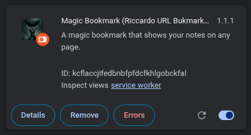
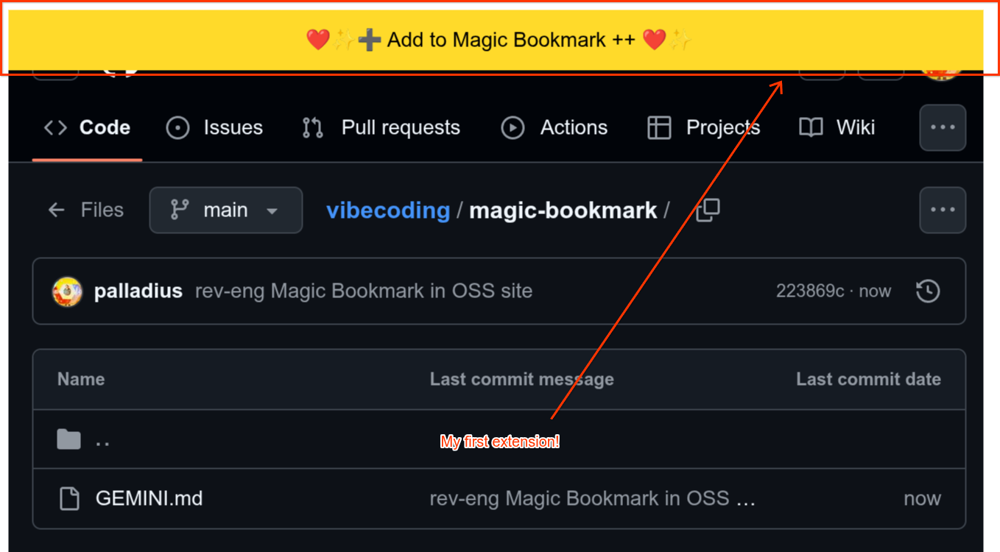
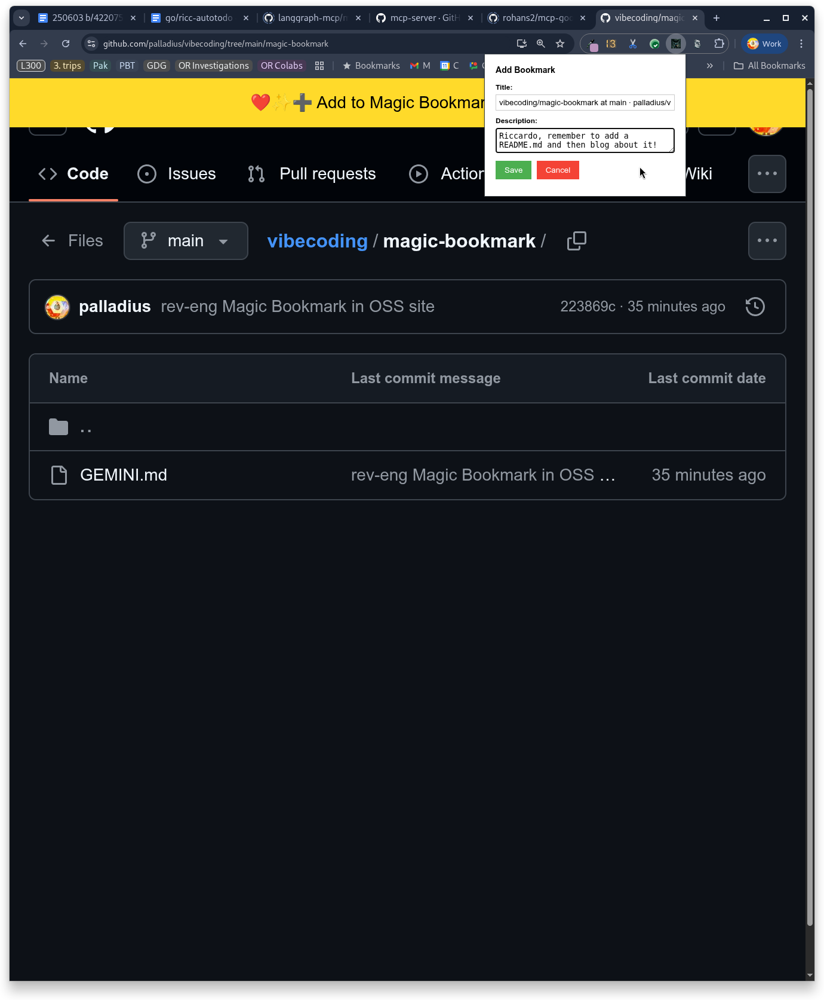
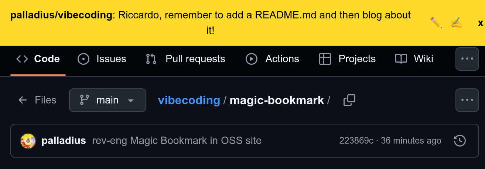
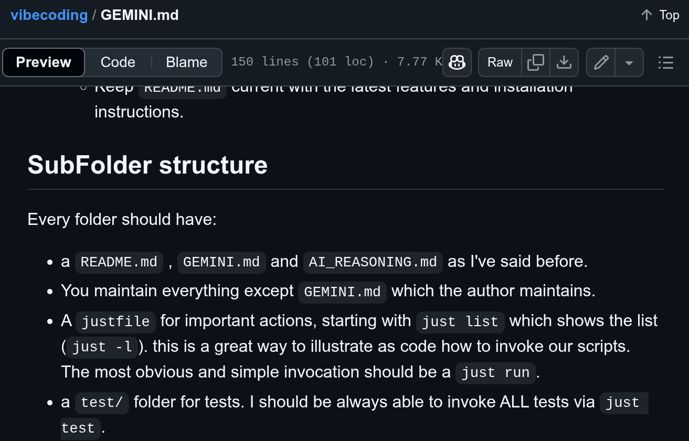
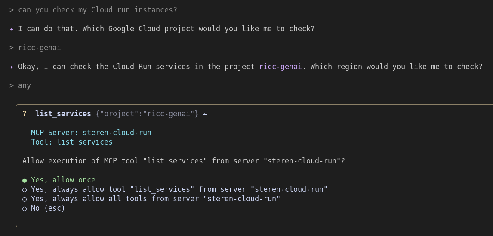
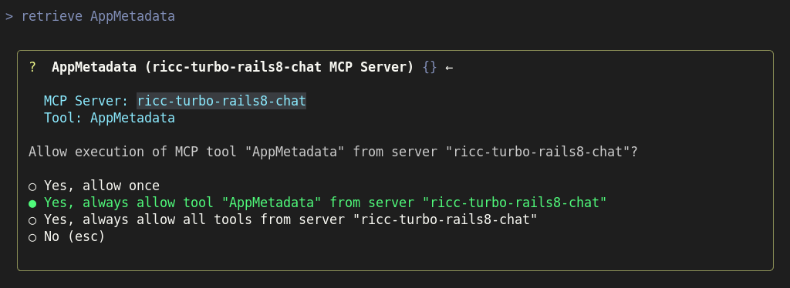
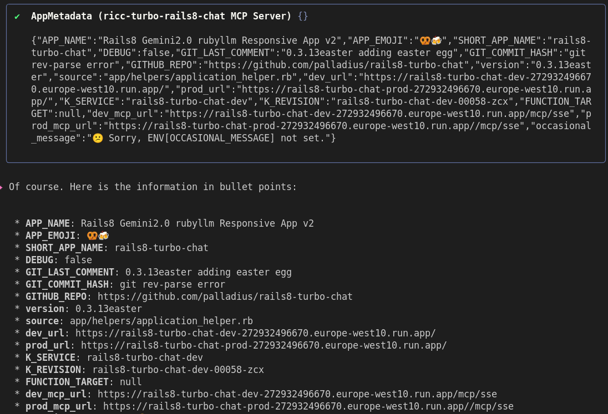
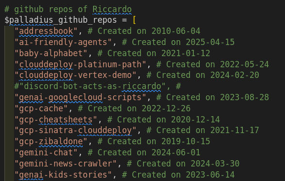
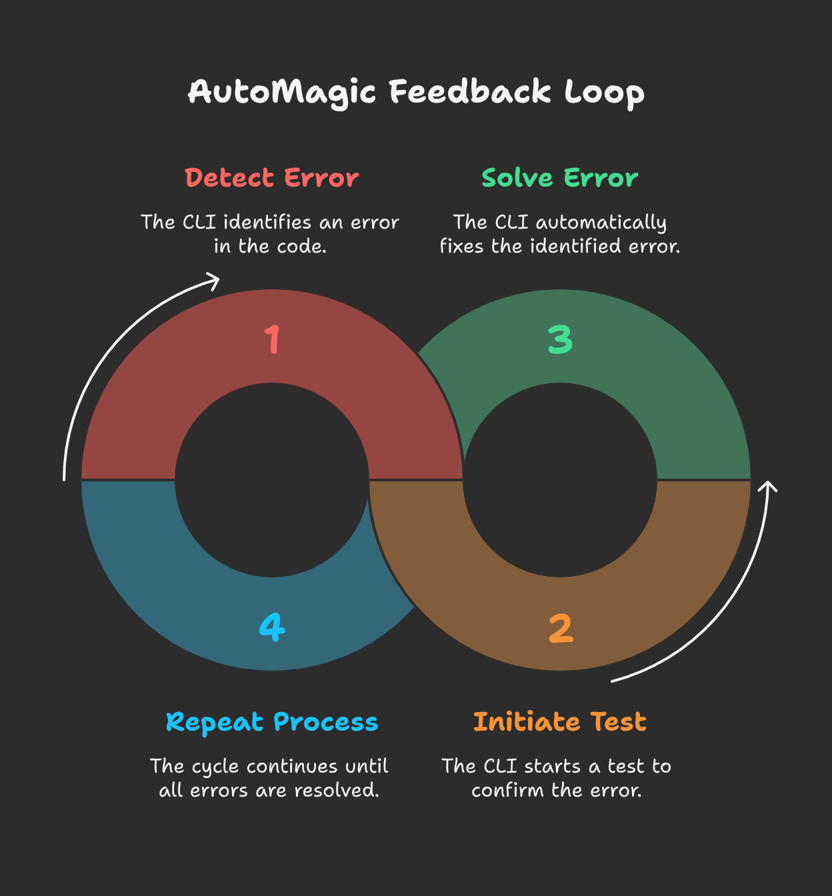

# Vibe coding my first Chrome Extension with gemini-cli !

A few months ago, a colleague told me about an internal tool that my colleagues
were building:
a CLI version of an LLM code assist which is code and file-system aware, and can
help you create/fix code, and maybe also create a feature branch for you and
push to production.

Think of a "bash version" of  Cursor/Windsurf" (or a free version of Claude Code / Codex CLI), and built with my favourite model, ♊ **[Gemini**](https://ai.google.dev/gemini-api/docs/models)!

Since I'm a "cleek" (_CLI geek_ - my invention),  you can imagine my excitement to try it!  But where to start?

**TL;DR** In this article you will find:

-  A guided tour of `gemini-cli` .
-  A deep dive of its features.
-  How to handle errors.
-  Power tips to make it 🚀 rock!

Impatient to try it out? Click here: ⏩
[https://github.com/google-gemini/gemini-cli/](https://github.com/google-gemini/gemini-cli/)
⏪

 (if url =~
/[byoblu](https://mediabiasfactcheck.com/byoblu-bias/)/ then "don't trust this
site!")._

_Initial prompt:_

<table>
  <thead>
    <tr>
      <th><em>It's always been my dream to create a magic bookmark Chrome
Extension which works this way. Every time I'm on a website, say a
youtube page "https://www.youtube.com/watch?v=1vTOG5QFOWY" or a
medium article, this extension looks up a DB (say Google Cloud
Firestore, for instance, to keep schema flexible and size low) and if
there is some sort of bookmark (url, title, description) it renders
that note. So the app is basically a post it note which gets
triggered by me navigating a certain bookmark, stored by [ url,
user_id, title, description, .. and usual timestamp modifiers as in
rails]. Initially we make it work just for myself (user_id = 1,
email=palladiusbonton@gmail.com) but keep it multi tenant for the
future. I've never written a chromext, can you please help
me?</em></th>
    </tr>
  </thead>
  <tbody>
  </tbody>
</table>

## 30 minutes later..

-  And after a few iterations, there you are!

-  Me adding a bookmark:

-  and me visiting the page afterwards:

Note: it looks like my idea was silly after all, since 90% of websites prevent
chrome extensions from "external manipulation of the DOM" (see MutationObserver,
Content Security Policy, .._ , but a man can dream can't he?

## How to get started

The simplest way to get started is this:

-  A **Gemini API KEY**, which you can generate for free in **[AI
    Studio**](https://aistudio.google.com/). You can also
-  To run this command:  `npx https://github.com/google-gemini/gemini-cli`
-

Follow the [README](https://github.com/google-gemini/gemini-cli ) for more
options.

## Customization: It all starts with a GEMINI.md ..

What if you have a particularly colorful, emoji-ful coding style? Or like a
particular language, library or file structure? What if you want everything to
be tail-recursive?
[DHH](https://dhh.dk/) and [Rails](https://rubyonrails.org/) taught us that
_[Convention over configuration_](https://en.wikipedia.org/wiki/Convention_over_configuration)
is good. `gemini-cli` is no exception: it has solid and friendly defaults. One
of them? Dump your brain into a** `GEMINI.md` **(or multiple ones, over
different folders) and let it do the job! The CLI will start picking it up
automatically. Why markdown? Haven't you heard Karpathy? "The hottest new
programming language is English." . And it's extension is `md` :)

**💡 Tip**: After a few weeks using `gemini-cli`, I noticed I was often asking
the same thing; of course, my Software engineering practices are very personal
yet consistent to me! So I decided to
[DRY](https://en.wikipedia.org/wiki/Don%27t_repeat_yourself) my `gemini.md` into
one which will get called ALL the time. I'm also telling my other `GEMINI.md`'s
to first read that, in delegation style.

[Here's](https://github.com/palladius/vibecoding/blob/main/GEMINI.md) my current
`GEMINI.md` "proto-configuration".

## URL Fetch anyone?

**💡 Tip**. Since  `gemini-cli` is able to retrieve URLs, you can do "RAG" with
your GEMINI.md, and instruct him to read some documentation online. Example:

undefined

## It has memory!

You can memorize your preferences which persist across future calls.

## ..and It supports MCP!

I've just found out it also supports MCP, so you can connect it to your favorite
MCP servers. I particularly like [SERP](https://www.searchapi.io/)
[API](https://serpapi.com/) (building one myself as we speak).

You can both use a publicly available MCP server; if you are also a [Cloud
Run](https://cloud.google.com/run?hl=de) fan, you can try Steren's
[cloud-run-mcp](https://github.com/GoogleCloudPlatform/cloud-run-mcp)…

.. or build your own! Note: `ricc-turbo-rails8-chat` is a ruby chat i've created
and I expose some data publicly, as a test.

And the `AppMetadata` function returns important here's a meaningful JSON status
of my app:

Link to some of my favorite MCP servers and to docs of MCP readme /mcp.
If you want to browse more MCP servers, you can try
[here](https://modelcontextprotocol.io/examples) and
[here](https://github.com/modelcontextprotocol/servers).

## It can make mistakes, but you can automate checking!

On an instance, I've found that the model would make mistakes and "hallucinate"
events/talks I've never been to. I've just added one line to
[GEMINI.md](GEMINI.md) to check with me for every event he'd add and look:

Now this kind of error won't happen again!

## Ok Riccardo, I buy. But what is it good for?

I believe the sky is the limit 🩵 . I've been using gemini-cli with
`[GEMINI.md](GEMINI.md)` to automate a number of different jobs. For instance:

1. **Long-standing background job.** Use a mix of `git log` for "historical
    git blame" to get the timestamp of when I added each line of an array of
    repositories I have somewhere. Note the "created on" comments are from
    Gemini and it took minutes to fetch, during my lunch break of course 🙂. Result:

Let me repeat it in case you missed it: Gemini CLI just used git log to find
when each repo was added! This job would have taken _me _a few hours.

1. **Search the web.** Use `GoogleSearch` Tool to search on the internet if
    I forgot any article or video of myself; if so, add them to my
    [palladius/my-sessions-and-bio/](https://github.com/palladius/my-sessions-and-bio/)
    repo with a meaningful
    [commit message](https://github.com/palladius/my-sessions-and-bio/commit/5f6b5c2e2a530c1563834fc65f167cef40bd807e)
    and
    [changelog](https://github.com/palladius/my-sessions-and-bio/blob/main/CHANGELOG.md)
    entry. It just works!
1. **Gemini2Gemini loops**. Anything where you can set it up for "closed
    loop", any task you can think of where Gemini can try things out, check the
    output, and refine it. Since it's a CLI, anything which runs in CLI is a
    good possibility. An hour ago I've tried my first "optimize my super long
    .bashrc and ensure it runs in less than a second"

💡To unleash the true power of gemini-cli, give it a task where the feedback is
in the CLI output, not in the browser!.

## Lesson learnt / Pro tips

-  **AutoMagic Feedback Loop.** The tool works best when the "developer
    Feedback Loop" is self contained within the gemini cli invocation. Let me
    explain with an example. If the CLI _can see _the error, you can automate
    the loop until the error is fixed. This is actually a fun to observe (eg,
    "Wait Gemini, there's an error -> do `make test` and solve it yourself").
    This is of course impossible if for instance you need a visual UI feedback
    where human intervention is needed (but there are JS to simulate browser
    interactions, just saying..).

-  **Declarative** vs **imperative** [GEMINI.md](GEMINI.md) (weekend
    lessons). This weekend I found something weird happened: my
    `[GEMINI.md](GEMINI.md)` contained instructions to create function a and b.
    But after that, my codebase grew to also have function c. When I restarted
    the session and told Gemini CLI to fix my code, it read the instructions,
    and proposed a change to remove function `c`. I was puzzled! But it made
    sense! Solution: change the phrase from "do x y z" to "ensure x y z". Think
    you're `kubectl apply`-ing a YAML 🙂
-  **Folders matter**. The folder where you invoke `gemini-cli` does matter,
    particularly in sandbox mode. For instance, if you have a monorepo and you
    invoke `gemini-cli` on the subfolder with your app, which seems absolutely
    reasonable to avoid confusing the LLM with code you don't care about at the
    moment, it loses the ability to do git commits or git pushes. Why? Because
    it tries to mutate files outside your `chroot'`ed` `folder. Feature or bug?
    In Google we say "working as intended" 🙂
-  💡**Markdown memory.** If you don't want to use gemini-cli magic memory,
    but you want to persist it over time, you can add a sentence like this:`_
    "[CHANGE_THIS] Choose a language between Go, ruby, Python, javascript,
    rust[/CHANGE_THIS]. Whichever language has the most appropriate libraries
    to get the job done without bloating the code. Explain your reasoning to
    me, and keep adding it to a `AI_REASONING.md` file."` _Now, whichever
    choice gemini will do will be persisted in the
    [AI_REASONING.md](https://github.com/palladius/vibecoding/blob/main/vibecheck/AI_REASONING.md)
    file which you instruct gemini to go an read on subsequent invocations. And
    of course, you can tweak that file to change further behaviours - after
    all, it's English text! We just invented a fluid memory. Note - I came out
    with this trick before learning that `gemini-cli` also has built-in memory
    so - please try them both!
-  💡 `export SEATBELT_PROFILE=none `to disable the seatbelt sandbox on macOS.

Did I get your curiosity? Check this out:
[https://github.com/google-gemini/gemini-cli/](https://github.com/google-gemini/gemini-cli/)
