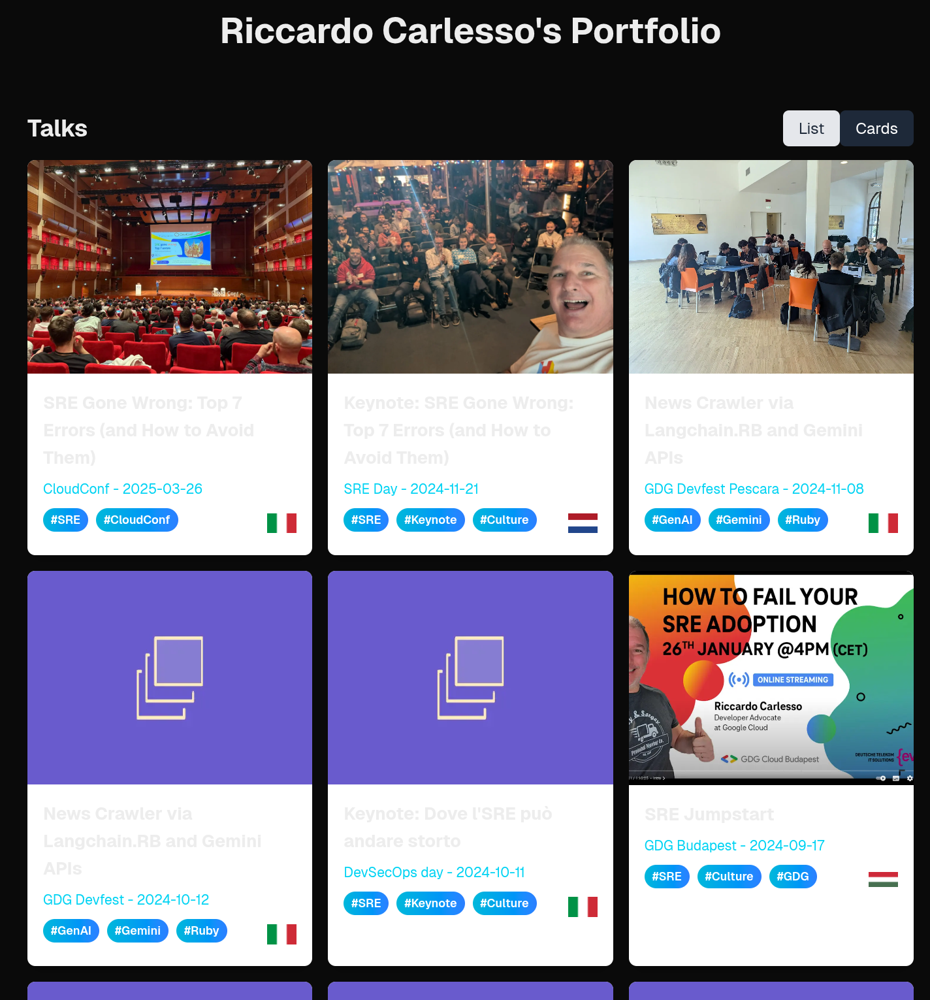

# Get started with gemini-cli: let's vibecode a Next.js app

On June 23rd, the DeepMind team has dropped a bomb 💣: `gemini-cli`!

I'm so excited to show you how it works so.. Why don't we code an application from scratch? I had this idea this morning of making a more complex and good looking version of [palladius/my-sessions-and-bio](https://github.com/palladius/my-sessions-and-bio) so.. Why don't we do it in a language that I don't speak?

What did you say, Latin? *Tamen Latine loquor*. Sorry, let's try something more esoteric and incomprehensible, like… Javascript!


For this test, I'm using:

-   `Gemini-2.5-pro-preview-06-05`

If you're curious, the final app: [https://portfolio-app-272932496670.europe-west1.run.app/](https://portfolio-app-272932496670.europe-west1.run.app/)

## How to get started

You can get access to Gemini CLI upon launch via either:
```bash
npm install @google/gemini-cli
```
or
```bash
npx @google/gemini-cli
```

## It all starts with a prompt..

You have an idea for an app? Put it in `GEMINI.md`. This should have both your schema/database requirements, functional and non functional requirements, UI, language and everything. In my case, I started with this:


Note the typo. Let's start coding!


Oh wow, first thing you do a README with a mermaid graph of your proposed schema?!? I dig that! Best start ever!


Then it adds a `justfile`, since i asked politely in the `GEMINI.md` file. Time to create the app (gemini chose **Next.js**):


And here's the first hiccup: Gemini tries to create the app in a non-empty directory, fails, and then course-corrects by moving the files, creating the app, and moving them back. This is the part I love the most: he tries, makes a mistake, and adjusts based on CLI output! All without me doing anything except ACCEPT.

## Populating the data

Next, we started populating the data, first into a YAML file, then to SQLite. Gemini created the `etc/data.yml` file and a script to import the data. I asked to rename the file to `.yaml` and Gemini did it, along with updating the import script.

Then we hit our first real error. I could have copied and pasted the error, but I decided to teach Gemini to fish.

> Dear Gemini, I can see there is a module not found error on UI (which you can't see). But the same error appears on `just run` . So I ask you: can you teach me to run npm in a way that we log somewhere under a git-ignored log/ folder which you can comfortably read and grep? Teach me how to run npm to dump its output to log so we can automate this.

And Gemini did it! It created a `log` directory, updated `.gitignore`, and modified the `justfile` to add a `run-dev` command that redirects all output to `log/dev.log`. This was a magic moment where I understood that he can find the errors and fix them himself!


## Pushing to the Cloud

With the app running locally, it was time to push it to the cloud. I asked Gemini to create a `cloudbuild.yaml` file and it even taught me how to configure my project. We hit a few bumps along the way, including some company policies, but Gemini was able to navigate them and get the app deployed.

We got interrupted a few times, but Gemini was able to pick up where we left off. I even added some information to `GEMINI.md` to help it, a practice I called "prompt reflection".

And finally... we're live!


## What about terraform?

I've always sucked at Terraform. What if the AI can do it for me? I asked Gemini to set up a Cloud Build trigger with Terraform. It was a dream!


## Back to the UI

With the CI/CD pipeline set up, we could focus on the UI. We added a footer, cards for the talks and articles, and even country flags for the events.



I wanted to automate image picking, so I asked Gemini to find a service that could take screenshots of URLs. It found one, and we were able to generate images for the articles and talks.


We added tests, a navigation bar, and an "About Me" page. We even made the app responsive, with a calendar view for upcoming talks.


## Test-Driven Development with Gemini

I found a regression in the API. Instead of just asking Gemini to fix it, I asked it to write a test first.

> Hey Gemini, I see there's an error in this URL: [http://localhost:3001/talks/2025-10-14-agents-on-a-plane-a-deep-dive-into-building-a-real-time-travel-agent](http://localhost:3001/talks/2025-10-14-agents-on-a-plane-a-deep-dive-into-building-a-real-time-travel-agent) Seems like the /talks/ route is broken. (1) can you verify this error yourself without me telling you? Show me the error you see. (2) can you first add a test that fails if this route gives 4xx/5xx? (3) after you show me that `just test` fails with it, please fix it :) And resist the temptation to fix it first! :)

Gemini crafted the test...


...and it failed, just as expected!


This is a great example of how you can use `gemini-cli` to follow a TDD workflow.

## The database is empty!

At some point, we realized the production database was empty. After some troubleshooting, we found the issue and fixed it. This was another great example of how Gemini can help debug complex issues.

## A big mistake… and a lesson learned

Gemini made a big mistake and tried to overwrite my `.env` file. I was angry, but it was a good learning experience for both of us. Gemini now knows to never touch `.env` files.


## The final result

After a lot of work, we have a beautiful portfolio app, built from scratch with the help of `gemini-cli`.


## Conclusions

We were able to:

1.  Create an app from scratch with `gemini-cli`.
2.  Set up Terraform for some of its infrastructure.
3.  Set up a working CI/CD pipeline.

## Lessons Learned

-   Teaching the AI to fish is more rewarding than endlessly copying and pasting error logs.
-   "Teach them to fish" became my mantra. It's about giving the AI the tools and context it needs to solve problems on its own.

## Get started with `gemini-cli`

You can get access to Gemini CLI upon launch via either:
```bash
npm install @google/gemini-cli
```
or
```bash
npx @google/gemini-cli
```
