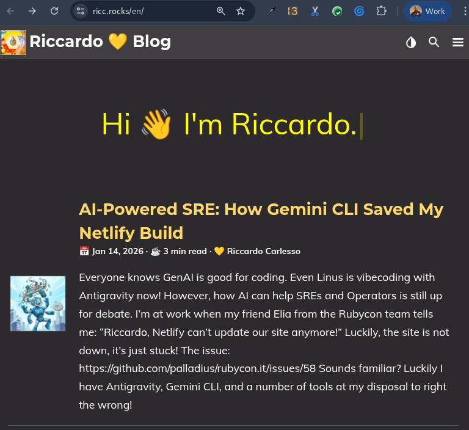

Everyone knows GenAI is good for coding. Even Linus is vibecoding with Antigravity now! However, **how AI can help SREs and Operators is still up for debate**.

I'm at work when my friend Elia from the Rubycon team tells me: *"Riccardo, Netlify can't update our site anymore!"* 

Luckily, the site is not down, it's just stuck! 


---


The issue: https://github.com/palladius/rubycon.it/issues/58 

Sounds familiar? Luckily I have **Antigravity**, **Gemini CLI**, and a number of tools at my disposal to right the wrong! Time to put my Ops hat on and fix this. So let's Start With...

```
$ cd ~/git/rubycon.it/
$ antigravity .
```


## Antigravity Keeps Me in the Loop

Antigravity is great at keeping me in the loop, and surviving software crashes and computer reboots.

I write lazily (I could be a CEO now!) on the right side of Antigravity:


> Help me troubleshoot this: https://github.com/palladius/rubycon.it/issues/58

After some thinking, Antigravity analyzes the issue, identifies the problem, and proposes a fix:


<!-- ## Fixing the Issue -->

Once the fix is ready, I simply tell Antigravity:

> Comment on issue 58 with: 1. what the problem was, 2. what your fix was. Ensure you sign yourself as Antigravity.

**Bham!** The comment is posted automatically.


Then:

> "ok git commit with gitmoji and push now!"

And we're done! The fix is deployed.


## Bonus: Adding a Sponsor

Meanwhile, a sponsor has paid us and wants their logo to be represented on our website! 

1. I file a GitHub issue: https://github.com/palladius/rubycon.it/issues/59 with a ZIP of their logo.
2. I tell Antigravity to take it from there. 
3. **4 minutes later**, the commit is done and online.
4. **1 minute later**, the change is documented on GitHub and the issue is closed. WOW!


### Wait a Minute... Sponsor asks for a change

The sponsor (Welaika) made a comment on GitHub about the wrong link. I open my Antigravity and:

> welaika made a comment on GH. PTAL at the comment and fix it pls.
> pls leave the LinkedIn link as a comment for future use.


A minute later... fixed!


And we're game! 🎮

## And now lets write a nice post about this..

*(yes, THIS post you're reading!)*

Houston we got a problem: 


As you can see from this image, Netlify is not updating our site and this article is only visible in localhost! 

Time to ask Antigravity in a new thread (yes, AG is multi threaded)! Let's attach this image and ask it to create an issue, and fix it!


=> https://github.com/palladius/ricc.rocks/issues/2

Now this was more complex, after a bit of back and forth, AG figured it out: 


And indeed... 


it worked, damn GLIBC! :) 

And finally, my article landed online on ricc.rocks, where most likely you're reading it!



## Conclusion (ricc TIODO change this)

This is how AI-assisted operations work in practice. With **Gemini CLI** and **Antigravity**, I can:

1. **Troubleshoot issues** faster by having AI analyze GitHub issues
2. **Implement fixes** with AI assistance
3. **Document changes** automatically
4. **Handle follow-up requests** efficiently

The future of SRE work is here, and it's powered by AI! 🚀

---

* Do you love `CLI`? Download Gemini CLI here: 
* DO you love `vscode`-type IDEs? Download Antigravity: it has Gemini CLI inside, like Tony Stark is powered by [Arc Reactor](https://ironman.fandom.com/wiki/.Arc_Reactor)
* Do you love **Ruby**? Want to know more about Rubycon? https://rubycon.it/

