Everyone knows GenAI is good for coding. I mean, even [Linus is vibecoding with Antigravity](https://news.ycombinator.com/item?id=46569587) now!

However, **how AI can help SREs and Operators is still up for debate**.

I'm at work when my friend Elia from the Rubycon team tells me: *"Riccardo, Netlify can't update our site anymore!"* 

Luckily, the site is not down, it's just stuck! 


In this article, we'll see how Antigravity and Gemini CLI can help:

1. Troubleshoot Netlify build issues, quite brilliantly.
2. Implement fixes and document changes for future reuse.
3. Build a **Post Mortem** (timeline + action items!) via **Custom Commands**. Use thw Workspace MCP to actually create a [Google doc](https://docs.google.com/document/d/1ba21A7ShDCqPhNBJxpH6sV3dSFQaOeDxy4VgrkurouM/edit?tab=t.0)!


---


The issue: https://github.com/palladius/rubycon.it/issues/58 

Sounds familiar? Luckily I have **Antigravity**, **Gemini CLI**, and a number of tools at my disposal to right the wrong! Time to put my Ops hat on and fix this. So let's Start With...

```
$ cd ~/git/rubycon.it/
$ antigravity .
```




## Antigravity Keeps Me in the Loop

Antigravity is great at keeping me in the loop, and surviving software crashes and computer reboots.

I write lazily (I could be a CEO now!) on the right side of Antigravity:

> Help me troubleshoot this: https://github.com/palladius/rubycon.it/issues/58

<!-- Testing Hugo's built-in figure shortcode -->


---

After some thinking, Antigravity analyzes the issue, identifies the problem, and proposes a fix:


<!-- ## Fixing the Issue -->

Once the fix is ready, I simply tell Antigravity:

> Comment on issue 58 with: 1. what the problem was, 2. what your fix was. Ensure you sign yourself as Antigravity.

**Bham!** The comment is posted automatically.


Then:

> "ok git commit with gitmoji and push now!"

And we're done! The fix is deployed.

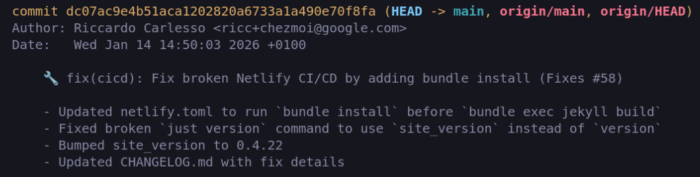

## Bonus: Adding a Sponsor

Meanwhile, a sponsor has paid us and wants their logo to be represented on our website! 

1. I file a GitHub issue: https://github.com/palladius/rubycon.it/issues/59 with a ZIP of their logo.
2. I tell Antigravity to take it from there. 
3. **4 minutes later**, the commit is done and online.
4. **1 minute later**, the change is documented on GitHub and the issue is closed. WOW!

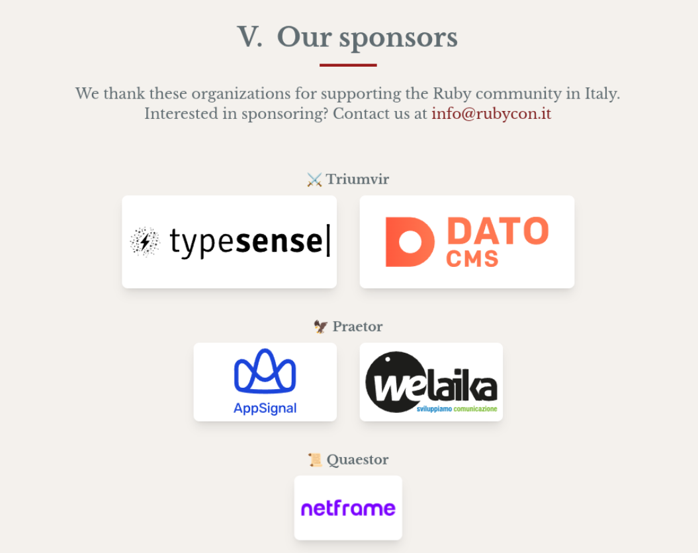

### Wait a Minute... Sponsor asks for a change

The sponsor (Welaika) made a comment on GitHub about the wrong link. I open my Antigravity and:

> welaika made a comment on GH. PTAL at the comment and fix it pls.
> pls leave the LinkedIn link as a comment for future use.


A minute later... fixed!

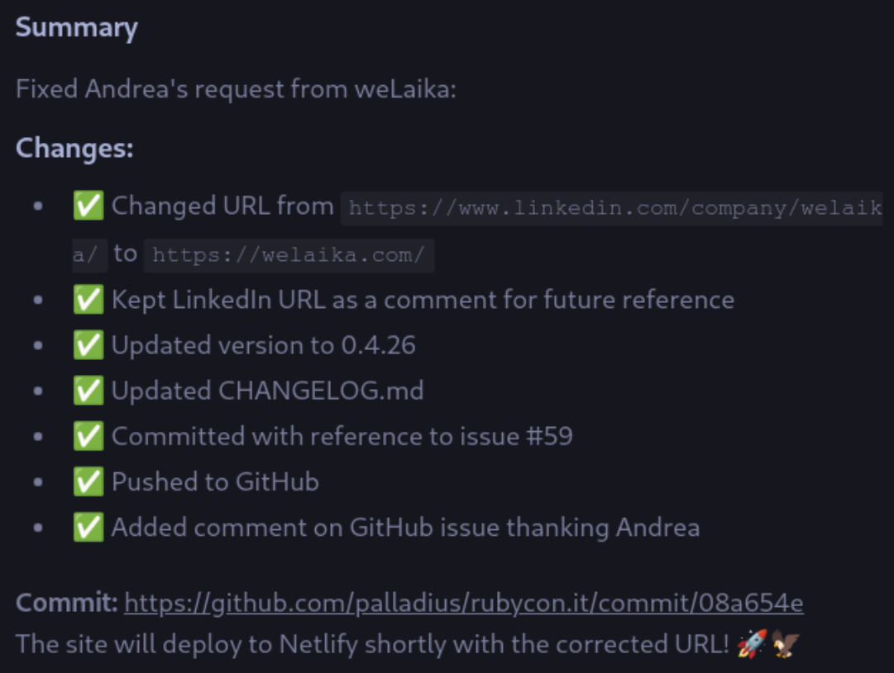

And we're game! 🎮

## Have I told you about that time I broke PROD?

> An Operator enters the bar and tells his friends *Have I told you about that time I broke PROD?*.
> His friends sit down and sip calmly their beer while waiting for a great story to be told.
> It starts like this...

I'm Riccardo, the kind of Engineers who commits to PROD, no PRs, no questions asked. 
Last Saturday, I mistakenly committed a new page and all of a sudden my website was all white! 
I'm not a chromatic snob, but I can tell if white over white is hard to read (when "Rubycon" reads "con").


But I'm also a tidy person, before fixing prod [I document it](https://github.com/palladius/rubycon.it/issues/57) and advise my friends on Whatsapp.

### The issue

As always, the problem was a commit: [`a61a79d`](https://github.com/palladius/rubycon.it/commit/a61a79d6e015bf4c8b05e2750fcee3342a89364a).
On Sat Jan 10 11:36:14 2026 I pushed a new Equity page and all of a sudden my website was all defaced!

### The solution

* I've asked Gemini to fix it, and it did.
* I've also asked it to write a mini Post-Mortem, and [it did](https://github.com/palladius/rubycon.it/blob/main/doc/post_mortems/20260110-css-outage.md).

I won't tell you how it did it, but it's the good old feedback loop: 
* check `git diff` for culprit (breaking change was minutes ago, after all!)
* check `curl localhost:8080` to reproduce the bad CSS until you fix it. This is a bit harder as the system has no EYES, but CSSs can be tested.

### The Post Mortem (via Custom Command)

Yesterday, I've open sourced a new Post Mortem Gemini CLI **Custom Command** *and* a **Skill**!. Today, I'll try to reproduce the PoMo and show you some magic here. Let's see it in action here:

> /sre:postmortem-create Look at breaking and fixing commits in https://github.com/palladius/rubycon.it/issues/57 and follow  
> the PoMo procedure to create a PoMo doc. Ignore doc/post_mortems/20260110-css-outage.md - you're smarter than that   

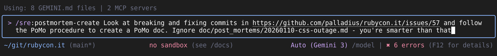

Code for `/sre:postmortem-create` Custom Command is available [here](https://github.com/palladius/gemini-cli-custom-commands/blob/main/commands/sre/postmortem-create.toml).

* Gemini CLI starts reading GitHub, and then starts looking at the two interesting commits:

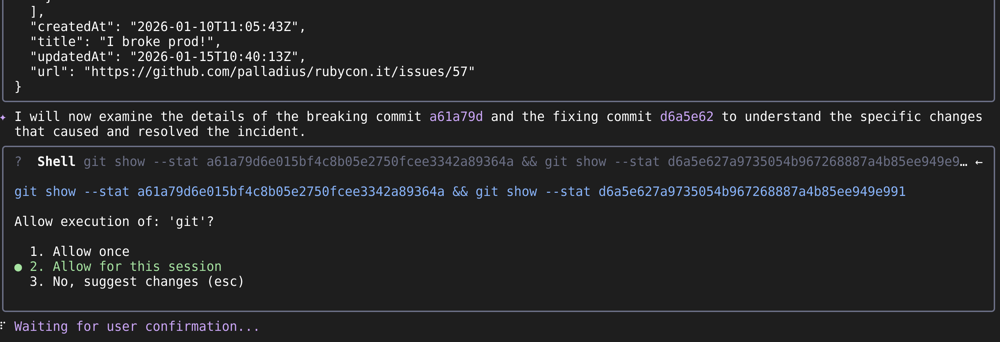

* It then createsd a CSV with the timeline, as instructed:

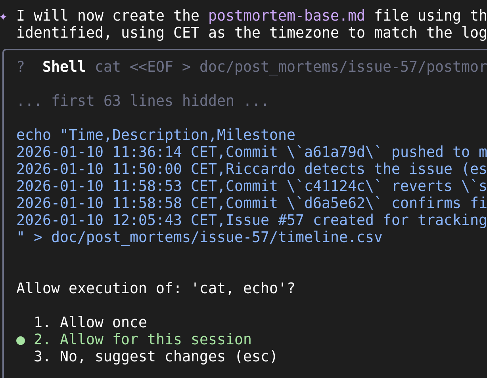

* 3. Updates the PLAN.md (stateful genius):


* 4. finalizes it all.


As you see, I've asked GianCarlo to use Workspace MCP to update. You canf ind Workspace MCP server here. It's maintained by my friend Allen.

* It first asks for permission: 

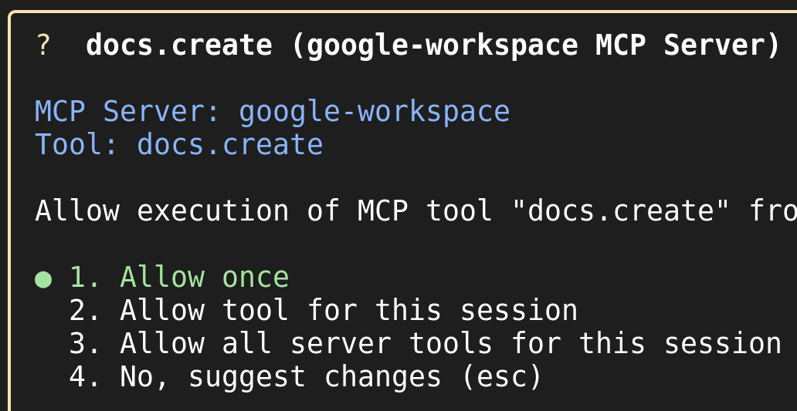

* It then goes on and...


* Gemini:  Would you like me to share it with anyone or file those action items as GitHub issues now? 🇮🇹🤌
* Riccardo: Yes why not. file AIs and then link them in the GDoc too.

And that's it! 

* [Google Doc created](https://docs.google.com/document/d/1ba21A7ShDCqPhNBJxpH6sV3dSFQaOeDxy4VgrkurouM/edit?tab=t.0):

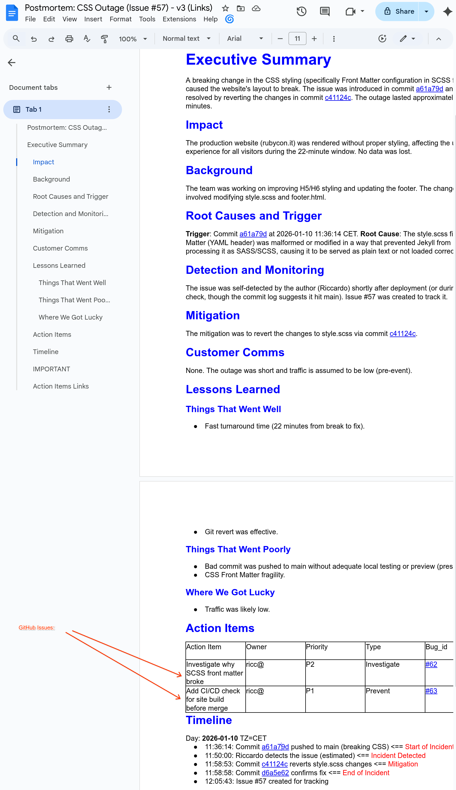

* 2 Action Items filed on GitHub:

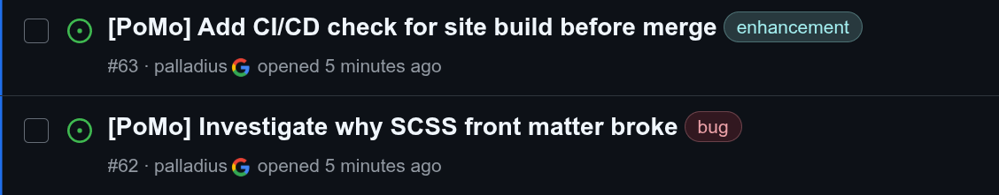

### Some final fun 🍌

> finally use Nano Banana MCP to create an image of the outage in the same folder!

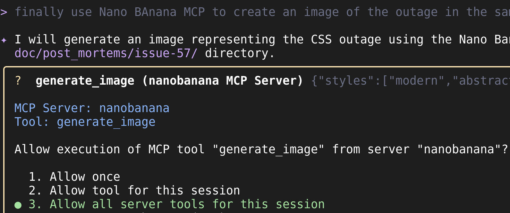

And the result is...

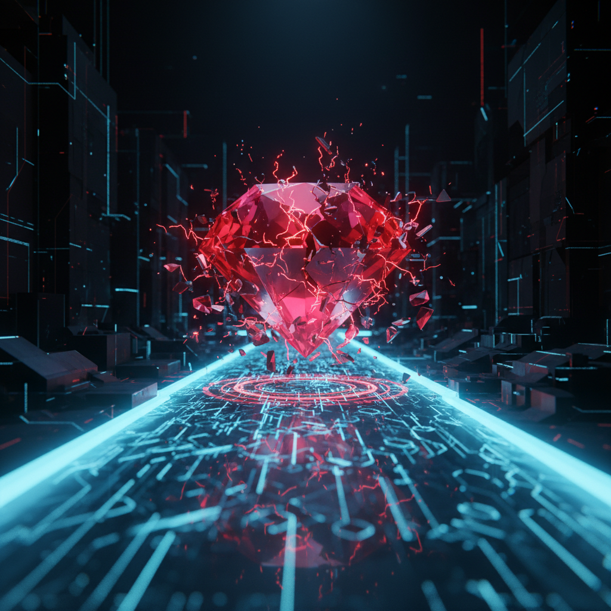

Good enough!

If you're interested, all steps are in: [doc/post_mortems/issue-57/](https://github.com/palladius/rubycon.it/tree/main/doc/post_mortems/issue-57). You can find the old PostMortem (created withut any CC) in [doc/post_mortems/20260110-css-outage.md](https://github.com/palladius/rubycon.it/blob/main/doc/post_mortems/20260110-css-outage.md).

## And now lets write a nice post about this..

*(yes, THIS post you're reading!)*

Houston we got a problem: 


As you can see from this image, Netlify is not updating our site ricc.rocks (to the right) and this article is only visible in localhost (to the left)! 

Time to ask *Antigravity* in a new thread (yes, AG is multi threaded)! Let's attach this image and ask it to create an issue, and fix it!


* Issue is created => https://github.com/palladius/ricc.rocks/issues/2

Now this was more complex, after a bit of back and forth, AG figured it out: 


And indeed... 


.. it works! Damn GLIBC! :) 

And finally, my article landed online on https://ricc.rocks/, where most likely you're reading it!


## Conclusions

This is how AI-assisted operations work in practice. With **Gemini CLI** and **Antigravity**, I can:

1. **Troubleshoot issues** faster by having AI analyze GitHub issues
2. **Implement fixes** with AI assistance
3. **Document changes** automatically. See [Issue #2](https://github.com/palladius/ricc.rocks/issues/2) for the fix and [Issue #3](https://github.com/palladius/ricc.rocks/issues/3) on how to do beautiful image captions with Hugo `figure`s ("go figure", literally!)
4. **Handle parallel requests** thanks to Antigravity's multi-threading.

The future of SRE work is here, and it's powered by AI! 🚀

---

* Do you love `CLI`? Download Gemini CLI here: 
* DO you love `vscode`-type IDEs? Download Antigravity: it has Gemini CLI inside, like Tony Stark is powered by [Arc Reactor](https://ironman.fandom.com/wiki/.Arc_Reactor)
* Do you love **Ruby**? Want to know more about its Italian conference? Check [Rubycon](https://rubycon.it/)

