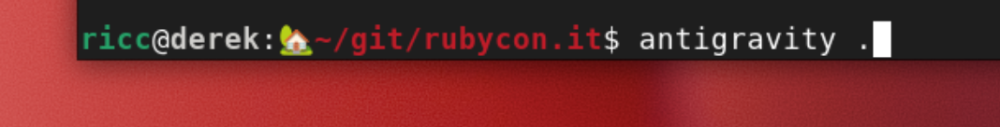

Everyone knows GenAI is good for coding. Even Linus is vibecoding with Antigravity now! However, **how AI can help SREs and Operators is still up for debate**.

I'm at work when my friend Elia from the Rubycon team tells me: *"Riccardo, Netlify can't update our site anymore!"* 

Luckily, the site is not down, but it's stuck! 


The issue: https://github.com/palladius/rubycon.it/issues/58 


Sounds familiar? Luckily I have **Antigravity**, **Gemini CLI**, and a number of tools at my disposal to right the wrong! Time to put my Ops hat on and fix this. So let's Start With...

```
$ cd ~/git/rubycon.it/
$ antigravity .
```



## Antigravity Keeps Me in the Loop

Antigravity is great at keeping me in the loop, and surviving software crashes and computer reboots.

I write lazily (I could be a CEO now!) on the right side of Antigravity:

> Help me troubleshoot this: https://github.com/palladius/rubycon.it/issues/58

After some thinking, Antigravity analyzes the issue, identifies the problem, and proposes a fix.

## Fixing the Issue

Once the fix is ready, I simply tell Antigravity:

> Comment on issue 58 with: 1. what the problem was, 2. what your fix was. Ensure you sign yourself as Antigravity.

**Bham!** The comment is posted automatically.

Then:

> "ok git commit with gitmoji and push now!"

And we're done! The fix is deployed.

## Bonus: Adding a Sponsor

Meanwhile, a sponsor has paid us and wants their logo to be represented on our website! I file a GitHub issue: https://github.com/palladius/rubycon.it/issues/59 

I tell Antigravity to take it from there. **4 minutes later**, the commit is done and online. **1 minute later**, the change is documented on GitHub and the issue is closed. WOW!

### Wait a Minute... Sponsor is Unhappy

The sponsor (Welaika) made a comment on GitHub about the link. I open my Antigravity and:

> welaika made a comment on GH. PTAL at the comment and fix it pls.
> pls leave the LinkedIn link as a comment for future use.

A minute later... fixed!

And we're game! 🎮

## Conclusion

This is how AI-assisted operations work in practice. With **Gemini CLI** and **Antigravity**, I can:

1. **Troubleshoot issues** faster by having AI analyze GitHub issues
2. **Implement fixes** with AI assistance
3. **Document changes** automatically
4. **Handle follow-up requests** efficiently

The future of SRE work is here, and it's powered by AI! 🚀

---

**Want to try Gemini CLI yourself?**

Get started with:
```bash
npm install @google/gemini-cli
# or
npx @google/gemini-cli
```
