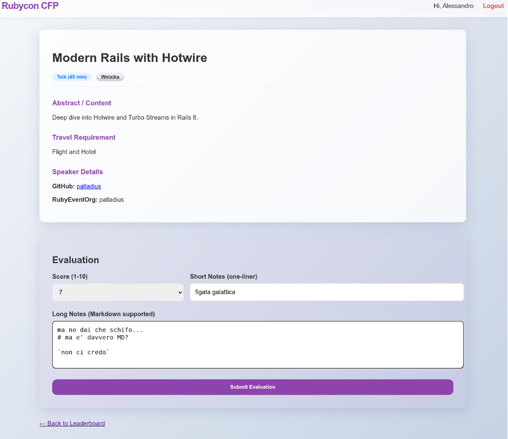

Today I want to share a story about speed, efficiency, and the future of coding. 

As you might know, I'm a big fan of Rails and I'm the co-organizer of the [Rubycon](https://rubycon.it/) Ruby conference. Last week we closed the [Call For Paper (CFP)](https://rubycon.it/cfp) for the conference and we received a lot of submissions. We needed to select the best talks and organize them in a way that makes sense for the conference schedule. 

Since this is the first time we've done this independently, we didn't have a dedicated platform. We asked people to shoot us an email with title, abstract and other info. 

**Bad idea.** We ended up with a massive, unmanageable spreadsheet.


Since I was "Friction Logging" my buddies Romin and Mete's great Codelab "[Build with Antigravity](https://codelabs.developers.google.com/building-with-google-antigravity#3)" for work, I thought to myself: *Python and Flask? No way! I'll build it with Rails 8 instead!*

I thought: **will AGY ([Antigravity](https://antigravity.google/)) be able to code something this ambitious for me?**

## The final result

For the impatient, here's the **final result** after 2 days of coding (but only 30 mins to get the MVP!):


My personal voting page (anonymized for privacy):


Final Selection review (anonymized):


## The Prompt

Here's my initial prompt, vaguely inspired by Antigravity's codelabs. 

> I would like to generate a website for Rubycon CFP evaluation for a 1-day technical conference informational site. 
> We have ~50 submissions to vote. Initialize it with `git` and keep doing micro-commits as you proceed.
> The website should have the following functionality:
> 1. A home page that shows login/logout, and the CFPs you need to still vote.
> 2. A login for people to log in (email, password, username). 
> 3. CFPs submissions should have the schema based on this page: https://rubycon.it/cfp
> 4. Every person can vote (1:many) a submission. This vote would have id, user_id, cfp_submission_id, score (1..10), short notes, long notes (MD).
> 5. The home page for a logged in user should have a Leaderboard of the TOP speakers.
> 6. Tech Stack: Ruby and Rails framework on server side. 
> 7. Test out the site on your own for all functionality and provide a detailed README.
> 8. Launch the web application for me to review.

This prompt took me 5-10min to write. I was pouring my heart and mind into it - a wrong word and the code would be messy! 

I set out to build a **CFP (Call for Papers) management application** called **Mecenate**. The goal? To have a fully functional app to handle conference submissions, evaluations, and speaker data in record time. 

* In **45 seconds**, AGY came up with a Rails 8 app with git initialized and a `README.md`.
* Within **5 minutes**, the app was up and running (no kidding!) and was ~80% done. It had a simple/pleasant interface. Only data was missing, some sample/fake CFPs were there:



* AGY then started running the app in `localhost:3000`, navigated it with the [Browser function](https://codelabs.developers.google.com/getting-started-google-antigravity#3), found some issues, and started fixing them from there! Within **30min**, the app was working with *fake data*.

## The gem: Antigravity in Playground mode 💎

This is Antigravity in Playground mode:


Here it's laying the foundations of the Rails app, and also the import jobs.

Once you create the app in playground mode, it lands in your filesystem. actually I asked AGY to create a private repo and push it there: it just worked!


## Bad news: Vibecoding and the 90% -> 100% gap

I read it everywhere and I don't want to lie: LLMs aren't able to get there yet. They're great at "vibecoding" a solution based on training material, so they'll do great for well known paths. However, they still struggle to integrate your *N* specific ideas without introducing inconsistencies.

**Tip**: Use Unit tests FTW and prompt the learnings somewhere and ensure your agents read those *first*.

With **Rails 8** providing the robust foundation and **Antigravity** (Google's advanced AI coding agent) as my pair programmer, we went from concept to a polished, feature-rich application in just about 30 minutes.

## The hard part: the data

We have submissions in two forms:
1. Lots of incoming emails. (Complete, but hard to parse)
2. A semi-curated spreadsheet with people's votes. (Structured, but incomplete)

My usual dilemma: Use the LLM to create **deterministic** code (parsing CSV), or use the LLM to look at stuff and come out **creatively** (reading emails)?

## Workspace MCP to the rescue

My buddy Allen has created a [workspace MCP](https://geminicli.com/extensions/?name=gemini-cli-extensionsworkspace) to interact with GMail, Drive and other Google services! I can ask Gemini CLI to just use it and read emails for me! 


I asked Gemini:
```
* use workspace MCP to read emails to rubycon.italy@gmail.com 
and return a list of emails which look like a CFP.
* maybe start dumping emails under a folder `emails/` 
and then we can sbobinate(*) them later
```

(*) *Sbobinate* is an italian word for "transcribing".


**Revolutionary.**

At the end of this step, I have a local list of all CFP emails in my file system, which I can feed to my Rails fixtures easily!

## Help! Data keeps changing!

We decided to keep the Spreadsheet as the master source for votes.
**Problem**: I didn't want to manually download a CSV every time.

I asked Antigravity:
> Ok now Write a script to dump the Spreadsheet into a CSV. I'll give u spreadsheet id, and i can create a service account, help me with it...

**Wow!** Antigravity did two things:
1. Created the Infra-as-Code on GCP (Enable APIs, Create Service Account).
2. **Coached me** into filling the gap (sharing the sheet with the service account).

After following the instructions, the script was ready.


.. and bingo! After 30 seconds, the code was there, and the script had the ability to see the spreadsheet, hence dump the CSV onto my fixtures folder! 

## The clear winner: Antigravity

Antigravity isn't just a code completor; it's a proactive agent. Here is how it transformed the workflow:

1. **Data Ingestion & Structuring**. It wrote a script to parse unstructured text from emails, extracting titles and abstracts, and populated the `submlissions/` directory with formatted YAML files.
2. **Mix AI and Determinism**. I love it when an LLM can help me **deterministically** dump 50 emails, and then **non-deterministically** fill in the gaps (nationality, company, GitHub username).
3. **Polish & quick UI**. A functional app doesn't have to look bad. We used modern CSS (and a bit of Rails magic) to make the dashboard pop.

### The "Wow" Moment

The real magic happened when I realized I wasn't just typing code; I was *directing* development.

When I asked to "Symlink Submissions to Sbobination," Antigravity understood the intent: strictly coupling the data sources to prevent drift. It executed the file system operations safely and verified the links. Now both PROD and DEV environments point to the same ***grounded*** data source.

## Conclusion

Building **Mecenate** in 30 minutes wasn't about typing fast. It was about leveraging **Rails 8** for the structure and **Antigravity** for the execution.

We moved from loose text files to a database-backed, aesthetically pleasing, and functionally complete application in less time than it takes to watch a sitcom episode.

*   **Rails 8** provided the rails.
*   **Antigravity** provided the engine.
*   **I** provided the destination.

This is the new standard for rapid application development.

More on [Antigravity Codelabs](https://codelabs.developers.google.com/building-with-google-antigravity).

<br/>

**P.S.** To take screenshots for this article *without* violating the privacy of my people, I simply asked Antigravity to create an "Anonymize" button. It did it in one shot.


