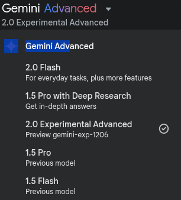
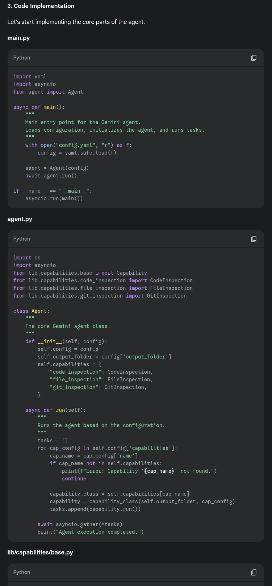

---
#########################################################
# Article note: this was written at manhouse
#########################################################
title: "Using 'gemini-exp-1206' model to write code as a pro in 2025.."
subtitle: TODO subtitle
date: 2025-02-03T12:17:43+01:00
draft: false
#image: /gallery/midjourney/PalladiusFigata_a_fantasy_imagination_of_ancient_mayan_city_if__f699b7ca-43d9-4d2a-b2ee-2022a0317e01.png
tags:
- gemini
- generative AI
- agents
categories:
- gemini
- google
- technology
---

I've been discussing with colleagues and friends how Gen AI is able to revolutionize code writing. Some people use embedded coding auxilia (Gemini Code, copilot, Cursor, ..), some use just a browser window to get snippets of code which they cut and paste into the IDE (what can go wrong, right pythonists?).

This article is about sharing lessons learnt in my journey as the **perfect lazy developer** (*minimum effort, maximum rendering* - as we say in Italian).

## Using Gemini to write code

I've been prompting gemini for a while, and started copying my prompts for future reuse.

For this article, I'm using the latest spectacular `gemini-exp-1206`:



# Prompt Idea 1: Build Python Agent with LangChain

This is my first idea: show me what can be done with langchain

## 🧐 Prompt 1: Build Python Agent with LangChain


> I would like to create a python agent using langchain and gemini. The code should be4 modular (smaller files under lib/). The agent might inspect code in a local folder and do things given a generic prompt like """identify TODOs , propose code changes based on TODOs and create unit tests""".
> The agent should be able to:
> 1. take an input prompt from CLI
> 2. start doing stuff asynchronously.
> 3. Come back when done in STDOUT, but also create hidden files in output based on its search. Something like `.agent-findings.md` but also create new files which can't be confused from user files. Example: I write main.py , agent writes "main_test._agent_.py" so we're sure the agent will skip its own files and wont create recursively files based on those.
>
> Can you help me draft it?

## Answer

Okay, I can help you draft a Python agent using LangChain and Gemini that meets your requirements. Here's a modular structure and code outline, broken down into files under a lib/ directory:

Project Structure:

```bash
agent_project/
├── lib/
│   ├── core.py        # Main agent logic, orchestration
│   ├── tools.py       # Custom tools for LangChain (code inspection, file creation)
│   ├── prompts.py      # Prompt templates for Gemini
│   ├── utils.py       # Utility functions (file handling, naming, etc.)
├── main.py         # CLI entry point
└── requirements.txt
```

Code Outline:

1. `lib/core.py` (Main Agent Logic):

[...]
...

## Conclusions

This didnt perform great.

Negative:

* Langchain didnt really work. Wanted to use gemini 1.0 and the code for LC+GEM didnt really work.
* it implemented TODOs as code, whereas this should have been more fluid.

Positive

* Code outline is awesome.
* However, plenty of lessons learnt and I can reuse part of the prompt!

# Prompt Idea 2: Build a Gemini-Powered Code Analyzer


## 🧐 Prompt 2: Build a Gemini-Powered Code Analyzer

I wanted to be able to create an extensible, multi-capability, file utility powered by Gemini. It should be able to
analyze code, know diffs thanks to git, and also know if files are OLD so my diabolic idea is to give it my 104 git repo folder
and tell me "this code is obsolete -> forget about it" vs "this code is awesome and was last edited a few months ago". My diabolic
plan involves also, somdeay, to create a standard, maintainable, `blueprint.yaml` which i can parse with things that a robot can do better than me like:
name and author of the project, abstract of what it does, last commit date, last file date, ...

```markdown
I would like to create a python agent using gemini (and langchain framework if needed). The code should be modular in implementation (smaller files under lib/, capabilities under lib/capabilities/ ). The agent might inspect code in a local folder and do things given a generic prompt like """identify TODOs , propose code changes based on TODOs and create unit tests""". The agent should have these core capabilities (but also be extensible):

* Capability 1: `code_inspection`. Inspect a folder recursively and take a look at the code, and answer a generic "prompt" passed to it ("find todos", "find snippets of code you suggest to refactor", "does this code work?", ..). This might just be
* Capability 2: `file_inspection`. Given a folder, take a look at files statistics, and output a tree structure with the files last_modified_date. This tool is important to understand if code is still being maintained or passe'
* Capability 3: `git_inspection`. Given a folder, and a prompt, take a look at files vs current git branch - are they modified? Is the new code better than the old one? Should we commit this code or not? What is a good git commit message for this delta? Make sure to ONLY include files diffed under this input folder, not ALL the files in the git repo.

The code should be able to act asynchronously so we can launch different analysis in parallel. Each analysis should be a markdown and in an output folder, (default: 'out/' ) with a subfolder per capability (eg, "out/cap1-code-inspection/README.md"). If a capability needs to output multiple files, it will do so under that deterministic "out/CAPABILITY_FOLDER/", if not it will use `README.md`.
When the code has finished, it will return in stdout.

The code will take in input a YAML file containing an array of capabilities and the parameters (folders, prompts) from me. Please populate a reasonable YAML for me and let's start coding it together.

Can you help me draft it?
```

### Gemini output

I really liked the orderly outline it produced in a few seconds:

File outline:

```bash
# Folder outline
gemini-agent/
├── main.py          # Main entry point for the agent
├── agent.py         # Core agent logic
├── config.yaml      # Configuration file (input for the agent)
├── requirements.txt # Python dependencies
├── lib/             # Core libraries and utilities
│   ├── __init__.py
│   ├── utils.py     # General utility functions (e.g., file I/O, logging)
│   └── async_utils.py # Asynchronous operation handling
└── lib/capabilities/ # Specific capabilities of the agent
    ├── __init__.py
    ├── base.py      # Abstract base class for capabilities
    ├── code_inspection.py
    ├── file_inspection.py
    └── git_inspection.py
```

I also asked him to give me a configurable YAML so he writes down great default ideas for me, which I then can easily change.

```yaml
# agent2_config.yaml
output_folder: "out/"

capabilities:
  - name: code_inspection
    folder: "./my_code_project"
    prompt: "Identify all TODOs in the code and suggest improvements."
    output_subfolder: "cap1-code-inspection"

  - name: file_inspection
    folder: "./my_code_project"
    output_subfolder: "cap2-file-inspection"

  - name: git_inspection
    folder: "./my_code_project"
    prompt: "Analyze modified files against the main branch. Suggest a commit message."
    output_subfolder: "cap3-git-inspection"
    base_branch: "main" # Optional: Specify the base branch for comparison
```

then Gemini starts to blurb out all the files, which is handy to cut and paste 1by 1:



## 2 to 3 lesson learnt


I noticed that Gemini doesn't know how to code Gemini (AGI is still a couple of months far, so it's been likely trained on a previous model).

**Problem**. I have Gemini 1.5 and 2.0 available, but Gemini insists to use `gemini-1.0` model as the only prod one (it's actually getting deprecated soon).
How do we solve it? Let's inject our "superior" knowledge (we're just 1 year ahead) into it.

Luckily our [public docs rocks](https://ai.google.dev/gemini-api/docs/sdks), so  better to give it the code from https://ai.google.dev/gemini-api/docs/sdks

## 🧐 2.5 Prompt addon

For Gemini code generation, please use and trust this code snippet:

```
# From https://ai.google.dev/gemini-api/docs/sdks
# Install: pip install google-genai dotenv

from google import genai
client = genai.Client(api_key='GEMINI_API_KEY') # take it from ENV or .env via dotenv
response = client.models.generate_content(
    model='gemini-1.5-flash', contents='How does RLHF work?'
)
print(response.text)
```


# Lessons learnt

* Ask Gemini to break down the mono-file into **smaller pieces**. This will work well with a yet-incredibly high context
  window of 1MB - and when the window fails you, you can still paste the small part of it and gemini will pick it up likely
  from where you left.


## ricc TODOs

* Add code from `~/git/blahblahpoo/20250201-code-agents` to github.
