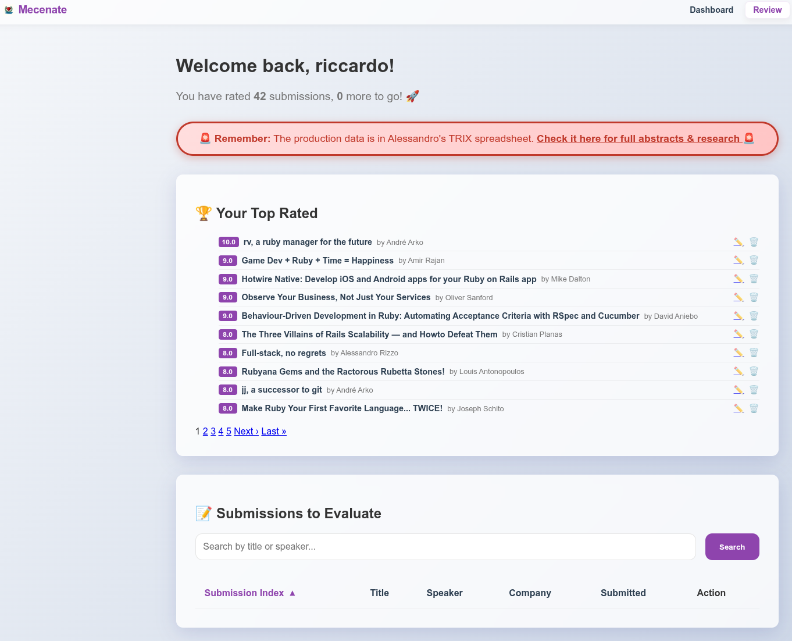

# AI Reasoning

## Context
The user requested a blog post titled "How I coded a Rails 8 CFP app in 30m with Antigravity".
The user provided a memory reference to `gemini-cli` and an `output.md`, but the current task is clearly about the "Mecenate" Rails 8 CFP app which we have been working on in recent sessions.

## Strategy
1.  **Analyze History**: I reviewed the conversation history to identify the key actions taken on the "Mecenate" project.
    *   Identified features: CSV parsing, Sbobination (symlinking), Scholarship renaming, Sponsorship toggle, Dashboard stats.
    *   Identified stack: Rails 8, Antigravity.
2.  **Synthesize Narrative**: I structured the blog post to follow a "Problem -> Solution -> Tech Stack -> Execution -> Result" flow.
    *   Highlighted the "30m" aspect by emphasizing the speed of specific tasks (e.g. "In moments, it wrote a script...").
    *   Focused on the "Pair Programming" aspect of Antigravity.
3.  **Tone**: Kept it enthusiastic, professional, and personal ("Riccardo's style").

## Content Decisions
*   **Excluded**: Game development tasks (puzzles, electron app) as they are likely separate from the "Rails 8 CFP app".
*   **Included**: Specific technical terms like "Sbobination", "YAML", "Symlink" to give the article authenticity and depth.
*   **Formatting**: Standard Hugo markdown with frontmatter.

## Next Steps
*   User can review and publish.

App is in Derek in `~/.gemini/antigravity/playground/hidden-nova`

