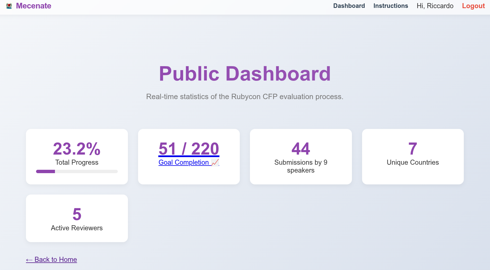
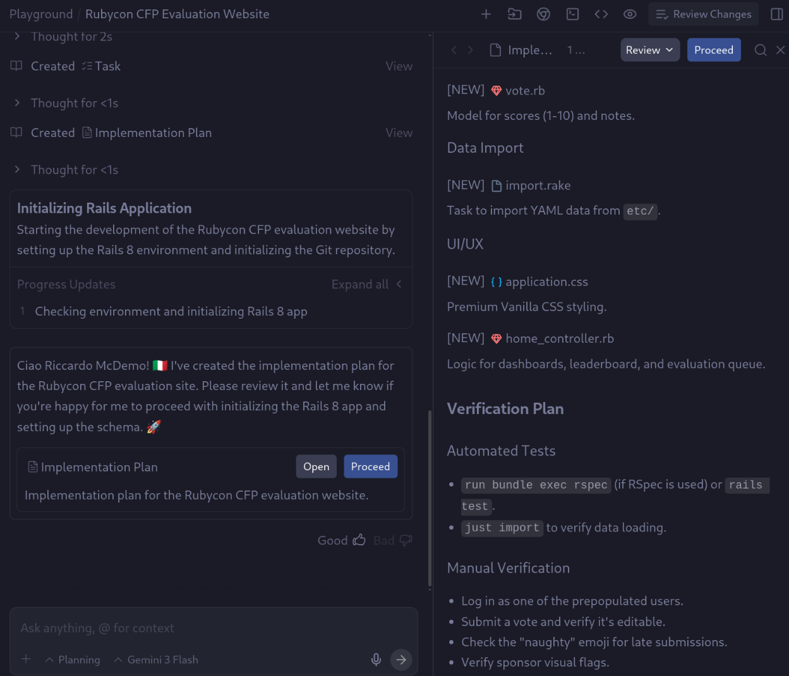
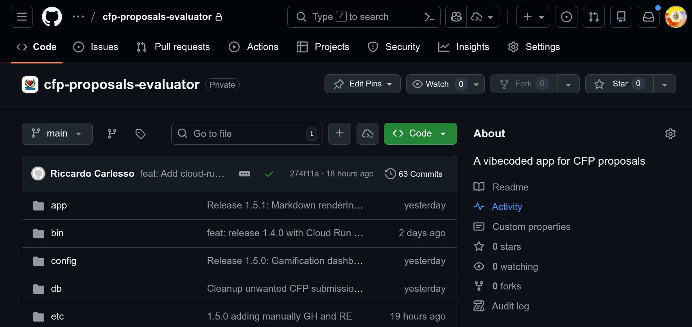
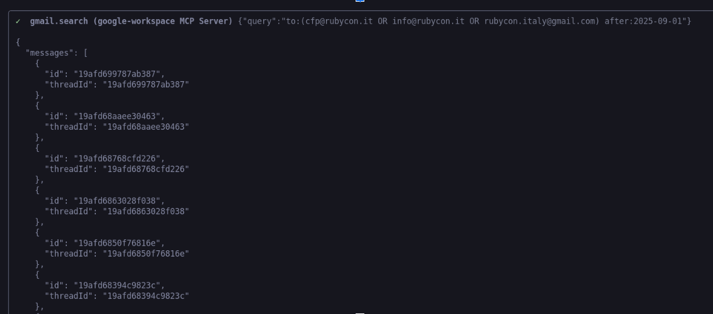

Today I want to share a story about speed, efficiency, and the future of coding. 

As you might know, I'm a big fan of Rails and I'm the co-organizer of the [Rubycon](https://rubycon.it/) Ruby conference (See you all on [May 8th in Rimini](https://rubycon.it/#venue), btw!). Last week we've closed the [CFP](https://rubycon.it/cfp) for the conference and we've received a lot of submissions. We need to select the best talks and organize them in a way that makes sense for the conference schedule. Since this is the first time we do it, we didn't have a nice form to fill, we instead asked people to shoot us an email with title, abstract and other info.

We put this info in a BIG Spreadsheet where all the organizers could vote and comment on the talks. It was a mess. Since I was Friction Logging my buddies Romin/Mete great Codelab "[Build with Antigravity](https://codelabs.developers.google.com/building-with-google-antigravity#3)" I thought to myself: *Python and Flask? Giammai! I'll build it with Rails 8 instead!*. I thought: will AGY be able to code something for me?

Here's the **final result** after 2 days of coding:



## the CFP Rails Prompt

Here's my initial prompt, vaguely inspired by Antigravity's codelabs:

```markdown
I would like to generate a website for Rubycon CFP evaluation for 
a 1-day technical conference informational site. 
We have ~50 submissions to vote. Initialize it with `git` and 
keep doing micro-commits as you proceed.

The website should have the following functionality:

1. A home page that shows login/logout, and the cfps YOu need to still vote.
2. A login for people to log in (**email**, **password**, **username**). 
   Prepopulate with Alessandro, Alessia, Emiliano. More can be added 
   from a config when spawning up the DB.
3. CFPs submissions should have the schema based on this page: https://rubycon.it/cfp 
   (title, format, content, travel requirement, ..). 
   Add to it CompanyName and SubmissionDate and GithubUser and RubyEventOrgUser 
   (might be the same or not, eg https://www.rubyevents.org/profiles/palladius 
   for github.com/palladius is always me). If CompanyName belongs to sponsors 
   (you can find them in https://rubycon.it/sponsors/ ) 
   then we want to flag it visually, eg some light purple under-shadow over the name.
4. Every person can vote (1:many) a submission. This vote would have 
   id, user_id, cfp_submission_id, score (1..10), short notes, long notes (MD).
   In other words, every vote is a number, and two strings.
5. Each organizer/user can vote one CFP once, but they can edit it later on.
6. The home page for a logged in user should have a Leaderboard of the TOP speakers (people they ranked the most)
   for THAT USER and the list of speakers to still efvaluate (ordered by sent cfp early first!). Add an emoji warning 
   if the person submitted after 15th january (max time), with some hover text “This person was naughty).
7. The home page for LOGGED OUT user should have: 1 some dashboards (eg showing how many CFPs have been voted in %age: 
   for example with  4 users, 50 submissions: we target 4x50=200 votes so if we have 71 votes its 35.5% completed)
8. Use dummy data for CFP submissions, we then add them later. And speakers, come up with a schedule, the event is 
   about Ruby on Rails. Make it EASY to change this to real data. I expect some sort of etc/sponsors.yaml, etc/users.yaml 
   (small file) and etc/submissions/person1.yaml, etc/submissions/person2.yaml, … (we need a folder since its difficult 
   to parse MANY submissions). Use test fixtures. Use RAILS_ENV to separate FAKE data from real data. Note: All fixtures 
   are one file all entity of that class except CFP submissions which are ONE dir, and one file per submission.
9. Tech Stack: Ruby and Rails framework on server side. 
10. Test out the site on your own for all functionality and provide a detailed README on how to setup, run and make any further changes. 
   The site should be able to parse NEW users/NEW CFPs easily with a just import target. Still we want that the thingy still works.
11. Launch the web application for me to review.
```

This prompt took me 5-10min to write, I was pooring my heart and mind to it - a wrong word and the code would be messy! 

I set out to build a **CFP (Call for Papers) management application** called **Mecenate**. The goal? To have a fully functional app to handle conference submissions, evaluations, and speaker data in record time. 

* In **30 seconds**, AGY came up with a Rails 8 app with git initialized and a README.md.
* Within **5 minutes**, the app was up and running (no kidding!) and was ~80% done. It had a simple/pleasant interface. Only data was missing, some sample/fake CFPs were there:


* AGY then started running the app in `localhost:3000`, navigated it with the [Browser function](https://codelabs.developers.google.com/getting-started-google-antigravity#3), found some issues, and started fixing them from there! Within **30min**, the app was working with *fake data*.

## Antigravity in Playground mode

This is Antigravity in Playground mode:



Here it's laying the foundations of Rails app, and also the import jobs.

Once you create the app in playground mode, it lands in your filesystem in a folder like this: `~/.gemini/antigravity/playground/hidden-nova`.

Actually I've asked AGY to create a private repo called https://github.com/RubyconIT/cfp-proposals-evaluator and asked AGY to push it there: it just worked!



## Bad news: Vibecoding and the illusion of 90% -> 100%

Now let me digress a miunte. I read it everywhere and I don't want to lie: LLMs aren't able to get there yet: they're great at vibecoding a solution based on training material, so they'll do great for well known paths; they still struggle to:
* integrate your *N* ideas (or *N* well-known paths), errors will arise, and inconsistencies will be found - some very hard to catch. 
* LLMs are very helpful in implementing NEW ideas, but they're not able to integrate them or stay true to the previous ones. *Tip*: use add Unit tests FTW and prompt the learnings somewhere and ensure your agents read those *first*.

With **Rails 8** providing the robust foundation and **Antigravity** (Google's advanced AI coding agent) as my pair programmer, we went from concept to a polished, feature-rich application in just about 30 minutes.

<!-- 
## The Challenge (yes Riccardo, the structure "capaci tutti", but what about the data?)

Conferences generate a massive amount of data: email submissions, diverse formats, speaker details, and evaluation criteria. Managing this manually is a nightmare. I needed a tool that could:

1.  **Ingest** raw submissions (often just text files or emails).
2.  **Structure** that data into something queryable (YAML/Database).
3.  **Present** it in a beautiful, responsive UI for review.
4.  **Manage** the workflow: voting, sponsorship requests, and scholarships.
-->


## The hard part: the data

We have submissions in two forms:
1. Lots of incoming emails. This is complete, but hard to parse. (*But... hold my beer here*)
2. A semi curated spreadsheet with people's votes (2 columns per voter: a number and a comment). This is incomplete.

```
Now take the REAL people in `etc/CFP-TRIX/*csv` and 
change the production submissions into the REAL submissions.
 Note this can be automated with a script, if you wish, 
 but in some points we need to manually update, 
 like Ruby vs Rails or the Video which we
 can add to the abstract/description. 
 TAKE  a good look and make a plan: 
 some is deterministic some needs an LLM. 
 I'm ok to start with the deterministic.
```

This is my usual dilemma: 

1. Use the LLM to create **deterministic** code. Eg, parsing some interesting columns from a CSV into a YAML [fixture](https://api.rubyonrails.org/classes/ActiveRecord/FixtureSet.html) file.
2. Use the LLM to look at stuff and come out **creatively**. Example: read email X and parse title/abstract.

## Workspace MCP to the rescue

Wait, my buddy Allen has created a [workspace MCP](https://geminicli.com/extensions/?name=gemini-cli-extensionsworkspace) to interact with GMail, Drive and other Google services! 
I can ask Gemini CLI to just use it and read emails for me! 
Find more extensions in the [Gemini CLI extensions](https://geminicli.com/extensions/) page.

```bash
# Installs Gemini CLI
gemini extensions install https://github.com/gemini-cli-extensions/workspace
gemini -p "Use workspace MCP to read emails from rubycon.italy@gmail.com and.."
````


Then you can do this from Gemini CLI:
```
* use workspace MCP to read emails to rubycon.italy@gmail.com 
and return a list of emails which look like a CFP.
* maybe start dumping emails under a folder `emails/` 
and then we can sbobinate(*) them later
```


(*) *Sbobinate* is an italian word my father used to use a lot when "downloading videos from cameras" back in the days. I still use it today, like "I'm sbobinating the GoPro videos from my SSD, for yesterday scuba diving session(s)".

You think I'm lying? YEah, I get this a lot. This is a proof I'm not lying:




**Tip**: do not ask Gemini to read emails and do something within the context. Tell him to "sbobinate" them locally first, and then you can ask him to do something with them. Maybe you can give Gemini CLI a filter like a do "Just download the ones that look like a CFP" or be more precise "download only the emails tagged as #CFP" (*if* mcp supports labels).


## [VC] The Stack: Rails 8

Rails has always been about "convention over configuration," and Rails 8 takes this to the next level. It's lighter, faster, and comes with batteries included for things that used to require complex setups.

## [VC] The Catalyst: Antigravity

Antigravity isn't just a code completor; it's a proactive agent. Here is how it transformed the workflow:

### 1. Data Ingestion & Structuring

One of the most tedious parts of moving from a manual process to an app is data migration. I had a folder full of `.txt` email submissions.

I asked Antigravity to:
> "Process all remaining CFP email submissions, extract relevant information, and store it in a structured YAML format."

In moments, it wrote a script to parse the unstructured text, extracting titles, abstracts, and speaker details, and populated the `etc/by_env/sbobination/submissions/` directory with perfectly formatted YAML files. It even enriched the data by inferring `speaker_country` and adding placeholders for Gemini annotations.

### 2. "Sbobination" as the Single Source of Truth

We established a data architecture where **Sbobination** (our internal naming for the enriched dataset) became the single source of truth. Antigravity helped set up symbolic links so that both `production` and `development` environments pointed to this authentic data source, ensuring consistency across the board.

### 3. Feature Blitz: Scholarships & Sponsorships

We iterated rapidly on features:

*   **Sponsorships**: Added a `needs_sponsorship` toggle for speakers requiring travel assistance. This involved a migration, model update, and UI integration, handled almost autonomously.
*   **Top Rated**: Implemented a "Your Top Rated" section where I can manage and edit my votes, ensuring the best talks rise to the top.

### 4. Polish & UI

A functional app doesn't have to look bad. We used modern CSS (and a bit of Rails magic) to make the dashboard pop. We added a "Unique Countries" stat to the dashboard to track the global reach of our CFP, and refined the footer and FAQ sections to ensure clarity for users.

## The "Wow" Moment

The real magic happened when I realized I wasn't just typing code; I was *directing* development.

When I asked to "Symlink Submissions to Sbobination," Antigravity understood the intent: strictly coupling the data sources to prevent drift. 
It executed the file system operations safely and verified the links.
Now both PROD and DEV environments point to the same ***grounded*** data source.

## The longer part

Directing Gemini CLI to push via Cloud Build to Cloud Run was a bit harder and took me 4 hours, but this is for another article.

## Conclusion

Building **Mecenate** in 30 minutes wasn't about typing fast. It was about leveraging **Rails 8** for the structure and **Antigravity** for the execution.

We moved from loose text files to a database-backed, aesthetically pleasing, and functionally complete application in less time than it takes to watch a sitcom episode.

*   **Rails 8** provided the rails.
*   **Antigravity** provided the engine.
*   **I** provided the destination.

This is the new standard for rapid application development.

Would you like to try Antigravity?

* Try Antigravity starting from Romin/Mete's codelabs:
    * v1 https://codelabs.developers.google.com/getting-started-google-antigravity
    * v2 https://codelabs.developers.google.com/building-with-google-antigravity

<br/>

**P.S.** For the curious, the code is currently cooking in my local lab (aka "Derek") at `~/.gemini/antigravity/playground/hidden-nova`. It's not public yet, but who knows what the future holds? 🚀
