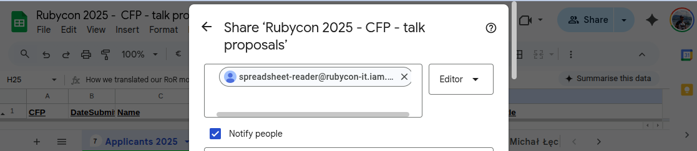

script

```
$ iac/gcp/create_service_account.sh
re: rubycon-it
🔌 Enabling Google Sheets and Drive APIs...
Operation "operations/acat.p2-7636499139-07863954-932d-4898-8e8c-8d07256bd598" finished successfully.
mw: Creating Service Account 'spreadsheet-reader'...
Created service account [spreadsheet-reader].
   ✅ Created service account.
🔑 Creating/Downloading JSON key to 'private/sa.json'...
   ⚠️  Key file 'private/sa.json' already exists. We won't overwrite it to prevent duplicates.
   If you want a new key, delete the file and run this script again.

🎉 Setup Complete!
----------------------------------------------------------------
👉 ACTION REQUIRED:
1. Open your spreadsheet in your browser.
2. Click the 'Share' button.
3. Share it with this email address:

   spreadsheet-reader@rubycon-it.iam.gserviceaccount.com

4. Give it 'Viewer' access.
----------------------------------------------------------------
```





