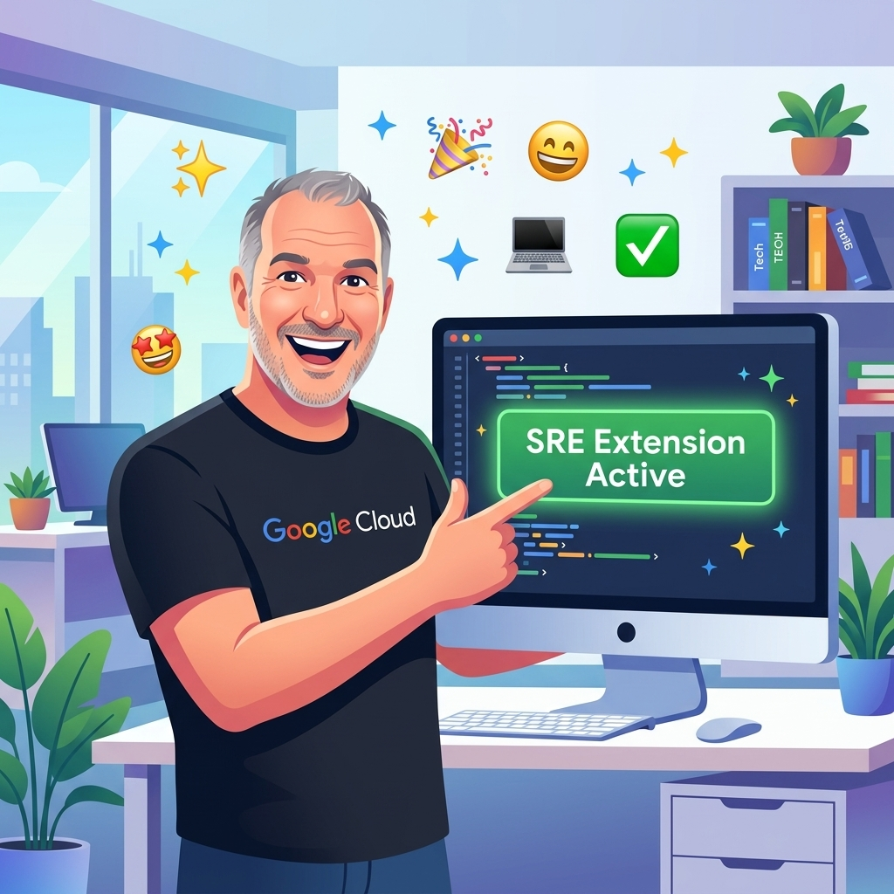
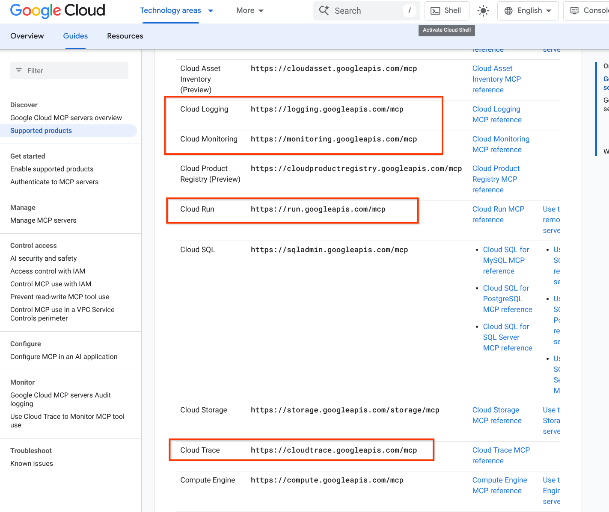
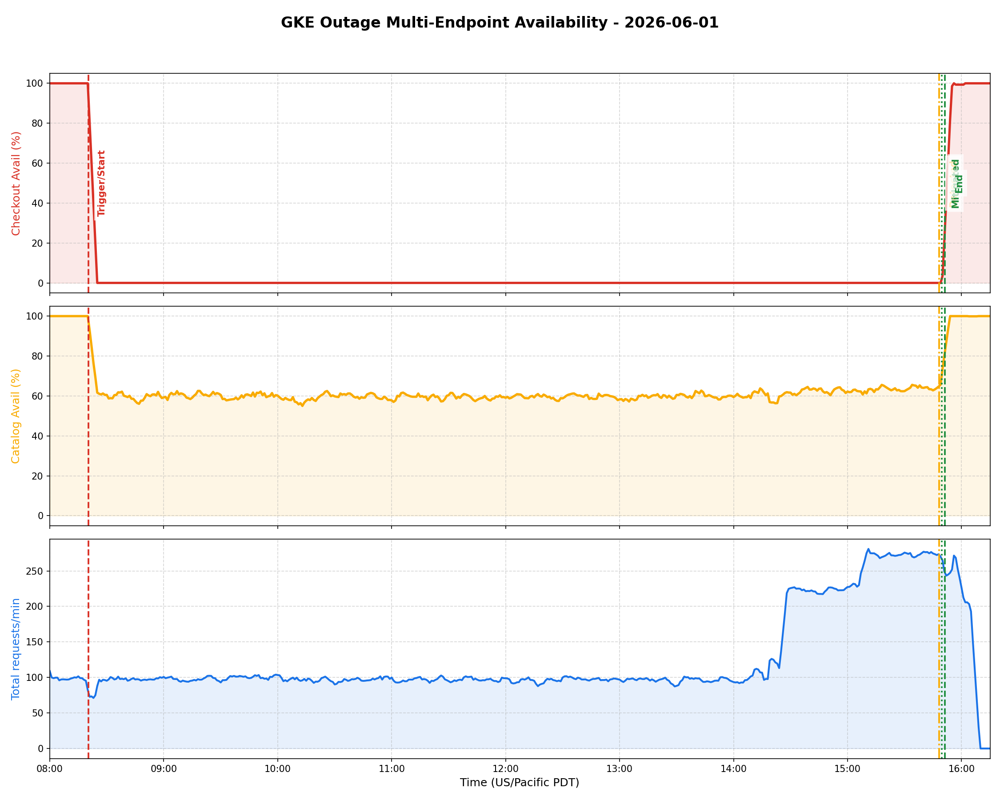
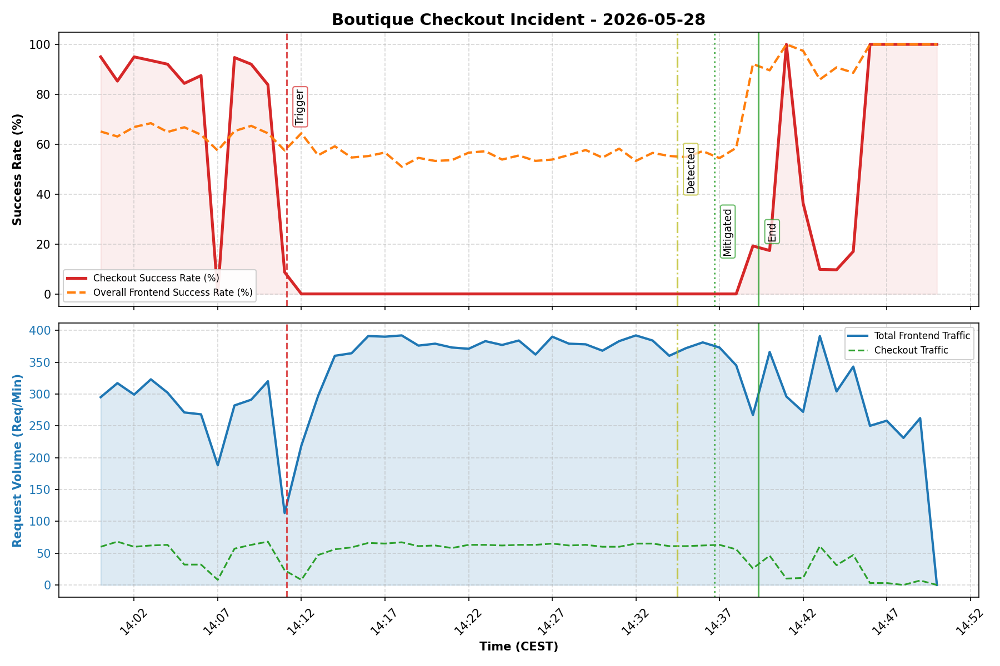
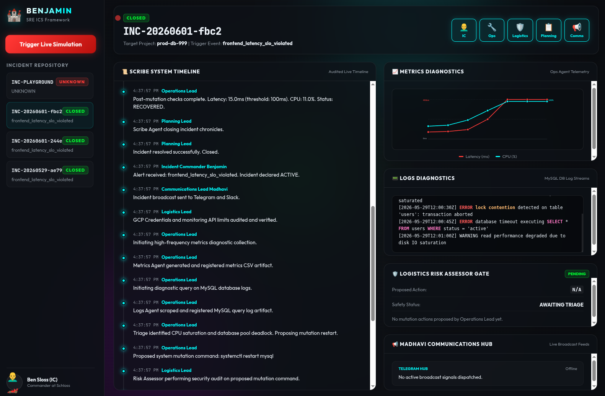
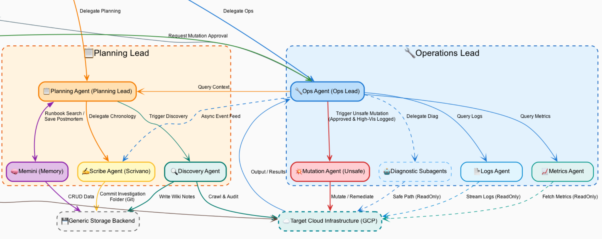

# Ops I did it again: The SRE Extension is out!

<small>*Written with drc, article v1.4*</small>

When I met Ramón in a cafeteria here in Google Zurich, I wouldn't have known that in a few months I would have released an official Open Source package to help SREs around the world! But life is full of surprises, and here we are.

When we talk about SRE (Site Reliability Engineering), we are talking about keeping systems alive under heavy pressure. SREs are constantly fighting outages, config drift, and alert storms. It is a world of pager alerts at 3 AM and frantic Slack threads.

## What on Earth is the SRE Extension?

That is why we created the **SRE Extension** for the [Gemini CLI](https://github.com/google-gemini/gemini-cli) and the [Antigravity CLI](https://antigravity.google/?utm_campaign=CDR_0x89ad3e41_awareness_b520314033&utm_medium=external&utm_source=blog) (`gemini` and `agy`).

It is a bundle of specialized, agentic skills that allow AI assistants to perform operations tasks safely.

And now, we have expanded this support so it works perfectly and seamlessly with both the [Antigravity CLI (agy)](https://antigravity.google/?utm_campaign=CDR_0x89ad3e41_awareness_b520314033&utm_medium=external&utm_source=blog), **Claude Code** and Codex.

The SRE Extension exposes a suite of specialized skills; let's examine them in a typical chronological order:

- **GCP Setup**. [gcp-setup](https://github.com/gemini-cli-extensions/sre/blob/main/skills/gcp-setup/SKILL.md) and [gcp-mcp-setup](https://github.com/gemini-cli-extensions/sre/blob/main/skills/gcp-mcp-setup/SKILL.md) for secure GCP setup; it also sets up your CLI environment with a bunch of Google MCPs (see the [supported products list](https://docs.cloud.google.com/mcp/supported-products?utm_campaign=CDR_0x89ad3e41_awareness_b520314033&utm_medium=external&utm_source=blog)).
  - Kudos to my buddy [Romin Irani](https://rominirani.medium.com) ([LinkedIn](https://www.linkedin.com/in/rominirani)) for his pioneering work on [Google Managed MCP Servers](https://rominirani.medium.com/getting-started-with-google-mcp-services-a31dfb1b87a8) (check out his [google-mcp-servers repository](https://github.com/rominirani/google-mcp-servers) too!).
  - We're also currently working on a nice [GCP Discovery](https://github.com/gemini-cli-extensions/sre/blob/main/skills/gcp-architecture-discovery/SKILL.md) skill.
  - If you don't have GCP, no worries, the other skills will be independent! We also accept contributions for other Clouds!

- **Investigation**. [investigation-entrypoint](https://github.com/gemini-cli-extensions/sre/blob/main/skills/investigation-entrypoint/SKILL.md). This is where your SRE CLI journey starts, in a safe way. This skill is aware of the others and knows what to call:
  - [cloud-logging](https://github.com/gemini-cli-extensions/sre/blob/main/skills/cloud-logging/SKILL.md), [cloud-monitoring](https://github.com/gemini-cli-extensions/sre/blob/main/skills/cloud-monitoring/SKILL.md), and [gcp-slo-management](https://github.com/gemini-cli-extensions/sre/blob/main/skills/gcp-slo-management/SKILL.md) for getting all those nice *o11y* signals you care about, including Service Level Objectives.
  - [GCP Playbooks](https://github.com/gemini-cli-extensions/sre/blob/main/skills/gcp-playbooks/SKILL.md) tries to be the place to record our (and your) playbooks. Currently supports Cloud Build, resource manager, GKE and Cloud Run.
  - [monitoring-graphs](https://github.com/gemini-cli-extensions/sre/blob/main/skills/monitoring-graphs/SKILL.md) to start and orchestrate outage triage, generate incident charts, and keep SRE investigations safe.
  - [Generic Mitigation](https://github.com/gemini-cli-extensions/sre/tree/main/skills/generic-mitigations) (inspired by Jennifer Mace's Google SRE Classroom article on [Generic Mitigations](https://sre.google/classroom/generic-mitigations/)) allows the system to classify the outage and find the best remediation.

- **Post Mortem**. [postmortem-generator](https://github.com/gemini-cli-extensions/sre/blob/main/skills/postmortem-generator/SKILL.md) to Create a Post Mortem.
  - There's also a [PoMo aggregator](https://github.com/gemini-cli-extensions/sre/tree/main/skills/postmortem-aggregator) skill to do some simple BI / data crunching from an aggregate of Post Mortems.

You can inspect the open-source codebase on the [Main SRE Extensions GitHub Repository](https://github.com/gemini-cli-extensions/sre).

## Riccardo's favorites

Two hidden gemstones:

* [cloud-monitoring](https://github.com/gemini-cli-extensions/sre/blob/main/skills/cloud-monitoring/SKILL.md). In order to safeguard token expenditure, I'm particularly proud for scripting a Python CSV extractor which takes a generic multi-var timeseries and then shows the user a simple, cost-effective Sparkline, like `|█▇▆▇ ▂▃   ▂ ▂|`. Costs 10 tokens vs thousands (if not millions) for a single CSV!
* [monitoring-graphs](https://github.com/gemini-cli-extensions/sre/blob/main/skills/monitoring-graphs/SKILL.md) actually vibe-codes Python scripts and creates amazing PoMo graphs which would probably make Ben Treynor cry of joy!

See 2 examples here (more examples in [this repo](https://github.com/palladius/about-sre-extension/)):

## What Can It Do for You? (The Low-Hanging Fruit)
You don't need to build complex pipelines to get value out of this. Here are some of the immediate, "wow" low-hanging fruits that the SRE Extension can do for you right out of the box:

1. **GCP Config** (powered by [gcp-playbooks](https://github.com/gemini-cli-extensions/sre/blob/main/skills/gcp-playbooks/SKILL.md)): The agent can inspect your GKE clusters and GCP projects, immediately flagging mismatched configurations, outdated images, or unattached disks. Oftentimes MCP makes the analysis more token-friendly than with just `gcloud`/`kubectl`.
2. **Smart Log/Metric Pulling** (powered by [cloud-logging](https://github.com/gemini-cli-extensions/sre/blob/main/skills/cloud-logging/SKILL.md) and [anomaly-detection](https://github.com/gemini-cli-extensions/sre/blob/main/skills/anomaly-detection/SKILL.md)): The investigator calls subagents to retrieve logs and metrics efficiently without bloating the context window.
3. **Automated Post-Mortems (PoMos)** (powered by [investigation-entrypoint](https://github.com/gemini-cli-extensions/sre/blob/main/skills/investigation-entrypoint/SKILL.md) and [monitoring-graphs](https://github.com/gemini-cli-extensions/sre/blob/main/skills/monitoring-graphs/SKILL.md)): As the agent investigates, it records system state and diagnostic outputs. At the end of the incident, it automatically drafts a structured markdown PostMortem document and generates annotated telemetry graphs.

Check out the [About SRE Extension Page & PostMortems](https://github.com/palladius/about-sre-extension) repository to see real examples of how these reports look!

## Lesson learnt (TODO move somewhere else)

Things I've learnt playing with Google harnesses and GCP investigations:

* Monitoring and Logs are BIG. Ingesting them in the agent results in "tipsiness". That's why we've instructed the Investigator skill to call those with subagents, and use `grep`, `jq` and the magic [export_timeseries_to_csv.py](https://github.com/gemini-cli-extensions/sre/blob/main/skills/cloud-monitoring/scripts/export_timeseries_to_csv.py) script to evince stats from huge metrics via NumPy.

## Let's Break Things: The GKE Demo Outage

To show you exactly how this works under stress, we recorded some walkthroughs and demo videos where we intentionally broke a live GKE cluster:
*   **Demo 01: SRE Extension Installation & Setup Walkthrough Video**: See how to get up and running from scratch (available on the [official GCT Channel](https://youtu.be/W1RMWhSDnvI) or the [original personal upload](https://youtu.be/_sqPO2oYUoM)):
    
*   **Demo 02: SRE Extension Demo Outage Investigation Video**: Watch us triage an active outage in real-time (available on the [official GCT Channel](https://youtu.be/bPCznsjW8BU) or the [original personal upload](https://youtu.be/5GGw0HegE3E)):
    

In these walkthroughs, you will see how the agent logs in, securely audits the deployment configuration, correlates the service errors, and isolates the broken workload—saving what would normally be 20 minutes of hunting in under two minutes.

For background context on how Google SRE teams are thinking about these workflows, check out the Google Cloud Blog article: [How Google SREs Use Gemini CLI to Solve Real-World Outages](https://cloud.google.com/blog/topics/developers-practitioners/how-google-sres-use-gemini-cli-to-solve-real-world-outages?e=48754805&utm_campaign=CDR_0x89ad3e41_awareness_b520314033&utm_medium=external&utm_source=blog).

## I want to try your extension on your GKE outage, can I?

Sure you can!

If you are the type of developer or SRE who needs to see it to believe it—or if you want to test your own SRE playbooks and agents in a safe sandbox—we have open-sourced our testing suites:

- **SRE Testing Suite**: Madhavi and I got you covered! Find it on the [SRE Testing Suite GitHub Repository](https://github.com/palladius/sre-testing-suite) and just follow the instructions. You can deploy this testing suite to spin up mock environments, simulate active GKE outages, and observe how your AI agents handle incident response.

We're also working on a GKE Outage Investigation Codelab to get an easy step-by-step codelab to experience this at your own time on your computer.

<!-- TODO GKE Outage codelab once ready - see TODOs. -->

## What Customers Want: Auto-Remediation (And Why It's Incredibly Risky)

When I talk to Google Cloud customers, one request comes up again and again: *“We don’t just want an AI assistant that tells us what’s wrong. We want auto-remediation. We want a magic button that fixes the incident at 3 AM.”*

Triage fatigue is real, and nobody wants to be paged just to run the same five command-line diagnostics or manual restarts. SREs want full, end-to-end automation of their runbooks.

So, why not just build a loop that automatically edits your GKE deployments or restarts your VMs?

Because I believe that is an **incredibly risky** thing to do. Letting an LLM agent run wild with write permissions on your production cluster is a recipe for catastrophic, self-amplifying outages. One bad hallucination or out-of-date context window, and your agent might delete the wrong database or apply a broken config.

This is why I am thinking of a **three-way vetted, safe auto-remediation architecture** for write operations:

1. **Read-Only Operator**: By default, the agent operates strictly in a read-only mode to analyze status and suggest fixes.
2. **Vetted Write Commands**: If a remediation is suggested, it goes through a multi-agent vetting pipeline:
   - It is only allowed if the risk classification is flagged as **LOW**.
   - A secondary, **always-fresh agent** (with a clean context window and no token/instruction fatigue) independently reviews and verifies the proposed command.
   - If approved, it is executed with higher latency, but with maximum safety.
3. **Out-of-Band Confirmation**: For higher-risk remediations, the system halts and asks the user for explicit confirmation. This confirmation can be approved out-of-band—for example, by replying to a GitHub Issue or typing a command in a Telegram bot (very much like we do in OpenClaw!).

If you want to play with the early, simulated prototypes of this approach:
- **ADK-Based Sandbox**: Meet **[Benjamin](https://github.com/palladius/adk-sre-benjamin)**! Check out the [adk-sre-benjamin GitHub Repository](https://github.com/palladius/adk-sre-benjamin) for my ADK-based incident simulator.

Here's the architecture diagram ([.dot](https://github.com/palladius/adk-sre-benjamin/blob/main/doc/architecture.dot) and [.png](https://github.com/palladius/adk-sre-benjamin/blob/main/doc/architecture.png)) if you're curious to understand (and maybe improve!) the agent interaction:

Fun fact: I've vibecoded this idea over Telegram with my agent while cycling around Zurich (then refined later on a computer)

## RECAP links

Here is a quick recap of the most important resources if you want to explore the SRE Extension further:

* **[Main SRE Extensions Repository](https://github.com/gemini-cli-extensions/sre)**: If you want to dive straight into the code, check out the public agentic skills, or contribute your own.
* **[SRE Testing Suite](https://github.com/palladius/sre-testing-suite)**: If you want to deploy a mock sandbox environment to break, triage, and test GKE outage scenarios on your own.
* **[Benjamin Auto-Remediation Sandbox](https://github.com/palladius/adk-sre-benjamin)**: If you want to examine our experimental multi-agent simulator for safe, vetted write operations.
* **[About SRE Extension Page & PostMortems](https://github.com/palladius/about-sre-extension)**: If you want to see real examples of structured markdown PostMortems and telemetry charts generated by the agent.
* **[How Google SREs Use Gemini CLI to Solve Real-World Outages](https://cloud.google.com/blog/topics/developers-practitioners/how-google-sres-use-gemini-cli-to-solve-real-world-outages?e=48754805&utm_campaign=CDR_0x89ad3e41_awareness_b520314033&utm_medium=external&utm_source=blog)**: If you want to read the official Google Cloud Blog context that inspired our extension.
* **[Getting Started with Google MCP Services](https://rominirani.medium.com/getting-started-with-google-mcp-services-a31dfb1b87a8)**: If you want to understand Romin Irani's pioneering work on Model Context Protocol (MCP) integrations on Google Cloud.

## Behind the Scenes: The Team
This launch wasn't a solo effort. A huge shoutout to the SRE and engineering minds who made this possible:
- **Ramón Medrano Llamas**: [LinkedIn](https://www.linkedin.com/in/rmedranollamas/) | [GitHub](https://github.com/rmedranollamas)
- **Madhavi Karra**: [LinkedIn](https://www.linkedin.com/in/madhavikarra) | [GitHub](https://github.com/madkarra)
- **Szymon Stawski**: [LinkedIn](https://www.linkedin.com/in/szymon-stawski-b85115183/) | [GitHub](https://github.com/szymonst)

## Share Your Thoughts!
We'd love to hear your thoughts and feedback on agentic operations and auto-remediation! Please fill out our [SRE Extension Feedback Form](https://forms.gle/eJPrbG4KKESp6GmF6) to help us shape the future of automated operations.
