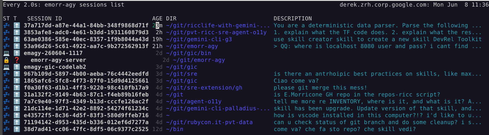
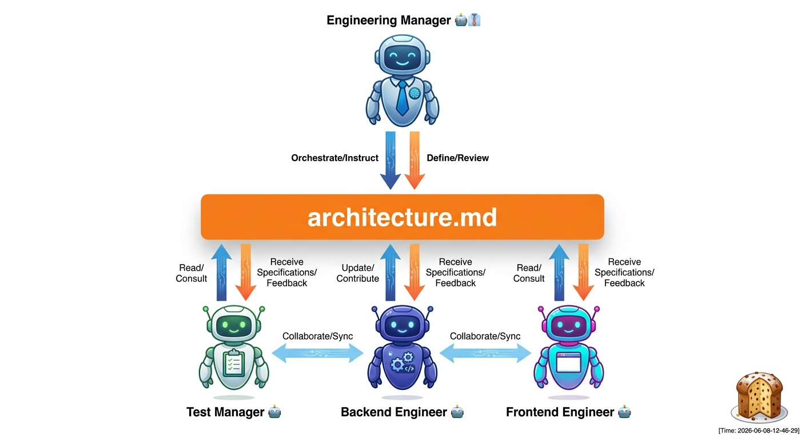

# Worktree multiagent dev flow with Antigravity


<!-- -
## Intent
This article highlights how Git Worktrees solve workspace pollution and file collision in concurrent multi-agent systems using the Google Antigravity SDK (agy). In a traditional development setup, switching branches (git checkout) changes files directly in the working directory. If a parent agent delegates tasks to three subagents running concurrently on the same local workstation, they cannot all work in the same directory without overwriting changes, polluting unstaged state, or corrupting builds. Git Worktrees managed by agy solve this by provisioning isolated workspaces.

## Outline
- Introduction
- Core Concepts
- Deep Dive / Implementation
- Key Takeaways / Conclusion
-->

Alexis said *'This is the year of Agent orchestration'*: I couldn't agree more with him! If 2025 was the year of the AI agent, 2026 is definitely the year of... AI Agent**s**!

I have two Linux computers, and two Macs, and each has six desktops. In each desktop I have 1-2 running harnesses, and sometimes a `vscode` instance to edit code. Yep, you don't want to see me CTRL-ALT-TAB babysitting 6-12 harnesses at a time. Which is, btw, why I started the E. Morricone AG project ([emorr-agy](https://github.com/palladius/emorr-agy)) last week! To make sense of this craziness.


<!-- TODO(riccgemini): find a way to get the image caption inside the image construct, so the scrpits can make somethign out of it for both ricc.rocks AND for Medium. Not sure how -->
**Caption**: Here's my `emorr-agy` CLI showing all my Antigravity CLI sessions.

## The problem: too many CLIs

I've been juggling 10 Gemini CLIs sessions per computer since late 2025, and last month I started switching to... 10-12 `agy` sessions on my computer. Context-switching is tough on me, I need an app just to tell me when to switch to what and what's the context of that window. Sometimes I use Apple Stickies on top of a terminal to remind myself what that term is doing (!!).

Then last weekend I read [this article](https://seroter.com/2026/06/01/one-prompt-four-subagents-and-ninety-seconds-to-get-a-working-app/) from my Seroter namesake and thought: OMG this is what I need, I need a harness to manage my CLIs, and [Antigravity 2.0](https://antigravity.google/) is the best at this!


This clean interface has it all:

* 📁 My personal Project 1
  * 🧵 Improve UI by adding blue login button with hidden password
  * 🧵 Add `/checkout/` to backend
* 📁 My work Project 2
  * 🧵 Add documentation to `doc/PRD.md`
  * 🧵 Add security tests after later omg/1234.

As you can see, all your unrelated work is nicely grouped by project (basically, a folder) and then all threads are aligned there, sorted by the most recent one you worked on (and yes, you can ARCHIVE them, otherwise they'll survive my wife's sadistic reboot).

## When it hit me

As I was saying, I was reading Richard's magic prompt on my throne and thinking: I just want to do this, *plus* a few things!

```markdown
Let's build a hotel room booking app [..].

First, launch the **Engineering Manager** agent to design the API and frontend,
saving the design and a Mermaid diagram into an **artifact** called `architecture.md`.

Once the design is ready, launch three agents in *parallel*:
1. **Test Manager**: Write a simple API test plan and append it to 'architecture.md'.
2. **Backend Engineer**: Build a clean Go REST API with standard error handling
   based on the design.
3. **Frontend Engineer**: Build a responsive web UI using a simple CSS framework
   like Tailwind to interact with the API (skip UI testing).

[..] *How to sync the 3 sub-agents* [..]

Finally, spin up both components and a browser so I can test the live app.
```

Let's unpack this **prompt**. It contains:

1. What you want (a hotel booking app).
2. Your team of 3 sub-agents.
3. How these sub-agents interact (what time / which way).
4. What happens when they're done (spin up and let the human-not-so-much-in-the-loop take a look).

Brilliant. This is meta-programming at its best: you don't prompt the code you want, you're prompting the TEAM of workers you want coding your thing! Another step into emergence and you're prompting... [scion](https://googlecloudplatform.github.io/scion/overview/)!



In the past few months, all I wanted to do was **GHI-triggered multi-agent implementation**!

* **GitHub Issue** Integration. Every subagent should work on an issue, if its defined.
* As a [Ruby on Rails](https://rubyonrails.org/) developer, I know the value of having your code on Rails. The Rails for AI imho is the [Conductor](https://github.com/gemini-cli-extensions/conductor) extension by my buddy Keith. I use it for all my serious projects.
  * Let's be honest, not always a GHI has what it takes for an agent to go and do things. Sometimes you need a HITL to answer the hard questions. This prevents the implementation for being sloppy (*"of course I meant just for authenticated users!!!"*)
* `git worktree`. This is what prevents 2+ agents for making a mess out of your repo (been there done that).
  * If you have N agents pushing Pull Requests to remote branches, it makes sense to have a "Git concierge" to resolve the code to main. He should be configured to have a more conservative approach to the repo. While agent X wants to implement feature X as instructed, this Concierge will be [unfazeable](https://gurps.fandom.com/wiki/Unfazeable) as a British Alfred (turns out only GURPS players know what this means) and act as a 'last defense' for your repo consistency (maybe the code is great, but forgot to run tests, or to update the CHANGELOG... nothing's better than a fresh context window to catch these errors).

<!--
TODO(gemini): create an AI image of many AI agents making a mess out of a git repo, using some ITalian 'too many cooks in the kitchen' kind of metaphor. Food metaphor needs to be in the image, but also some referring to `git` and line of code, and bad merges. Put the two things together in a creative and funny way. Resuolt needs to be tragicomical and result in user feeling the frustration.
-->

## The app: the Italian watchmaker

After watching *Heroes*, I'm a bit scared of watchmakers, exp [Sylar](https://www.youtube.com/watch?v=MqIf3ysYPmg).
I've helped my 8-year old for the whole day as he struggled to map a watch pointing to 19:45 to the "19:45" string, and that is sad since he's so good at math! Once he moves from visual to strings, he can do 08:45 + 20 in no time! So I know what the app needs to be, a platform independent mobile app -> Flutter!

A catchy name, that's the easy part! `orologia.io`


Caption: since `.com` era is so 2000s, and the Sardinian `.io` era is now! (And no, I'm not buying the domain, only italians get this joke).

Here is the exact multi-agent prompt I designed to orchestrate the creation of **orologia.io**:

```markdown
Let's build a cross-platform Flutter game called **orologia.io** to help kids learn how to read analog clocks and transition to digital/string representations (e.g., matching a watch face showing 19:45 to the text "19:45", and practicing time math like adding 20 minutes).

First, launch the **Lead Architect** agent to design the Flutter application structure, state management flow, and UI layouts (Analog Clock screen, Multiple-choice Quiz, and time addition/subtraction Sandbox mode). Save the design and a Mermaid sequence diagram into an artifact called `architecture.md`.

Once the design is ready, launch three sub-agents in parallel to execute the implementation:
1. **QA Automation Engineer**: 
   - Write a comprehensive Dart unit/widget test plan for the time generation and scoring system.
   - Design an **autonomous integration test script** (using `package:integration_test` or a browser/device automation script like Playwright/Selenium) that launches the application on a local server (`http://localhost:8080`) or an active Android Emulator.
   - The script must simulate gameplay by autonomously tapping options, checking score changes, taking a gameplay screenshot, and saving it to `artifact/gameplay_snapshot.png`.
2. **Game Logic Developer**: Build the core Dart logic, including random time generator, conversion of time into analog clock hand angles (hours/minutes), score calculation, and time arithmetic helpers.
3. **UI / Flutter Developer**: Build a beautiful, responsive Flutter interface with an interactive analog clock (custom painter or animated clock hands), vibrant kids-friendly styling, and micro-animations for success/failure feedback.

As soon as the QA Automation Engineer finishes the test plan, hand it to the Game Logic Developer, who reads it from `architecture.md` and implements the Dart unit tests. After both developers complete their tasks, the QA Automation Engineer runs the unit tests and executes the autonomous integration/gameplay test script. Once the script successfully completes and saves the screenshot, the QA agent presents the visual handoff report with the screenshot to the human developer, and leaves the live simulator running for manual review.
```

## The coding Framework

I want to use:
* `git worktree` for async agent implementation
* *GitHub Issues* + *Conductor* "Railways" (someone would say boundaries) for implementation.
* "Antigravity 2.0" as harness, inspired by Richard's article (TODO link)
* [State on Disk](https://aipositive.substack.com/p/how-i-turned-gemini-cli-into-a-multi), inspired by [Paul article](https://aipositive.substack.com/p/how-i-turned-gemini-cli-into-a-multi).
