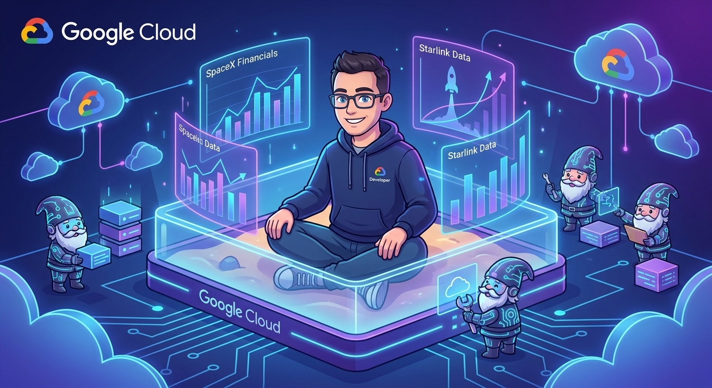
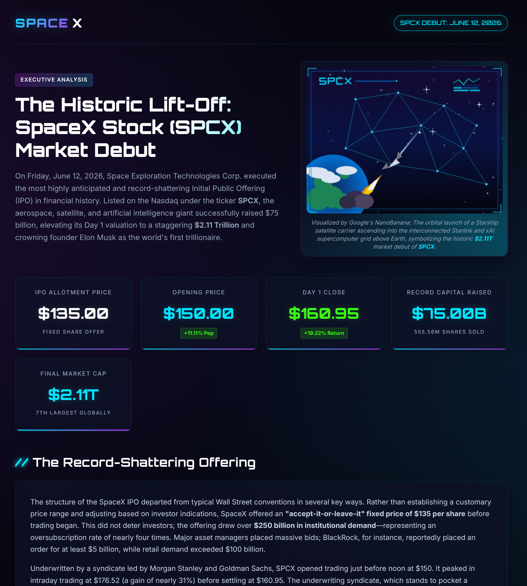
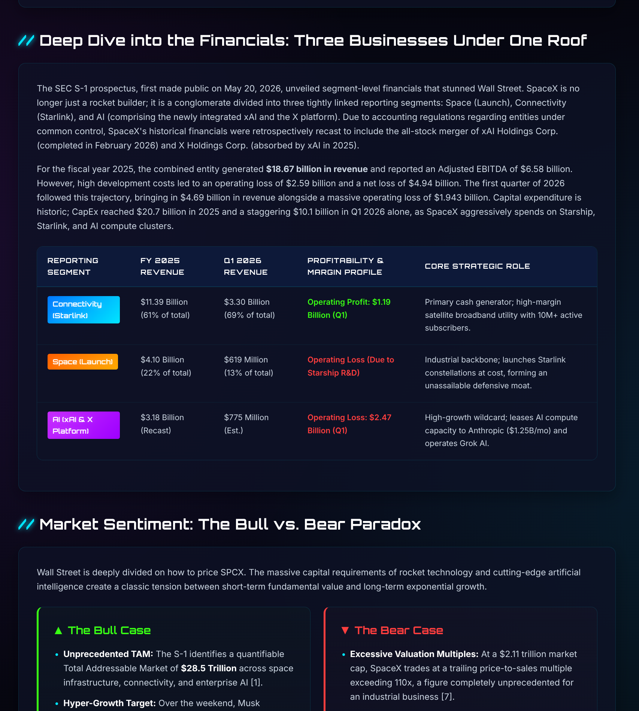
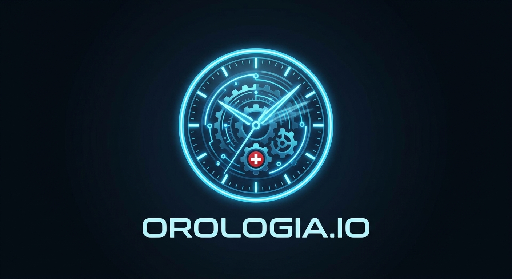

# Orchestrating with Antigravity: A Crescendo of Agents (Part 1)

## Stateful API Sandboxes & Snapshot Downloads



I'm a command-line guy. If it doesn't run in a terminal or get driven by a bash script, I usually avoid it. For years, my daily workflow revolved around `gemini-cli`, and recently the newer `antigravity-cli` (`agy`). I avoided desktop apps and GUI tools like the plague. 

But recently, I hit a wall. 

As I scaled up my AI agent workflows—managing multiple concurrent coding agents, multi-turn stateful loops, and file changes—babysitting 6 to 12 terminal windows across six virtual desktops became a cognitive nightmare. This is the story of that failure, and the learnings that followed. It is a story in two parts:
1. **Part 1 (This Article)**: Trying to solve agent persistence programmatically via the Python GenAI SDK and `agy` CLI, and encountering the crescendo of complexity.
2. **Part 2**: Hitting the CLI limit and stepping into the **Antigravity 2.0 UI / Desktop app** to orchestrate parallel local subagents safely with Git Worktrees.

In this first part, we will explore how stateful remote sandboxes work under the hood using the Google GenAI SDK (`antigravity-preview-05-2026`), how to re-attach to container environments, and how to programmatically retrieve your agent workspace.

---

## The Sandbox Dilemma: Stateless vs. Stateful

In a traditional agent API interaction, each call is stateless. You send a prompt, the agent responds, and the workspace disappears. If you want the agent to edit a file it created in a previous turn, you have to pass the entire file content back and forth in the prompt context. This consumes tokens, increases latency, and makes multi-turn code generation slow and expensive.

The Google Antigravity SDK solves this with **Stateful Remote Sandboxes**. When you run an agent with the environment parameter set to `"remote"`, the SDK:
1. Provisions a private, secure Ubuntu container (sandbox) on Google Cloud.
2. Runs the agent inside that container.
3. Keeps the container alive and returns an `environment_id`.
4. Allows subsequent API calls to re-attach to the same container, inheriting the exact filesystem state.

---

## The SpaceX IPO Analyzer: Python Orchestration

To demonstrate this capability, let's write a Python script that orchestrates a stateful, multi-turn agent session. 

Our agent acts as a **SpaceX IPO Analyzer**. In the first turn, it researches the SpaceX IPO and generates a Markdown report. In the second turn, it re-attaches to the same container, reads the Markdown report, converts it into a styled HTML dashboard (with custom CSS), and generates a space-themed image asset. Finally, in the third turn, it programmatically downloads the entire workspace container snapshot.

Here is the complete python script:

```python
import os
import requests
import tarfile
from google import genai

client = genai.Client()

print("🚀 Turn 1: Launching SRE/Financial Agent in remote Ubuntu Sandbox...")
# Turn 1: Launch agent to research and write a report in a remote sandbox
interaction_1 = client.interactions.create(
    agent="antigravity-preview-05-2026",
    input="Research SpaceX IPO and save report as spacex-report.md.",
    environment="remote"  # Launches a remote Ubuntu sandbox
)
env_id = interaction_1.environment_id
print(f"✅ Turn 1 Complete. Container Environment ID: {env_id}")

print("\n🔄 Turn 2: Re-attaching to same container and converting to HTML...")
# Turn 2: Re-attach to the SAME sandbox and preserve conversation memory
interaction_2 = client.interactions.create(
    agent="antigravity-preview-05-2026",
    environment=env_id,                              # ← Re-attaches to same sandbox
    previous_interaction_id=interaction_1.id,       # ← Preserves conversation memory
    input="Convert that spacex-report.md file into a clean index.html webpage with styling and generate a custom nanobanana image."
)
print("✅ Turn 2 Complete.")

print("\n📦 Turn 3: Downloading the entire container snapshot (.tar) locally...")
# Turn 3: Download the entire sandbox environment state (.tar) locally
api_key = os.environ.get("GEMINI_API_KEY")

response = requests.get(
    f"https://generativelanguage.googleapis.com/v1beta/files/environment-{env_id}:download",
    params={"alt": "media"},
    headers={"x-goog-api-key": api_key},
)

tar_path = "snapshot_env.tar"
with open(tar_path, "wb") as f:
    f.write(response.content)

print(f"✅ Snapshot downloaded to {tar_path}. Extracting...")
with tarfile.open(tar_path) as tar:
    tar.extractall(path="./workspace_extract")
print("🎉 Workspace extracted successfully! Check ./workspace_extract/")
```

---

## Deep Dive: What is inside the container snapshot?

When the environment is downloaded and extracted, you get the exact workspace of the agent. In our SpaceX IPO demo, the extracted folder contains:

*   **`spacex-report.md`**: The raw research report compiled by the agent during Turn 1, detailing the financials, valuation, and the bull/bear case for SpaceX.
*   **`index.html`**: The space-themed HTML dashboard created in Turn 2. It reads the Markdown data and displays it using a responsive, modern glassmorphism design.
*   **`nanobanana.jpg`**: A graphic generated by the agent's image generation tools and embedded directly into the UI.

Here's the visual rendered output of the generated dashboard:


*Caption: Page 1 of the generated SpaceX IPO analysis dashboard.*


*Caption: Page 2 of the generated financial dashboard, displaying the bull/bear investment case.*

---

## The App: The Italian Watchmaker

After watching *Heroes*, I'm a bit scared of watchmakers, exp [Sylar](https://www.youtube.com/watch?v=MqIf3ysYPmg).
I've helped my 8-year old for the whole day as he struggled to map an analog watch pointing to 19:45 to the "19:45" string, and that is sad since he's so good at math! Once he moves from visual to strings, he can do 08:45 + 20 in no time! So I know what the app needs to be, a platform independent mobile app -> Flutter!

A catchy name, that's the easy part! `orologia.io`



*Caption: since `.com` era is so 2000s, and the Sardinian `.io` era is now! (And no, I'm not buying the domain, only italians get this joke).*

Here is the exact multi-agent prompt I designed to orchestrate the creation of **orologia.io**:

```markdown
Let's build a cross-platform Flutter game called **orologia.io** to help kids learn how to read analog clocks and transition to digital/string representations. The Product Requirement Document (PRD) and Behavior-Driven Development (BDD) specifications are already available in the repository at `docs/PRD.md`.

First, launch the **Lead Architect** agent to design the Flutter application structure, state management flow, and UI layouts (Analog Clock screen, Multiple-choice Quiz, and Sandbox mode), referencing the requirements in `docs/PRD.md`. Save the design and a Mermaid sequence diagram into an artifact called `architecture.md`.

Once the design is ready, launch three sub-agents in parallel to execute the implementation:
1. **QA Automation Engineer**:
   - Write a comprehensive Dart unit/widget test plan for the time generation and scoring system.
   - Design an **autonomous integration test script** (using `package:integration_test` or a browser/device automation script like Playwright/Selenium) that launches the application on a local server (`http://localhost:8080`) or an active Android Emulator.
   - The script must simulate gameplay by autonomously tapping options, checking score changes, taking a gameplay screenshot, and saving it to `artifact/gameplay_snapshot.png`.
2. **Game Logic Developer**: Build the core Dart logic, including random time generator, conversion of time into analog clock hand angles (hours/minutes), score calculation, and time arithmetic helpers.
3. **UI / Flutter Developer**: Build a beautiful, responsive Flutter interface with an interactive analog clock (custom painter or animated clock hands), vibrant kids-friendly styling, and micro-animations for success/failure feedback.

As soon as the QA Automation Engineer finishes the test plan, hand it to the Game Logic Developer, who reads it from `architecture.md` and implements the Dart unit tests. After both developers complete their tasks, the QA Automation Engineer runs the unit tests and executes the autonomous integration/gameplay test script. Once the script successfully completes and saves the screenshot, the QA agent presents the visual handoff report with the screenshot to the human developer, and leaves the live simulator running for manual review.
```

### The reality check: Hitting the Flutter wall

Here is where the screaming failure (and learning) happened. I set up this beautiful, complex multi-agent prompt. I let the agents run for two hours, spawning worktrees, writing Dart classes, setting up widget structures, and compiling tests.

The result? It was sloppy. The clock hands were misaligned, the UI was clunky, and it just didn't feel playable. 

Frustrated, I did a 20-second **vibe coding** run. Following Andrej Karpathy's idea of vibe coding—acting as the conductor feeding specs and letting the AI realize the code and UI interactively—I asked a single agent to spin up a quick, single-file prototype in plain HTML, CSS, and JavaScript.

What I did NOT expect was that the 20-second vibecoded JS app was **10x better** than the 2-hour carefully planned Flutter app. It looked better, it was smoother, and it was actually fun to play.

So, I did what any lazy developer would do: I didn't throw away the Flutter code. Instead, I took that vibecoded JS app and used it as a "visual spec" to teach my Flutter subagents how the clock should look and behave. 

But trying to manage this feedback loop—coordinating the Lead Architect, the subagents, the Flutter repository, and checking screenshots of the running JS app—completely broke my CLI workflow. Babysitting text scrollbacks in multiple terminal windows was a lost cause. 

This is where I hit the wall. I had to capitulate, open the **Antigravity 2.0 Desktop app**, and use its visual thread manager to keep my sanity while steering the agents. It was the only way to make the visual loops of vibe coding actually work without losing my mind.

---

## Key Takeaways

1.  **`environment_id` Isolation**: Container preservation keeps your agent workspace hot. You don't need to rebuild context or transfer files over network sockets.
2.  **Environment Download API**: Bridge the cloud container to local storage. By downloading the workspace state directly, you can easily integrate AI agent builders into your CI/CD pipelines, local editors, or backup routines.
3.  **True Multi-Turn Autonomy**: The combination of stateful sandboxes and local workspace downloads allows developers to build complex, multi-agent compilers that perform heavy lifting entirely in the cloud, while delivering clean, completed output artifacts to the host system.

---

🚀 **Ready for Part 2?** Read [Orchestrating with Antigravity: A Crescendo of Agents (Part 2)](https://ricc.rocks/en/posts/technology/2026-06-16-crescendo-of-agents-part-2/) to see how we scale this local development flow using Git Worktrees, Conductor++, and parallel subagents under Agostina.