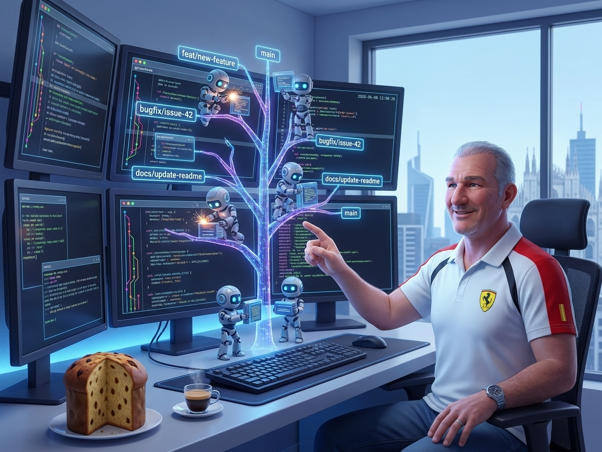
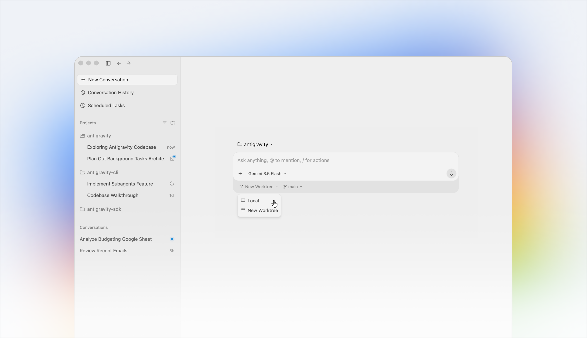
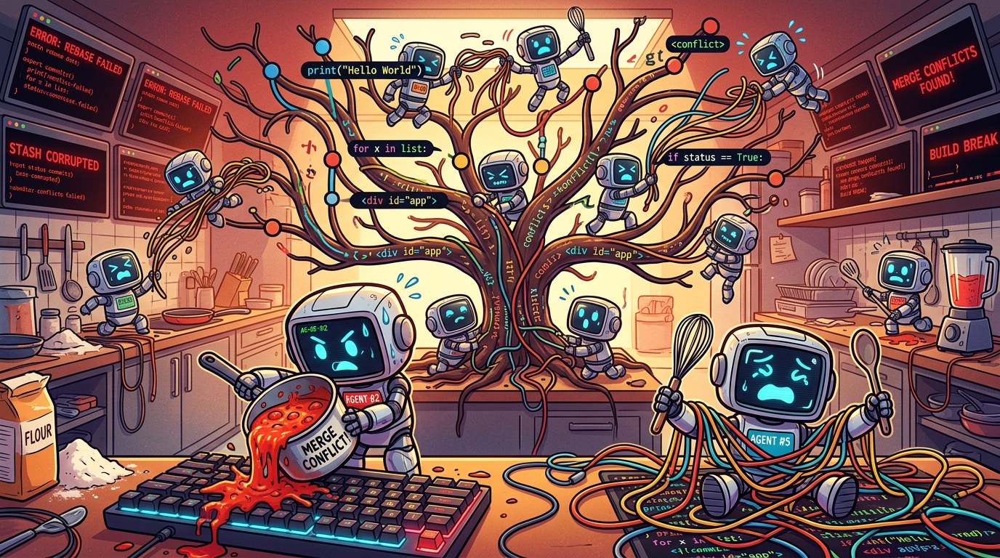
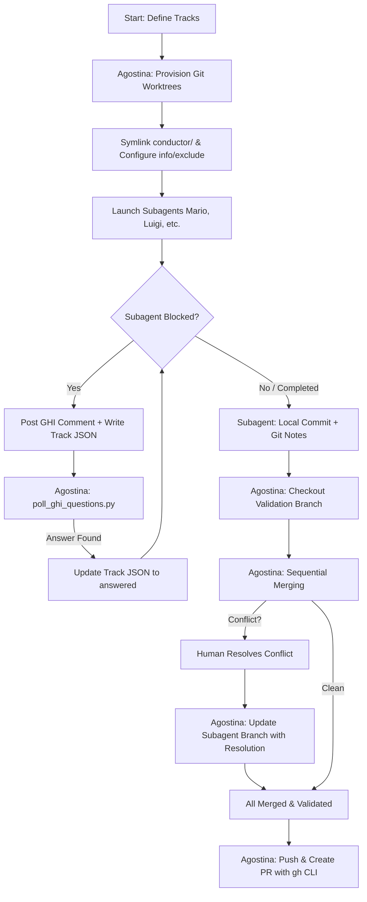
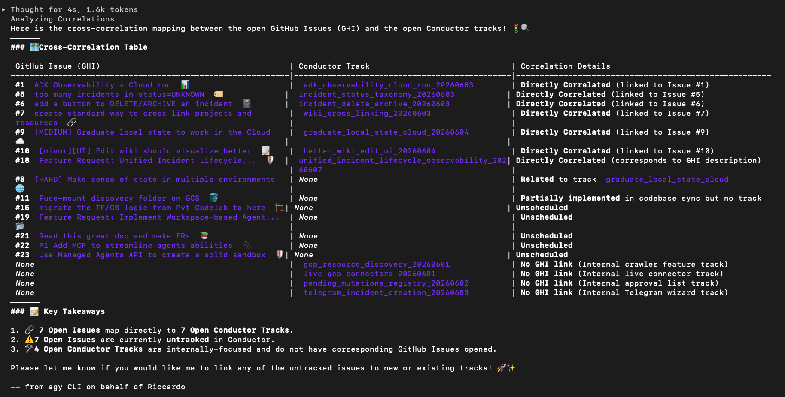
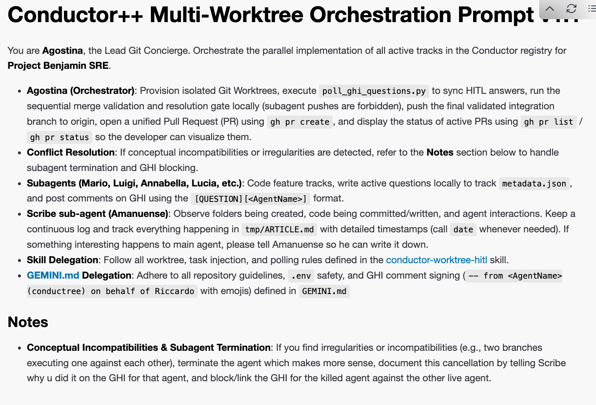
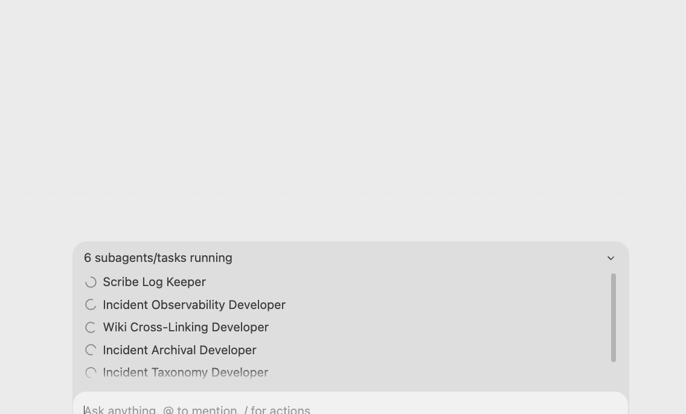
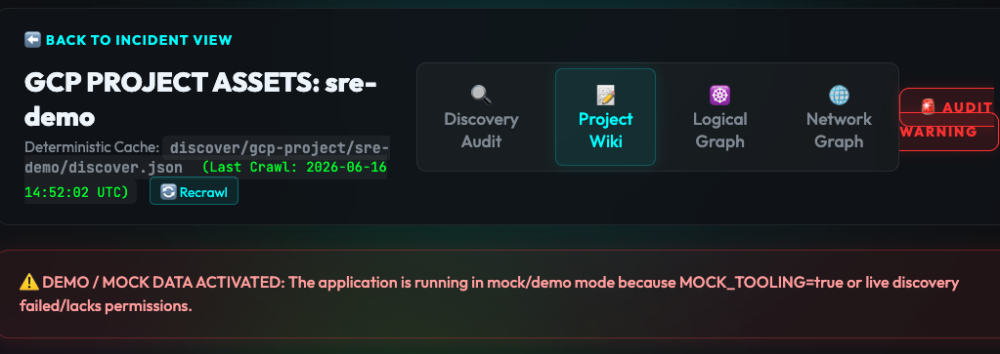

# Orchestrating with Antigravity: A Crescendo of Agents (Part 2)

## Parallel Coding with Git Worktrees, Conductor++, and Agostina

<!-- -
## Intent
This article highlights how Git Worktrees solve workspace pollution and file collision in concurrent multi-agent systems using the Google Antigravity SDK (agy). In a traditional development setup, switching branches (git checkout) changes files directly in the working directory. If a parent agent delegates tasks to three subagents running concurrently on the same local workstation, they cannot all work in the same directory without overwriting changes, polluting unstaged state, or corrupting builds. Git Worktrees managed by agy solve this by provisioning isolated workspaces.

## Outline
- Introduction
- Core Concepts
- Deep Dive / Implementation
- Key Takeaways / Conclusion
-->

[Alexis](https://www.linkedin.com/in/alexismp/) said *'This is the year of Agent orchestration'*: I couldn't agree more with him! If 2025 was the year of the AI agent, 2026 is definitely the year of... AI Agent**s**!

If you read [Part 1 of this series](https://ricc.rocks/en/posts/technology/2026-06-16-crescendo-of-agents-part-1/), you know my confession: **I'm a CLI guy.** I don't do UIs. But when I tried to orchestrate a team of parallel subagents to build a simple clock game (`orologia.io`), my terminal babysitting workflow completely broke down. Juggling tmux panes, file checkouts, and Apple Stickies stuck to terminal windows to track active runs was a cognitive nightmare. 

I capitulated and opened the **Antigravity 2.0 UI/Desktop app** to manage the visual feedback loop of comparing my Flutter code with a 10x better, 20-second vibecoded JS prototype. It saved my sanity.

But once you have a visual harness that works, the immediate developer question is: **how far can we scale this?**

If Part 1 was a soloist sandbox and a simple clock game, Part 2 is about heavy-duty parallel engineering. Today, we'll see how we took the Antigravity Desktop app and scaled it up to a massive 12-track SRE simulation (**Project Benjamin**) using Git Worktrees, a Rails-like orchestrator called Conductor++, and a concierge agent named Agostina.

<!--more-->



> 💡 **Looking for Part 1?** Read [Orchestrating with Antigravity: A Crescendo of Agents (Part 1)](https://ricc.rocks/en/posts/technology/2026-06-16-crescendo-of-agents-part-1/) to learn about stateful remote sandboxes and Python SDK orchestration.

## The problem: scaling past the CLI

When you scale from a soloist agent to a crescendo of parallel agents—where a coordinator agent spawns subagents, manages branch checkouts, and handles human-in-the-loop approval requests—the CLI simply stops scaling cognitively. You can't track it all in a flat scrollback buffer.

Then last weekend I read [this article](https://seroter.com/2026/06/01/one-prompt-four-subagents-and-ninety-seconds-to-get-a-working-app/) from my Seroter namesake and thought: *OMG, this is exactly what I need.* I need a visual harness to manage my concurrent agents, and [Antigravity 2.0](https://antigravity.google/) is the best at this!



This clean interface has it all:

* 📁 My personal Project 1
    * 🧵 Improve UI by adding blue login button with hidden password
    * 🧵 Add `/checkout/` to backend
* 📁 My work Project 2
    * 🧵 Add documentation to `doc/PRD.md`
    * 🧵 Add security tests after later omg/1234.

As you can see, all your unrelated work is nicely grouped by project (basically, a folder) and then all threads are aligned there, sorted by the most recent one you worked on (and yes, you can ARCHIVE them, otherwise they'll survive my wife's sadistic reboot).

## When it hit me

As I was saying, I was reading Richard's magic prompt on my throne and thinking: I just want to do this, *plus* a few things!

```markdown
Let's build a hotel room booking app [..].

First, launch the **Engineering Manager** agent to ... into an **artifact** called 'architecture.md'.

Once the design is ready, launch three agents in *parallel*:
1. **Test Manager**: Write [..] to 'architecture.md'.
2. **Backend Engineer**: Build an API based on [..] .
3. **Frontend Engineer**: Build a web UI [..] to interact with the API [..].

[..] *How to sync the 3 sub-agents* [..]

Finally, spin up both components and a browser so I can test the live app.
```

Let's unpack this **prompt**. It contains:

1. What you want (a hotel booking app).
2. Your team of 3 sub-agents.
3. How these sub-agents interact (what time / which way).
4. What happens when they're done (spin up and let the human-not-so-much-in-the-loop take a look).
5. **Important**. the common file state here is the common artifact: `architecture.md`.

Brilliant. This is meta-programming at its best: you don't prompt the code you want, you're prompting the TEAM of workers you want coding your thing! Another step into emergence and you're prompting... [scion](https://googlecloudplatform.github.io/scion/overview/)!


In the past few months, all I wanted to do was **GHI-triggered multi-agent implementation**!

* **GitHub Issue** Integration. Every subagent should work on an issue, if its defined.
* As a [Ruby on Rails](https://rubyonrails.org/) developer, I know the value of having your code on Rails. The Rails for AI imho is the [Conductor](https://github.com/gemini-cli-extensions/conductor) extension by my buddy Keith. I use it for all my serious projects.
  * Let's be honest, not always a GHI has what it takes for an agent to go and do things. Sometimes you need a HITL to answer the hard questions. This prevents the implementation for being sloppy (*"of course I meant just for authenticated users!!!"*)
* `git worktree`. This is what prevents 2+ agents for making a mess out of your repo (been there done that).
  * If you have N agents pushing Pull Requests to remote branches, it makes sense to have a "Git concierge" to resolve the code to main. He should be configured to have a more conservative approach to the repo. While agent X wants to implement feature X as instructed, this Concierge will be [unfazeable](https://gurps.fandom.com/wiki/Unfazeable) as a British Alfred (turns out only GURPS players know what this means) and act as a 'last defense' for your repo consistency (maybe the code is great, but forgot to run tests, or to update the CHANGELOG... nothing's better than a fresh context window to catch these errors).

### 🛠️ Equip Your Agents with the `condutree` Skill

To make this entire multi-agent git-worktree workflow reusable for any codebase, I packaged these exact rules and automations into an open-source agent skill called **`condutree`** (technically, `conductor-worktree-hitl`). 

You can find the code and details in my public [gemini-cli-custom-commands repository](https://github.com/palladius/gemini-cli-custom-commands) (and be sure to star the new [devrel-cli repository](https://github.com/palladius-uat/devrel-cli) where I'm centralizing all my developer advocacy automation tools!).

Equipping your Antigravity coordinator and subagents with this skill teaches them:
1.  **Worktree Provisioning**: How to safely check out independent git worktrees for concurrent tasks.
2.  **Git Hygiene**: Symlinking the shared Conductor metadata folders while excluding them locally so git status remains clean.
3.  **HITL Polling**: The dual reentrant protocol for posting issue comments, reading local registries, and polling answers without exhausting API quota limit ranges.
4.  **Local Commits & Notes**: Standardizing local branch commits and signing off details via Git Notes without direct remote pushes.


*Caption: Too many coding subagents making a mess of a single branch without git worktree isolation (an AI-generated illustration of the "too many cooks in the kitchen" metaphor applied to git merges).*

*While the clock game taught us that multi-agent systems require a visual feedback loop to align code with user expectations, we needed to see how this workflow behaves under heavy SRE workloads. Enter Project Benjamin...*

## Scaling Up: Conductor++ Multi-Worktree Multi-Agent Dev Flow

To see how far we could push this parallel execution model, we built **Project Benjamin**—a complex, real-world SRE automation and incident command simulator. We weren't just testing toy apps; we wanted to run a multi-agent system that could audit cloud environments and coordinate incidents across multiple isolated workspaces at the same time.

Here is how we designed and optimized this parallel dev flow:

### 1. The Preparation: Setting Up for Great Work

Before we could run this without file collisions and merge chaos, we had to solve some tricky git hygiene and naming issues:

*   **Preventing Git Worktree Symlink Pollution**: In our Conductor++ setup, each parallel agent gets its own Git Worktree (e.g., `.worktrees/telegram_incident_creation/`). Because subagents need to communicate metadata back to the parent coordinator, we symlink the root `conductor/` directory into each worktree:
    ```bash
    ln -s ../../conductor conductor
    ```
    However, Git ordinarily sees a symlinked tracked folder inside a subdirectory as both a deleted folder and a new untracked file. To prevent this working-tree pollution:
    *   We configured the local repository's `.gitignore` to explicitly ignore `conductor/questions.json` and track-specific question folders.
    *   We updated the Conductor orchestration prompt to run a dynamic Git exclude command within each worktree:
        ```bash
        echo "conductor" >> $(git rev-parse --git-dir)/info/exclude
        ```
        This instructs Git to dynamically ignore the symlink inside that specific worktree, keeping working trees 100% clean.

*   **Personifying the Coordinator**: To give our DevFlow an approachable, unflappable personality, we named our Lead Git Concierge coordinator **Agostina**. Agostina behaves like a calm, organized Italian concierge running on espresso, ensuring that parallel subagents (Mario, Luigi, etc.) remain in sync without stepping on each other's toes.

*   **The Amanuense Scribe Agent**: To maintain a high-resolution, real-time chronicle of all parallel development events, we introduced a dedicated scribe agent called **Amanuense**. Amanuense continually logs directory creation, code changes, and agent interactions with precise timestamps, outputting them to a central audit file so developers can audit exactly who did what, when, and in which worktree.

### 2. The Logic: Parallelism Without the Chaos

Running multiple AI agents coding in parallel on the exact same repository requires strict isolation and a race-free way to communicate.

*   **Subagent Git Hygiene (No Direct Remote Pushes)**: If multiple subagents attempt to run `git push` concurrently, they will trigger lock collisions on remote refs and introduce untested code into production. Subagents commit exclusively to their local feature branches (`feature/<track_id>`) and write summarizing git notes. Only the coordinator (Agostina) is permitted to run `git push`, checkout the validation branch, and merge feature branches.

*   **Dual Reentrant Question Protocol**: Instead of using a single global `questions.json` file (which introduces write races when multiple subagents ask questions concurrently), we designed a dual reentrant protocol:
    1.  **Isolated Local State**: Subagents write questions to their private track folder (`conductor/tracks/<track_id>/metadata.json`). This is 100% race-free.
    2.  **GitHub GHI Comments**: Subagents post the question as an issue comment with a unique tracking signature: `[conductree:<track_id>:<question_id>]`.
    3.  **Smart Polling**: Agostina runs a polling script that first checks if any local track is in `"awaiting_human"` status. If none are, it skips the GitHub API poll entirely (saving 95%+ of API quota). When it finds a matching comment answer on GitHub, it updates the local metadata to `"answered"`, waking up the subagent.

*   **Cascading Conflict Loop Resolution**: In a parallel multi-worktree execution flow, merging the completed feature branches one-by-one can create a "cascading conflict" scenario. Imagine Mario's branch is merged cleanly into the validation branch, but Luigi's branch has merge conflicts. 
    If the human developer resolves Luigi's conflict directly on the validation branch, Luigi's original feature branch in `.worktrees/telegram_incident_creation/` is still conflicting and out-of-date. To prevent this drift, Agostina automatically cherry-picks or merges the conflict resolution back into Luigi's feature branch. This ensures that the subagent's isolated worktree remains up-to-date and syntactically aligned with the validated codebase.

*   **Pushing to Pull Requests (PRs) & Visualization**: Instead of having the coordinator push the merged validation branch directly to `main` (which bypasses code review gates), we route the final integration through a **Pull Request (PR)**.
    1.  **The Flow**: Subagents commit locally. Agostina pulls, validates, and merges the branches locally. Once all integration tests pass, Agostina pushes the unified integration branch to remote and invokes the `gh` CLI to create a Pull Request:
        ```bash
        gh pr create --title "feat: unified parallel implementation" --body "..."
        ```
    2.  **PR Visualization**: The human operator reviewer can visually inspect diffs, review CI checks, and interact with the code using GitHub's native UI. To make this process fully transparent, Agostina updates the Conductor registry's `metadata.json` with the created PR URL and displays active PR status locally using `gh pr list` and `gh pr status`.

*   **Conceptual Incompatibility & Subagent Termination**: Parallel execution can also lead to conceptual conflicts or logical incompatibilities between two tracks (e.g., track A implements a feature that track B refactors in an incompatible way). If Agostina detects such irregularities, she is authorized to immediately terminate one of the conflicting subagents. The cancellation must be documented directly on the GHI (GitHub Issue) for the terminated agent's task, and the issue must be blocked/linked against the other active agent's GHI to preserve clear decision ancestry.

### 3. The Execution: Orchestration Lifecycle

The orchestrator lifecycle is defined as follows:



1.  **Provisioning**: Agostina sets up the isolated worktrees and launches the subagents.
2.  **Execution & HITL**: Subagents code independently, using the polling script to handle high-fidelity human-in-the-loop (HITL) questions.
3.  **Merge & PR**: Agostina sequentially merges the code, driving conflict resolutions back to the source worktrees, pushes the final integrated branch to remote, and opens a unified Pull Request (PR) via the `gh` CLI for human review and final merge to `main`.
## Case Study: Project Benjamin (Full Multi-Agent Speed Run)

To prove that our Conductor++ Multi-Worktree pipeline works in real production environments, we set up **Project Benjamin** as a stress test. 

We went into **full multi-agent mode**. Instead of playing with one or two toy features, we took 12 complex, critical SRE capabilities and broke them down into **more than 20 concrete GitHub Issues (GHIs)**. 

Then, we let the machine rip. 

In just **5 hours**, the Conductor++ pipeline successfully built, tested, and merged **all 20+ GHIs** into the main branch! 

The scope of implementation was massive: from setting up OpenTelemetry (OTEL) tracing in Cloud Run to writing interactive Telegram incident wizards and pending mutation approval registries. 

Here are the operational facts and results of this live execution:

### 🚦 Integration & Merge Results

Using our parallel Git Worktree orchestration, all feature tracks were developed, tested, and fully integrated into the `main` branch. Below is the final status audit of the SRE features:

| Issue # & Feature | Conductor Track ID | Merge Status in `main` | Key Operational Value |
| :--- | :--- | :--- | :--- |
| **#1: ADK Observability + Cloud Run** | `adk_observability_cloud_run_20260603` | **Merged** | Dockerization of SRE dashboard and built-in **OpenTelemetry (OTEL) tracing** for all inter-agent communication flows. |
| **#5: Incident Status Taxonomy** | `incident_status_taxonomy_20260603` | **Merged** | Establishes a strict IMAG-compliant lifecycle taxonomy (Open, In Investigation, Mitigated, Resolved). |
| **#6: Incident Deletion & Archival** | `incident_delete_archive_20260603` | **Merged** | Prevents data loss by replacing raw delete buttons with a safe incident archiving mechanism. |
| **#7: Wiki Project Cross-linking** | `wiki_cross_linking_20260603` | **Merged** | Parses wiki markdown to dynamically cross-link GCP project references and network topologies. |
| **#8: Multi-env State Management** | `multi_env_state_management_20260616` | **Merged** | Rails-style environment folders (`prod`, `dev`, `test`) to isolate incident states. |
| **#9: Graduate State to Cloud** | `graduate_local_state_cloud_20260604` | **Merged** | Seamless cloud-sql state integration with local sqlite fallback to support multi-homed runs. |
| **#10: Responsive Wiki UI** | `better_wiki_edit_ui_20260604` | **Merged** | Hides lateral incident/chat columns during wiki editing to maximize workspace view. |
| **#18: Discord Incident War-Rooms** | `unified_incident_lifecycle_observability_20260607` | **Merged** | Dynamic creation of Discord war-room text channels, with **remote human steering** via `@mention` routing to SRE agents. |
| **#26: GCP Asset Crawlers** | `gcp_resource_discovery_20260601` | **Merged** | Resource crawlers for GKE, VPC, GCE VMs, GCS, SQL, and Cloud Run to build SRE knowledge index. |
| **#27: Live GCP Connectors** | `live_gcp_connectors_20260601` | **Merged** | Direct shell SSH mutation capabilities and diagnostics API mappings. |
| **#28: Pending Mutations Queue** | `pending_mutations_registry_20260602` | **Merged** | Safety registry queuing hazardous actions for explicit confirmation, with operator feedback to agents. |
| **#29: Telegram Incident Wizard** | `telegram_incident_creation_20260603` | **Merged** | An interactive Telegram chatbot wizard with project selection and voice-note/STT diagnostics transcription. |

---

### 📸 The Workflow Timeline (Visual Audit)

Here is the step-by-step progression of the SRE Benjamin run, showing how the coordinator, scribe, and parallel subagents worked without stepping on each other's toes:

#### Step 1: Initializing SRE Tracks & Worktrees
The parent coordinator initialized the workspaces on the host machine. The Conductor inspector CLI tracked active tracks and assigned subagents (e.g. `grazia` for Discord war-rooms, `pinocchio` for pending mutations queue).


*Caption: Conductor inspector showing active tracks in progress.*

#### Step 2: Parallel Worktree Isolations
Each agent checked out its own branch and worked in isolation. The Amanuense scribe logged precise file edits and workspace activity without file conflicts.


*Caption: Monitoring the worktree files during concurrent development.*

#### Step 3: Interactive Polling & Human Steering
When agents needed clarification (such as verifying Telegram token configuration), they posted issues that were parsed by `poll_ghi_questions.py`.


*Caption: Human approvals and diagnostics feedback loop active.*

#### Step 4: The Final Green State
Once all feature branches were validation-checked and sequentially merged, Agostina created the Pull Request. The final audit output confirmed all 12 SRE tracks were fully merged into the production branch.


*Caption: Final audit output showing 100% of Conductor tracks completed and merged.*

## The coding Framework

I want to use:
* `git worktree` for async agent implementation
* *GitHub Issues* + *Conductor* "Railways" (someone would say boundaries) for implementation.
* The [`gemini-superpowers` plugin](https://github.com/barretstorck/gemini-superpowers), which provides the `using-git-worktrees` skill used to isolate our parallel subagents.
* "Antigravity 2.0" as harness, inspired by [Richard's article](https://seroter.com/2026/06/01/one-prompt-four-subagents-and-ninety-seconds-to-get-a-working-app/)
* [State on Disk](https://aipositive.substack.com/p/how-i-turned-gemini-cli-into-a-multi), inspired by [Paul article](https://aipositive.substack.com/p/how-i-turned-gemini-cli-into-a-multi).