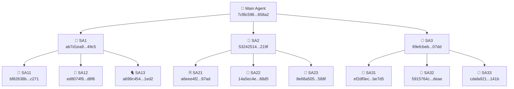

# 🌳 Nested Subagent Test — 3×3 Fan-Out Results

> **Test Date:** 2026-07-15 ~16:02-16:04 CEST
> **Initiated by:** Ricky ♦️ Rubacuori (RiccardinoCM26 🦖)
> **Parent Agent Conversation ID:** `7cf8c596-0fe0-4664-955d-6e29aae658a2`

## 🎯 Objective

Verify that Antigravity subagents can spawn their own subagents (nested/recursive invocation).
Created a 2-level hierarchy: 3 Level-1 subagents each spawning 3 Level-2 subagents = **12 total agents**.

## ✅ Result: SUCCESS

All 12 agents completed successfully. Double-nesting works! 🎉

## 🗺️ Agent Hierarchy



## 📊 Full Agent Registry

| Agent | Level | Parent | Conversation ID | Date Output |
|-------|-------|--------|----------------|-------------|
| **Main** | L0 | — | `7cf8c596-0fe0-4664-955d-6e29aae658a2` | — |
| **SA1** | L1 | Main | `ab7d1ea9-96d3-43d1-890f-f7604a3549c5` | — |
| **SA2** | L1 | Main | `53242514-b273-4fe2-a156-8c5634fc219f` | — |
| **SA3** | L1 | Main | `89efcbeb-e198-4de4-a486-e1994d0b07dd` | — |
| **SA11** | L2 | SA1 | `bf82638b-693a-4d06-9615-65768ac8c271` | `Wed Jul 15 16:03:35 CEST 2026` |
| **SA12** | L2 | SA1 | `ed8074f9-c06c-489f-b199-677e8886d8f6` | `Wed Jul 15 16:03:35 CEST 2026` |
| **SA13** | L2 | SA1 | `a699c454-b801-4a1d-963a-fbc7f9cd1ed2` | `Wed Jul 15 16:03:35 CEST 2026` |
| **SA21** | L2 | SA2 | `a6eee4f2-e848-46a1-8f59-120898b197ad` | `Wed Jul 15 16:03:28 CEST 2026` |
| **SA22** | L2 | SA2 | `14a5ec4e-74df-4b5b-b259-2bfc720a88d5` | `Wed Jul 15 16:03:29 CEST 2026` |
| **SA23** | L2 | SA2 | `8e68a505-a353-40c2-9cad-dcceed47588f` | `Wed Jul 15 16:03:29 CEST 2026` |
| **SA31** | L2 | SA3 | `ef2df0ec-c144-4a4b-8268-ac124f3be7d5` | `Wed Jul 15 16:03:36 CEST 2026` |
| **SA32** | L2 | SA3 | `5915764c-e743-4227-bf92-4dad68c2deae` | `Wed Jul 15 16:03:35 CEST 2026` |
| **SA33** | L2 | SA3 | `cdafa921-a0a6-4bf6-917e-8393eb19141b` | `Wed Jul 15 16:03:36 CEST 2026` |

## 😂 Joke Parade

| Agent | Number | Joke |
|-------|--------|------|
| SA11 | 11 | Why is 11 the loneliest number? Because it's just two ones standing together but never touching! |
| SA12 | 12 | Why did 12 go to therapy? It had too many factors in its life! |
| SA13 | 13 | Why is 13 so unlucky? Because it can't even! |
| SA21 | 21 | Why is 21 the best age? Because you can finally blackjack legally! |
| SA22 | 22 | What did 22 say to 11? You are only half the number I am! |
| SA23 | 23 | Why is 23 Michael Jordan's favorite? Because even numbers couldn't keep up! |
| SA31 | 31 | Why does 31 love ice cream? Because it's a Baskin Robbins flavor count! |
| SA32 | 32 | What do 32 teeth say? We are the full set, no wisdom needed! |
| SA33 | 33 | Why is 33 the magic number? Because Larry Bird said so! |

## ⏱️ Timeline

- **16:02:29** — Output directories created
- **16:02:59** — SA1, SA2, SA3 launched in parallel
- **~16:03:08** — L1 agents echo'd their names
- **~16:03:19** — L1 agents spawned L2 subagents
- **~16:03:28-36** — All L2 agents ran `date` + echo jokes
- **~16:04:33-37** — All L1 agents collected results and reported back
- **~16:04:56** — Main agent verified all output files

**Total wall-clock time: ~2 minutes** for 12 agents to spawn, execute, collect, and report! 🚀

## 📁 Output Files

```
.ricc-double-subagent-test/
├── README.md              ← You are here
├── SA1/
│   ├── results.md         ← SA1 results + mermaid diagram
│   └── SA1x_transcripts.md ← L2 transcript excerpts
├── SA2/
│   ├── results.md         ← SA2 results + mermaid diagram
│   └── SA2x_transcripts.md ← L2 transcript excerpts
└── SA3/
    ├── results.md         ← SA3 results + mermaid diagram
    └── SA3x_transcripts.md ← L2 transcript excerpts
```

## 🔑 Key Findings

1. **Nested subagents work!** `self`-type subagents can indeed invoke `invoke_subagent` to spawn their own children.
2. **Parallel execution works at both levels** — all 3 L1s ran concurrently, and each L1 launched its 3 L2s concurrently.
3. **Message passing works across levels** — L2 → L1 → Main, all messages arrived correctly.
4. **Transcript access works** — L1 agents could read L2 transcript JSONL files.
5. **~2 min total** for a 12-agent tree is pretty snappy! ⚡

---
*Generated by Antigravity CLI on behalf of Ricky ♦️ Rubacuori — 2026-07-15*
