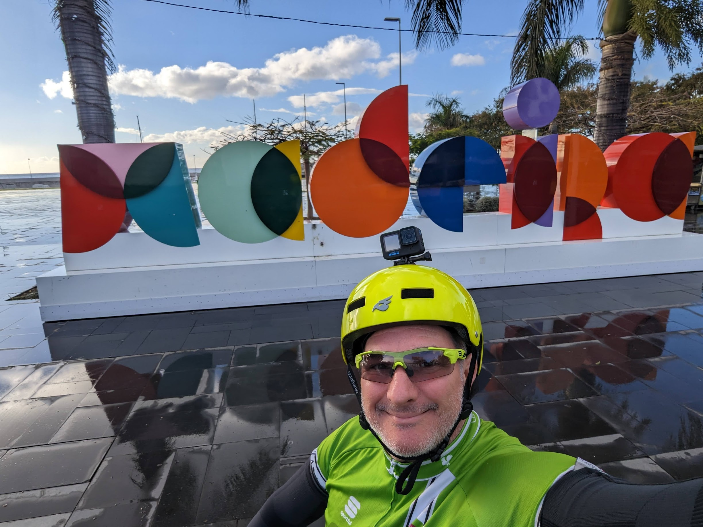

*( 🚧 Work in progress )*

## Why Madeira in February?

I married a saint woman (Kate) who from time to time allows me to travel solo for a week while her family comes to
Zurich and help with kids. This year it happened in February: too early to cycle in Mallorca, so I asked my friend Mike
for a nice place to go and he suggested Madeira.

I told my friends on Xmas and my friend Riccardo (yep, you're not seeing double yet, it's just another Riccardo, 'Ridge').

## Saturday: just a look around

I land

## Sunday: muddy mountain-biking

## Mon: go west!

## Tue: go up!

## Wed: lonely, rainy east-side

Ridge left early this morning, leaving me alone with a fully charged ebike.

Today I take thr 70km ride east to the airport; it's expected to rain after 13:00 so I have 3+ hours of dry ride.

The views are absolutely majestic, but after 30m it starts raining and it's getting less fun.

So I get to this amazing cliff, and at my third shower I decide to go back to the hotel and call it a day. I'm not hugely into rain, particularly in a terrain I dont know, a bike I dont know, too much
to test for a wet terrain with 15% descents.

Note: Video embedding does work, but then page stops afterwards.

<video src="madeira-merc-scogliera.mp4" controls="no" />

Non va l'embed di MP4 ma [su youtube](https://youtu.be/wTq28Y1GIRM) si.

## Thu: TODO

