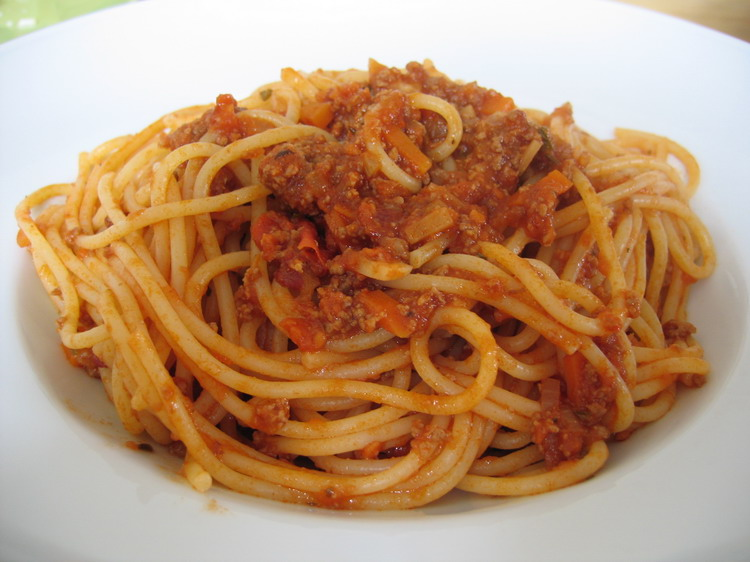

Spaghetti bolognese: Everyone knows them... except Italians.

Right, read it again if you don't believe me... in Italy we don't prepare that kind of pasta.



What the hell, you may be wondering... Italy is famous for spaghetti and bolognese sauce (that we call "ragout alla bolognese" or simply ragü, but we would never mix these two things in the same dish).

*Why oh why*, you may as well think? I think the reason can be found in two ways.

1. First, they come from two different cultures. Spaghetti come from the south, where a simpler tomato, basil, and veg sauce would seem more appropriate.
2. Second, spaghetti are slippery, so they're not as good to 'retain' a demanding sauce as a beef ragout is. As every bolognese person can tell you, appropriate pastas for bolognese ragout can be: **tagliatelle** (first choice), *pennette/penne/mezzepenne*, *conchiglie*, *fusilli*, *maccheroni*, ... in general every form of 'pasta rigata' (**ribbed** pasta). Pasta rigata is a pasta that is not smooth, so thas sauce is more likely to stay with the pasta, instead of slipping down. I think the main reason why every person from Bologna is horrified by the mere idea of associating spaghetti with our proud ragout is that we perfectly know (because everyone has made that mistake once in their life) what happens if you do that: spaghetti would ruthlessly come up your fork completely naked of any red or meaty trace... just to leave a gloomy surprise in the very end: a bloody pool of meat and tomato just looking at you as if asking "Now what?". And unless you are Italian, you don't know what scarpetta is. but that's another story.

As [wikipedia](https://en.wikipedia.org/wiki/Bolognese_sauce) (as of 19dec09) says about *Bolognese sauce*:

> [...] Spaghetti alla Bolognese, Spaghetti Bolognese, or Spaghetti Bolognaise in a form popular outside of Italy, consists of a meat sauce served on a bed of spaghetti with a good sprinkling of grated Parmigiano cheese. Although Spaghetti alla Bolognese is very popular outside of Italy, it never existed in Bologna, where ragout is served always with the local egg pastas tagliatelle or lasagne. Spaghetti is a drum wheat pasta from Naples, and the Naples Ragout of a meat flavoured thick tomato sauce clings much better to slippery spaghetti than Bologna's ground beef ragout. [...]
>
> From: <cite>[wikipedia](https://en.wikipedia.org/wiki/Bolognese_sauce)</cite>


## Script for Linux/Mac

This wonderful script will replenish your computer with Spaghetti images. I called it: `gugol-image.rb`:

You can also find it in my sakura repository: https://github.com/palladius/sakura/blob/master/bin/gugol-image

```ruby
#!/usr/bin/env ruby

$BASEDIR = "/tmp/.gugol_image/"
DFLT_ARGS = %w{ spaghetti alla bolognese }

###### FROM rcarlesso library
def deb(s); end
class String
   def depurate_for_file
       gsub(/[\/: \.]/ , '_')
   end
end
#### END RICLIB

def good_extension?(url)
   File.extname(url).downcase.match( /(jpg|png|gif)$/ ) ? true : false
end

def download_url(line,match)
   url = line.gsub(/^.*#{match}=/,'').split('&')[0]
   deb "MATCH/URL: #{match} // #{url}"
   file_name = File.basename(url).downcase
   if good_extension?(url)
       `wget '#{url}' -O '#{$mydir}/#{file_name}' 1>/dev/null 2>/dev/null &`
   else
       puts "#DEB# Skipping: #{red url rescue url}"
   end
end

def gugol_image(query)
   out = `lynx --dump "http://images.google.com/images?hl=en&um=1&sa=1&q=#{query}"`
   $mydir = $BASEDIR + query.depurate_for_file() + '/'
   deb   "BaseDir: #{$mydir}"
   `mkdir -p #{$mydir}`
   out.split("\n").grep( /imgurl=/ ).each{ |line|
       deb "Line: #{line}"
       download_url(line, 'imgurl')
     }
   `open #{$mydir}`
   puts "Files downloaded in: #{$mydir}"# if mac or linux
end

def main
    query = ARGV.empty? ? DFLT_ARGS : ARGV
    gugol_image(query.join(' '))
end

main()
```

## What about spaghetti with pineapple?

Well, let me answer with an image (from Miudjourney): this is Yoda after eating too much pizza with pineapple:

<!--
content/en/posts/www.palladius.it/spaghetti-bolognese-dont-exist/Riccardo_baby_yoda_eating_a_pineapple_pizza_getting_told_off_by_Mario.png
-->


**Midjourney**: baby_yoda_eating_a_pineapple_pizza_getting_told_off_by_Mario

## Resources

* [Bolognese sauce](https://en.wikipedia.org/wiki/Bolognese_sauce) on Wikipedia
* A video from BBC: http://news.bbc.co.uk/2/hi/europe/8467045.stm (thanks Paul)
