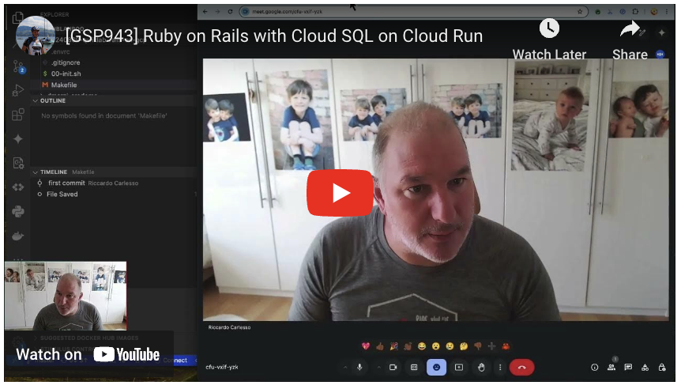

([Article original sur Medium](https://medium.com/@palladiusbonton/ruby-on-rails-with-postgresql-on-cloud-run-bdaaf0b26e0b))

Connaissez-vous [Cloud Skills Boost](https://www.cloudskillsboost.google/) (anciennement connu sous le nom de Qwiklabs) ?

Dans **[cette vidéo](https://www.youtube.com/watch?v=vpPftSHE9kM)**, je vous montre comment j'exécute les étapes décrites dans Ruby on Rails avec PostgreSQL sur Cloud Run sur le site web de cloudskillsboost, en rencontrant quelques obstacles en cours de route, et en les corrigeant.

De plus, je vais vous présenter ma chaîne d'outils personnelle et particulière, en tant qu'ancien développeur bash/perl, elle peut donc vous sembler particulière.

Si vous êtes impatient de commencer, voici mon code final sur GitHub [lien vers le code](https://github.com/palladius/20240809-qwiklab-rails-on-gcp) et le Codelab RoR [lien vers le codelab](https://www.cloudskillsboost.google/focuses/20047).

Voici ma vidéo sur Rails !

## **À propos de Skillsboost**

Skillsboost (anciennement connu sous le nom de Qwiklabs) est un moyen de vous former à Google Cloud en exécutant des "labs". Ces labs sont limités dans le temps, Google crée toutes les ressources pour vous et les supprime à la fin du lab.

Pour réaliser les labs, vous disposez d'un système de crédits. Vous pouvez payer $$ pour les obtenir, ou vous pouvez en obtenir gratuitement en vous inscrivant simplement à notre programme Innovator Champion (oui, tout est gratuit !). Cela devrait vous permettre de réaliser environ 10 labs gratuitement, également avec Gemini (je les ai essayés, ils sont très amusants !).

Notre Codelab se trouve ici : https://www.cloudskillsboost.google/focuses/20047

## **L'approche de Riccardo pour Skillsboost**

Il existe plusieurs façons d'exécuter un Lab, mais j'en vois principalement deux :

1. Vous exécutez le code dans le Cloud. C'est le plus simple, ce que tout le monde fait. Vous utilisez une combinaison de Cloud Shell et de Cloud Editor (si vim ne vous convient pas).
2. Vous exécutez le code localement. C'est un peu plus difficile à mettre en place, mais vous pouvez ensuite conserver tout votre code utile localement pour une utilisation/un piratage ultérieur. J'ai passé quelques années à écrire une chaîne d'outils pour cela, en utilisant codelabba et proceed_if_error_matches et d'autres. Comme vous pouvez l'imaginer, je pense être le seul terrien à conserver mes scripts codelab quelque part localement. Suis-je en bonne compagnie ? N'hésitez pas à me contacter et à me dire ce que vous faites différemment !

Comme vous pouvez le voir dans ma vidéo, je fais les deux pour vous montrer les deux approches, ainsi que les avantages et les inconvénients.

## **Qu'est-ce qu'un journal de friction ?**

Un journal de friction est un document Google Doc dans lequel vous décrivez par écrit votre expérience, vos émotions et même votre niveau de colère (à l'aide de codes couleurs) au développeur d'un code/ressources. L'idée est ensuite de partager votre document avec l'implémenteur, en y suivant le code et les bogues du document. Mon idée folle est d'en faire une vidéo !

## **Ma chaîne d'outils "codelabba"**

Le moment est venu d'expliquer ma chaîne d'outils personnelle. Habituellement, j'ai un certain nombre de dépôts git sous `~/git/`, l'un d'entre eux étant Open Source. Bien sûr, je parle de palladius/sakura.

* `00-init.sh` : Le script d'initialisation, commun à tous mes projets codelabba, il fait référence à des variables ENV comme PROJECT_ID, REGION et ainsi de suite.

* `.envrc` : Ce fichier est alimenté par `direnv`, un outil que m'a suggéré Rob Edwards et il contient toutes mes variables ENV. Vous pouvez le considérer comme la partie hydratation du 00-init et de tout le reste, grâce aux bibliothèques Ruby/Python pour gérer les fichiers .env*. J'ai également fait un effort pour que ce fichier fonctionne d'emblée avec Pulumi (en adoptant les noms de variables ENV standard de Pulumi) et pour qu'il soit aussi compatible que possible avec les codelabs de Google Cloud.

* `proceed_if_error_matches` : C'est le script le plus simple et le plus intelligent que j'ai jamais écrit. Il transforme les scripts bash séquentiels avec `set -euo pipefail` en scripts bash ressemblant à terraform. Imaginez que vous ayez besoin de : (1) créer un bucket (2) définir une ACL sur celui-ci (3) télécharger des fichiers sur celui-ci. Il est raisonnable de penser que vous avez trois scripts séquentiels, qui peuvent échouer de temps en temps et qu'il vous faut du temps pour corriger chaque ligne. Une fois que vous avez terminé, vous voulez passer à la suivante, mais devinez quoi ? Vous ne pouvez pas travailler sur (2) car (1) va commencer à échouer avec un message ennuyeux comme "le bucket existe déjà". J'ai donc pensé - et si je pouvais filtrer UNIQUEMENT certains messages d'erreur, que je capture sous forme de chaînes de caractères ? C'est la raison d'être de ce fichier.

* `codelabba.rb` (propriétaire) Il s'agit d'un script ruby que je n'ai jamais publié publiquement. Mais demandez-moi dans les commentaires, et je prendrai peut-être le temps de le nettoyer et de le mettre en open source. Il crée basiquement un squelette pour mes codelabs, et je l'ai inventé la 2ème ou 3ème fois que je faisais un codelab Qwiklab, exactement pour les raisons que j'ai écrites ci-dessus.

* `XX-blah-blah.sh` ([exemple](https://github.com/palladius/20240809-qwiklab-rails-on-gcp)) Ce sont des scripts à exécuter dans l'ordre : 01, 02, 03, ... afin qu'ils vous racontent une histoire. Voyez cela comme un "notebook python Bash". Je sais, c'est la phrase la plus profonde que vous allez lire aujourd'hui :)

Code : https://github.com/palladius/20240809-qwiklab-rails-on-gcp

## Conclusions

C'est une grande expérience pour moi ! Était-ce une bonne idée ? Une terrible idée ? Faites-le moi savoir dans les commentaires !

*(Generated by Geminocks: https://github.com/palladius/ricc.rocks/tree/main/gemini prompt_version=1.4)*