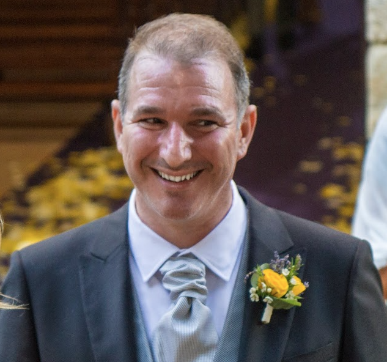

Bella regaz! 👋

Ciao! Sono Riccardo, noto sul web come <tt>Palladius</tt> o semplicemente **Ricc**.

## Lavoro 💼

Sono **Developer Advocate per [Google Cloud](https://cloud.google.com/)**, con focus su SRE, Intelligenza Artificiale Agentica, Open Source e Developer Experience.

Questo blog raccoglie una sintesi delle mie passioni: dallo sport ai viaggi, dalla famiglia alla tecnologia.

* **LinkedIn**: <https://www.linkedin.com/in/riccardocarlesso/>
* **Pagina Ufficiale Google**: <https://cloud.google.com/developers/advocates/riccardo-carlesso>
* **Curriculum Vitae**: [Scarica il CV Executive 1-Pagina in Italiano (PDF)](/cv/ricc-onepager-it.pdf) · [English Version (PDF)](/cv/ricc-onepager.pdf)

Parlo e scrivo di SRE, Operations, Cultura ingegneristica in Google, GenAI / Agentic harnesses e Ruby / Rails.

## Vita Personale 🇨🇭

Sono italiano, ma quasi sempre puntuale! Ho vissuto in Italia per 32 anni, poi mi sono trasferito in Irlanda (2008) e nel 2011 in Svizzera dove vivo attualmente con mia moglie Kate e i miei due splendidi bimbi: *AJ* e *Sebowski*. Ci trovi su [Instagram](https://www.instagram.com/palladius/) o nella [Galleria di famiglia](/it/gallery/riccardo-family/).

Ovviamente, adoro la Svizzera.



## Hobbies & Passioni 🏃‍♂️🎹

Per citare un detto: *Prima avevo degli hobby, ora ho dei figli*. Le mie passioni ruotano attorno allo sport, alla musica, ai viaggi e al nerdiness:

* 🎹 **Pianoforte**: suono soprattutto Genesis dell'era Peter Gabriel e Dream Theater.
* 🏊 **Triathlon**: ho completato due **Ironman** completi (entrambi a Zurigo) e diversi 70.3 in EMEA.
* 🃏 **Magic the Gathering**: su Arena o con i bimbi (con effetti disastrosi, ma almeno Ale impara a contare fino a 20!).
* 🍲 **Cucina**: con il Thermomix e sperimentando piatti italo-americani.
* ✈️ **Viaggi**: tengo un foglio di calcolo dei paesi visitati con il mio amico Andrea (siamo a quota 61+).
* 💻 **Coding & Automazione**: adoro Ruby on Rails, Linux, scripting Bash e unire la famiglia al codice:
  * [aj-alphabet-dev.palladi.us](http://aj-alphabet-dev.palladi.us/alfabeto?alphabet=it&cells_per_row=6&locale=it&predilige=portrait): per insegnare le lettere dell'alfabeto ai bimbi.
  * 🚧 [PuffinTours](https://puffintours-prod-rjjr63dzrq-ew.a.run.app/) 🚧: diario di viaggio di famiglia.

## Questo Sito 🌍


Questo sito è generato con Hugo e il tema [ZZO](https://github.com/zzossig/hugo-theme-zzo) ([documentazione](https://zzo-docs.vercel.app/zzo)).


Repository e sorgenti:
* GitHub: <https://github.com/palladius/ricc.rocks>
