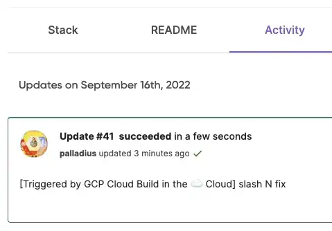

---
# Note this is SUPER weird, I try to make this work for ALL my thingies so there might be some behavioural clatches in the
# initial HEADER :) Lets try to keep it small :)
title: "♊ [Geminocks] Setting a ⬣ Cloud Build trigger with 🧹Pulumi in 🐍 Python"
date: 2022-09-22T21:17:43+01:00
draft: false
tags: [symlink, GCP, pulumi, CloudBuild, Medium]
# paperMod
canonicalURL: https://medium.com/google-cloud/setting-cloudbuild-with-pulumi-in-python-330e8b54b2cf
# ANANKE :)
featured_image: /images/gohugo-default-sample-hero-image.jpg
image: /images/mtg-clone.jpg
---

L'articolo originale qui:  https://medium.com/google-cloud/setting-cloudbuild-with-pulumi-in-python-330e8b54b2cf

TODO(7feb23): aggiungi questo video come incorporato: https://www.youtube.com/watch?v=5jhWVNN8P_M (creato il 6feb23)

Un paio di settimane fa, mi sono innamorato di **Pulumi**. Ha tutto ciò che volevo da Terraform: facile da configurare, facile gestione della configurazione, una bella interfaccia utente gratuita e, soprattutto... supporto linguistico! Pulumi è la migliore invenzione dopo la pizza di bufala e ha solo un problema.. [nessun supporto Ruby](https://github.com/pulumi/pulumi/issues/132) :/

Comunque, sono così innamorato di ⬣ GCP (che per inciso mi paga lo stipendio, devo ammetterlo), Cloud Build, Cloud Deploy e in generale delle pipeline CI/CD su Google Cloud che volevo provarlo. Cercando su Google "Cloud Build Pulumi" sono arrivato a questo bel articolo per JavaScript, che non è nelle mie corde.

## Il codice

Il mio codice è qui: https://github.com/palladius/pulumi/tree/main/examples/python-gcp-cloudbuild-auto-trigger

Nota: 👍 Il codice è finalmente in fase di compilazione corretta. Evviva!

## Cosa c'è di così speciale nel codice?

Il codice consente a qualsiasi progetto Pulumi che potresti avere su GCP (in Python 🐍) di impostare un trigger per l'autoaggiornamento. Un push al repository git attiverà un lavoro di compilazione che, se ha successo, effettuerà l'accesso come te a Pulumi ed eseguirà un aggiornamento con il nuovo codice.

Quindi, ad esempio, se commetti una modifica che aggiunge un bucket GCS al codice, in un paio di minuti quel bucket GCS verrà creato e il README.md verrà aggiornato con i parametri del builder:

In grassetto puoi vedere 3 parametri aggiornati da Cloud Build stesso!

Il mio codice supporta **Github** (come è) e **Bitbucket** (codice 99% lì poiché funzionava per primo!) per il momento.

Ho anche personalizzato il messaggio come per l'articolo di Laura, anteponendo un "[costruito con Cloud Build]" al messaggio git ("slash N fix", in questo caso):

## Cosa significa Pulumi?

Ho provato Google Translate, sembra che potrebbe significare scopa (🧹) in hawaiano o in Birmania (🇲🇲, ora Myanmar). Fino ad allora, userò la prima emoji, fino a quando qualcuno non mi dimostrerà il contrario.

Modifica: il mio amico Aaron di Pulumi conferma la scopa e punta a [questo articolo](http://joeduffyblog.com/2018/06/18/hello-pulumi/).

##  Prossimi passi
La mia 📝 per il futuro include:

* Avere un'impostazione corretta di password/stato su GCP tramite HSM o GCS.
* Trasformare in un modulo in modo che qualsiasi progetto pulumi che potresti avere possa semplicemente invocare questo codice con 4-5 variabili (utente github, repository github, directory di compilazione pulumi, credenziali, ..). Devo ancora vedere se questo è fattibile anche tra lingue (non🐍).

## Riferimenti

Codice originale (Cloud Build + Node.js): https://www.pulumi.com/docs/guides/continuous-delivery/google-cloud-build/

Il mio codice (python): https://github.com/palladius/pulumi/tree/main/examples/python-gcp-cloudbuild-auto-trigger

*(Generated by Geminocks: https://github.com/palladius/ricc.rocks/tree/main/gemini prompt_version=1.3)*