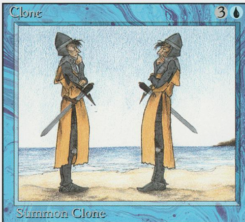

<!-- Generated by Geminock vVER . cache_key='4f8554330875c9c8070648af082354f91994505bf540d7ad30b03ccd66b1fadf-it.yaml' --> 
---
# Note this is SUPER weird, I try to make this work for ALL my thingies so there might be some behavioural clatches in the
# initial HEADER :) Lets try to keep it small :)
title: "🇮🇹♊ [Geminocks] Temi a confronto (🏆)"
date: 2023-02-05T21:17:43+01:00
draft: false
tags:
- symlink
- hugo
- WOW
- geminocks
- Italian
# Categories is feinitely used by STACK framework:
categories:
- hugo
- category
- important
keywords:
- tech
- hugo
- comparative
- theme
- themes
# ANANKE :)
featured_image: clone-mtg-vintage.png # /images/gohugo-default-sample-hero-image.jpg
image: clone-mtg-vintage.png
images:
- tranquilpeak-showcase.png
- clone-mtg-vintage.png
- zzo-screenshot.png
# tranquilpeak-only: https://github.com/kakawait/hugo-tranquilpeak-theme/blob/master/docs/user.md#image
thumbnailImage: https://www.etrurio.com/wp-content/uploads/2019/12/pistacchi-scaled.jpg
---




Ho provato molti moduli questo fine settimana. Nota che temi diversi hanno parole e chiavi/valori diversi nella strofa precedente, quindi è meglio non confonderli.
Ad esempio, questa pagina ha una `featured_image` che funziona solo con Ananke e una `image` che probabilmente funziona con altri temi.

Cosa ho provato finora:

## Collegamenti simbolici in tutte le pagine.

* finora ne ho provato solo uno: sicuramente golang non noterà il file con collegamento simbolico modificato.
* Nota che STACK si trova attualmente in un posto DIVERSO. Lasciamelo spostare per un secondo.

## I miei siti Web Hugo che ho provato finora

Tutto il codice si trova in diverse directory del mio repository GH: https://github.com/palladius/ricc.rocks/

| Tema + PermaCompare | Sito web     | Stelle |  Descrizione |
| ----------- | ----------- | ------ | ---- |
| Bootstrap   | [hugo-bootstrap-ricc-rocks](https://hugo-bootstrap-ricc-rocks.netlify.app/) | ⭐️⭐️⭐️⭐️⭐️ | Semplicemente fantastico |
| Stack       | [hugo-stack.ricc.rocks](https://hugo-stack.ricc.rocks) |⭐️⭐️⭐️⭐️⭐️ | ci ho giocato MOLTO. Nota che è in un repository diverso |
| ----------- | ----------- | ------ | ----  |
| [🙉](https://ricc-zzo.netlify.app/en/posts/riccardo/prova-zzo/) ZZO         | [ricc-zzo.netlify.app)](https://ricc-zzo.netlify.app/en/) | ⭐️⭐️⭐️⭐️⭐️ | Ha le icone come le voglio io, molto giocoso, ma pieno di funzionalità splendide. Mi piace un tot!  |

(*) Permacompare: permalink in produzione alla pagina di confronto :)

* **PaperMod**: funziona! https://papermod.ricc.rocks	 non ancora esplorato molto. Pagina di confronto: https://papermod.ricc.rocks/posts/papermod-analysis-page/  [🙉](https://ricc.rocks/posts/papermod-analysis-page/) PaperMod |⭐️⭐️⭐️⭐️   | Super elegante. Essenziale ma dannatamente buono nella sua essenza! |
* **Stack**: Innanzitutto, ha la [matematica](https://dev.stack.jimmycai.com/p/math-typesetting/). https://hugo-stack.ricc.rocks  poi lo adoro e basta!
* **Bootstrap**: https://hugo-bootstrap-ricc-rocks.netlify.app/
* 🚧 [WIP] **Tranquilpeak**.  https://tranquilpeak.netlify.app/ Ha la matematica
* 🚧 [WIP] **ZZO**. https://ricc-zzo.netlify.app/en/

Ho perso la battaglia:

* **Coder**: Nah, troppo semplice per me.
* Ananke. Troppo semplice - https://hugo-ananke.netlify.app/

## Album fotografici

* Solo XXX sembra avere album fotografici decenti. Tuttavia, la gente dice "vorrei che il tuo tema fosse buono come Photoswipe", quindi credo che potrei semplicemente far funzionare [**PhotoSwipe**](https://photoswipe.com/) con qualsiasi altra cosa: vedi [HugoPhotoSwipe](https://github.com/GjjvdBurg/HugoPhotoSwipe).
* forse controlla https://github.com/liwenyip/hugo-easy-gallery ma non credo ne valga la pena. (505 ⭐️).
* O semplicemente codificarlo (vorrei che fosse Ruby e non Golang): https://hugocodex.org/add-ons/image-gallery/
* oppure usa questa [fantastica libreria](https://github.com/mfg92/hugo-shortcode-gallery): demo in https://matze.rocks/images/#gallery-filter=Landscape


## ZZO


* **Pagina di confronto**: https://ricc-zzo.netlify.app/en/posts/riccardo/prova-zzo/
* installazione: https://zzo-docs.vercel.app/
* Tema GH: https://github.com/zzossig/hugo-theme-zzo
* Versione Ricc: https://ricc-zzo.netlify.app/

Caratteristiche:

```
Skin multiple (scuro, chiaro, solarizzato, ...)
Menu per cellulare
Ricerca
Ottimizzazione per i motori di ricerca (SEO)
Multilingue (i18n)
Design reattivo
Interfaccia utente personalizzabile
RSS
Galleria
Evidenziazione del codice veloce
Pagina dei discorsi
Pagina della vetrina
Pagina della pubblicazione
Pagina del curriculum
Pagina di presentazione
```


## Bootstrap

* Documentazione sull'immagine: https://hbs.razonyang.com/v1/en/docs/image-processing/#resizing-images Un sacco di cose buone qui, inoltre ho trovato un bug e il ragazzo lo ha risolto in 24 ore - FANTASTICO.
* Documentazione della galleria: https://hbs.razonyang.com/v1/en/docs/shortcodes/gallery/


# Vecchia roba

## PaperMod

Ho passato poco tempo finora, ma è solo colpa mia, non sua :)

Documenti: https://github.com/adityatelange/hugo-PaperMod/

NEUTRO:

* supporta [molte icone](https://adityatelange.github.io/hugo-PaperMod/posts/papermod/papermod-icons/#social-icons), ma non sono sicuro di come usarle
* [Supporta la matematica](https://adityatelange.github.io/hugo-PaperMod/posts/math-typesetting/), ma non sono sicuro di come farlo funzionare/
* le emoji sono carine, una volta abilitate puoi fare 🙈 :see_no_evil: 🙉 :hear_no_evil: 🙊 :speak_no_evil:

CATTIVO 😩:

* troppo semplice. Non ha qualcosa su di me come blogger, è solo un puro (elegante) contenitore di notizie. Niente su Riccardo, solo i miei articoli.


## Ananke ⭐️⭐️

Stato: [](https://app.netlify.com/sites/hugo-ananke/deploys)
Vecchio:
* [hugo-ananke.netlify.app](https://hugo-ananke.netlify.app)
* Storicamente il primo che ho provato. Non ho esplorato molto

BUONO 😍:

* DA FARE

CATTIVO 😩:

* **troppo semplice**. Ad esempio, il modulo di contatto è tra i post (seriamente?)
* nessuna galleria di immagini temo


## TranquilPeak


* GH: https://github.com/kakawait/hugo-tranquilpeak-theme
* 861 stelle / 515 fork
* DemoSite:
* licenza: GPL
* installazione: https://github.com/kakawait/hugo-tranquilpeak-theme/blob/master/docs/user.md

Come citare in giudizio il tag immagine (finalmente!): https://github.com/kakawait/hugo-tranquilpeak-theme/blob/master/docs/user.md#image


PIÙ

* bella grafica
* gallerie integrate

MENO

* dice che FS non supporta i collegamenti simbolici per le immagini. Ma li supporta per i post
* Sospetto nell'organizzazione di contenuti/post/. Se sposto i contenuti dentro o fuori dalle directory, scompare. Strano. (Forse c'è una buona ragione per questo, ma sembra un bug rispetto ad altri temi in cui puoi spostare le cose su TUTTO all'interno di content/)


*(Generated by Geminocks: https://github.com/palladius/ricc.rocks/tree/main/gemini prompt_version=1.4)*