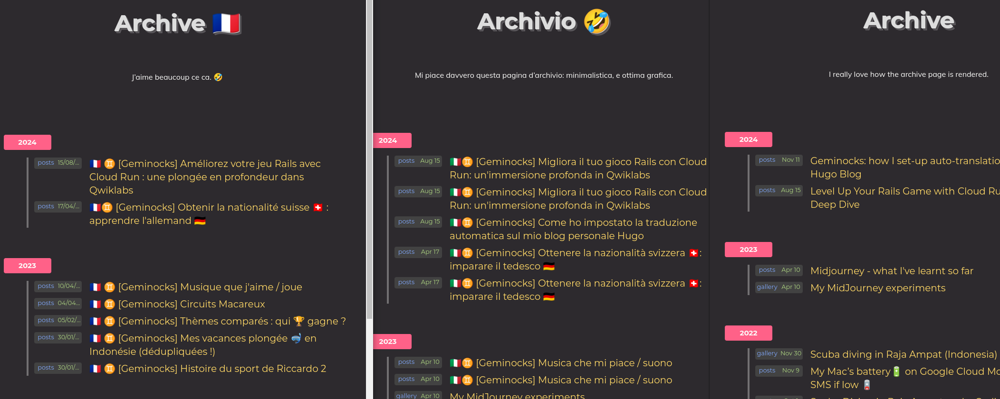

**Nota**: questo è il mio esperimento: prima scrivo in Hugo/markdown, e poi traduco e pubblico!

Codice

# Geminocks

[https://ricc.rocks/](https://ricc.rocks/) è una perla sottovalutata di contenuti preziosi (e non sono per nulla di parte: è il mio blog personale! 🤣).

All'interno potete trovare foto di famiglia, sport e hobby, affiancati ai miei articoli su Google Cloud, SRE e Intelligenza Artificiale.

## La configurazione del Blog

Uso una configurazione molto semplice:
* **GitHub** per versionare il codice: [github.com/palladius/ricc.rocks](https://github.com/palladius/ricc.rocks)
* **Netlify** per la build automatica
* Dominio `ricc.rocks`

## La sfida del multilingua

Un blog rispettabile dovrebbe avere almeno una versione in inglese e una nella propria lingua madre (🇮🇹 nel mio caso).
Dato che amo la filosofia DRY (Don't Repeat Yourself), ho voluto automatizzare la traduzione dei post preservando intatto il Front Matter YAML di Hugo usando le API di Gemini.
