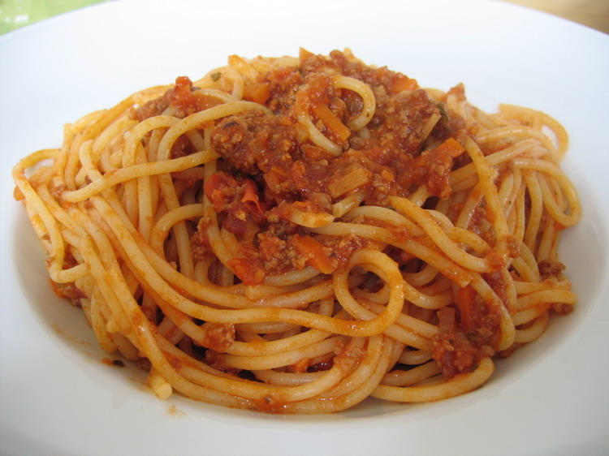

Spaghetti alla bolognese: li conoscono tutti nel mondo... tranne gli italiani.

Esatto, rileggetelo se non ci credete: in Italia **non** prepariamo questo piatto!



L'Italia è celebre per gli spaghetti e per il ragù alla bolognese (o semplicemente *ragù*), ma non uniremmo mai queste due cose nello stesso piatto.

*Ma perché mai?*, vi chiederete. La ragione è duplice:

1. **Origine culturale**: Gli spaghetti nascono al Sud, dove tradizionalmente si sposano con condimenti freschi a base di pomodoro, basilico e verdure.
2. **Fisica della pasta**: Gli spaghetti sono lisci e scivolosi, quindi non trattengono un sugo corposo e pesante come il ragù di carne bovina. Come ogni bolognese vi confermerà, la pasta d'elezione per il ragù sono le **tagliatelle all'uovo** (prima scelta assoluta!), seguite da paste corte e rigate come *penne/pennette*, *tortiglioni*, *garganelli* o *fusilli*. La pasta rigata o ruvida trattiene il condimento; con gli spaghetti, invece, la pasta risale la forchetta completamente nuda, lasciando sul fondo del piatto una triste pozza di carne e sugo...

Come riporta Wikipedia:
> *Gli spaghetti alla bolognese sono un piatto molto diffuso all'estero, ma praticamente inesistente nella cucina tradizionale bolognese, dove il ragù si serve esclusivamente con le tagliatelle fresche o nelle lasagne.*

## Lo script per scaricare immagini di spaghetti (`gugol-image.rb`)

```ruby
#!/usr/bin/env ruby

$BASEDIR = "/tmp/.gugol_image/"
DFLT_ARGS = %w{ spaghetti alla bolognese }

def gugol_image(query)
   puts "Cercando immagini per: #{query}..."
end
```

## E la pizza con l'ananas? 🍍🍕

Vi lascio con un'immagine generata su Midjourney: ecco Baby Yoda dopo aver mangiato una pizza all'ananas mentre viene rimproverato da Super Mario:


## Risorse
* [Ragù alla bolognese su Wikipedia](https://it.wikipedia.org/wiki/Rag%C3%B9_bolognese)
