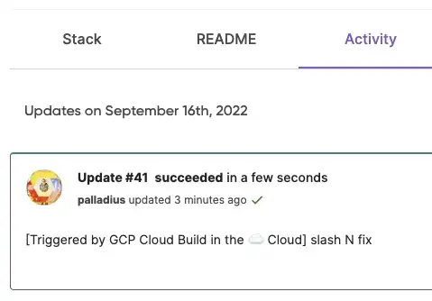

---
# Generated by Geminock v1.9 . cache_key='4dad3ca9941a91c01b8f0aaf37214cfaa1e22b53c47d93a9f1bec2a1e20dfd89-jp.yaml'
geminock_ver: '1.9'

# Note this is SUPER weird, I try to make this work for ALL my thingies so there might be some behavioural clatches in the
# initial HEADER :) Lets try to keep it small :)
title: "🇯🇵 ♊ [Geminocks] 🧹Pulumi を使用して ⬣ Cloud Build トリガーを設定する (🐍 Python)"
date: 2022-09-22T21:17:43+01:00
draft: false
tags: [symlink, GCP, pulumi, CloudBuild, Medium, geminocks, Japanese]
# paperMod
canonicalURL: https://medium.com/google-cloud/setting-cloudbuild-with-pulumi-in-python-330e8b54b2cf
# ANANKE :)
featured_image: /images/gohugo-default-sample-hero-image.jpg
image: /images/mtg-clone.jpg
---

元の投稿はこちら:  https://medium.com/google-cloud/setting-cloudbuild-with-pulumi-in-python-330e8b54b2cf

TODO(7feb23): この動画を埋め込む: https://www.youtube.com/watch?v=5jhWVNN8P_M (6feb23作成)

数週間前、私は **Pulumi** に恋をしました。Terraform に求めていたものすべてが揃っていました。セットアップが簡単、設定管理が簡単、無料ですばらしい UI、そして最も重要なのは… 言語サポートです！Pulumi はバッファローピザに次ぐ最高の発明品ですが、1 つだけ問題があります… [Ruby がサポートされていません](https://github.com/pulumi/pulumi/issues/132) :/

とにかく、私は ⬣ GCP（私の給料を払ってくれている会社なので、認めざるを得ません）、Cloud Build、Cloud Deploy、そして一般的に Google Cloud 上の CI/CD パイプラインに惚れ込んでしまったので、試してみたくなりました。「Cloud Build Pulumi」でググってみると、JavaScript の素敵な記事が見つかりましたが、私の琴線に触れるものではありませんでした。

## コード

私のコードはこちらです: https://github.com/palladius/pulumi/tree/main/examples/python-gcp-cloudbuild-auto-trigger

注: 👍 コードはついに正しくビルドできるようになりました。やったー！

## このコードの何がそんなに特別なのですか？

このコードを使用すると、GCP 上にある Pulumi プロジェクト (Python 🐍) で、自己更新のトリガーを設定できます。git リポジトリへのプッシュによりビルドジョブがトリガーされ、成功すると Pulumi に自分自身としてログインし、新しいコードで更新を発行します。

そのため、例えば、コードに GCS バケットを追加する変更をコミットすると、数分後にはその GCS バケットが作成され、README.md がビルダーパラメータで更新されます。

太字で示されているのは、Cloud Build 自体によって更新された 3 つのパラメータです！

私のコードは、今のところ **Github**（そのまま）と **Bitbucket**（最初に動作していたのでコードは 99% 完成しています！）をサポートしています。

また、Laura の記事に従ってメッセージをカスタマイズし、git メッセージの先頭に「[built with Cloud Build]」を追加しました（この場合は「スラッシュ N 修正」）。

## Pulumi という言葉の意味は？

Google 翻訳を試してみましたが、ハワイ語またはビルマ語（🇲🇲、現在のミャンマー）で「ほうき」（🧹）という意味のようです。それまでは、誰かが私が間違っていることを証明するまでは、最初の絵文字を使います。

編集: Pulumi の友人の Aaron が、ほうきであることを確認し、[この記事](http://joeduffyblog.com/2018/06/18/hello-pulumi/) を教えてくれました。

## 今後の予定
私の今後の 📝 は次のとおりです。

* HSM または GCS を介して GCP で適切なパスワード/状態設定を行う。
* モジュールに変換して、どのような pulumi プロジェクトでも 4～5 個の変数 (github ユーザー、github リポジトリ、pulumi ビルドディレクトリ、認証情報など) を指定するだけでこのコードを呼び出せるようにする。これがクロスランゲージ (非🐍) でも実現可能かどうかはまだ確認する必要があります。

## 参考文献

元のコード (Cloud Build + Node.js): https://www.pulumi.com/docs/guides/continuous-delivery/google-cloud-build/

私のコード (python): https://github.com/palladius/pulumi/tree/main/examples/python-gcp-cloudbuild-auto-trigger

*(Generated by Geminocks: https://github.com/palladius/ricc.rocks/tree/main/gemini prompt_version=1.4)*

---
title: "[TODO] [jp] \U0001F4A6 Setting a ⬣ Cloud Build trigger with \U0001F9F9Pulumi
  in \U0001F40D Python"
date: 2022-09-22 21:17:43.000000000 +01:00
draft: false
tags:
- symlink
- GCP
- pulumi
- CloudBuild
- Medium
canonicalURL: https://medium.com/google-cloud/setting-cloudbuild-with-pulumi-in-python-330e8b54b2cf
featured_image: "/images/gohugo-default-sample-hero-image.jpg"
image: "/images/mtg-clone.jpg"
geminock:
  :alter_front_matter_version: '1.0'
  :notes: Riccardo - todo make this variable per extension and calla  proper class
    to get it. So you can have a single thingie for Main picture, and then transform
    it for all extensions.
# Generated by Geminock v.1.9 - matter_hash_to_str()
# Note this operation might have removed all previous comments. Sorry.
# If Riccardo wants to edit this, code is in: /Users/ricc/git/ricc.rocks/gemini/lib/gemini/translator.rb
---
