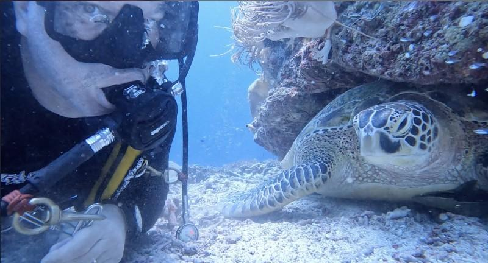
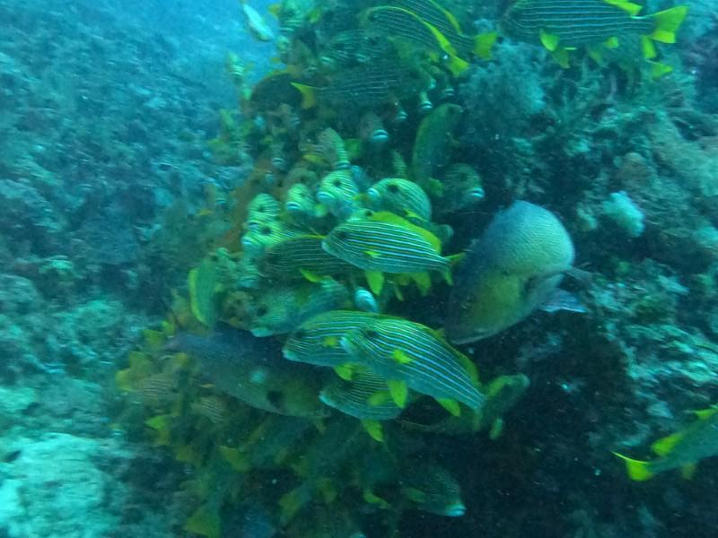
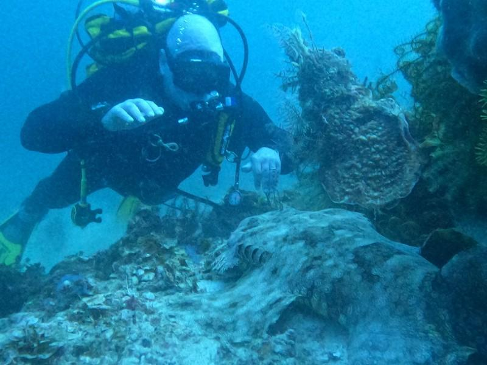
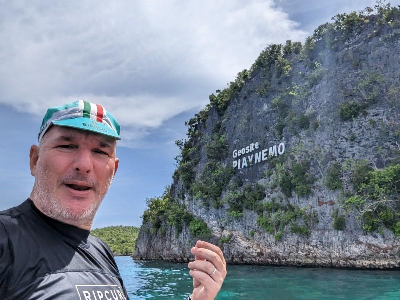
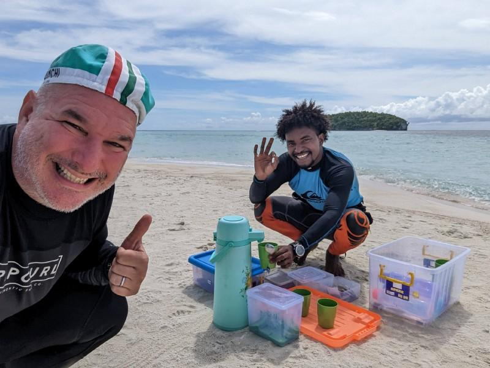

---
# ce ne sono 2 di queste maledette indonesie
title: "🇯🇵♊ [Geminocks] インドネシアでのスキューバ🤿休暇（重複排除済み！）"
date: 2023-01-30T21:17:43+01:00
draft: false
tags:
- personal
- sport
- scuba
- rubyonrails
- geminocks
- Japanese
canonicalURL: https://medium.com/p/cf851f0f588/edit
hidden: false
# ANANKE :)
featured_image: "scuba--jo09uvup59g.jpg"
image: "scuba--jo09uvup59g.jpg" # tartaruga
#image: images/hugo-cocktail.jpg
#image: imagez/riccardo-smiles-swim-ironman.jpeg
#image: images/feature2/color-palette.png
Categories:
#- symlink
- holidays
#- rajaamapt
- rubyonrails
- code
images:
- scuba--rn7opz2oo.jpg
# - /scuba--rn7opz2oo.jpg
# - images/scuba--tnomzk5zfnr.jpg
# - /images/scuba--tnomzk5zfnr.jpg
# - hugo-cocktail.jpg
# - /images/riccardo/riccardo-smiles-swim-ironman.jpeg
# - "scuba--4kl75dqag8l.jpg"
# - "scuba--4rx3qr0wnkk.jpg"
# - "scuba--4s5obbog0je.jpg"
# - "scuba--7qqeh3owtge.jpg"
# - "scuba--92kef42brna.jpg"
# - "scuba--jo2nuuxek58.jpg"
# - "scuba--jo09uvup59g.jpg"
# - "scuba--ks67tanqqui.jpg"
# - "scuba--n82h94fc7s.jpg"
# - "scuba--tnomzk5zfnr.jpg"
---
Self: [https://medium.com/p/cf851f0f588/edit](https://medium.com/p/cf851f0f588/edit)
Status: 下書き
バージョン: **0.1**

注: これは[GDocエクスポート]です。
---

<!--
{{with .Resources.GetMatch "scuba--rn7opz2oo.jpg"}}
  
{{end}}
-->

# ラジャアンパットでの私のスキューバダイビング体験..

..そして、Ruby on Railsのスクービーアプリのコーディングを我慢できなかった方法

`TODO(ricc): これら2つの素晴らしいビデオを何らかの形で追加する`

* https://studio.youtube.com/video/QW4XBtibFnk/edit
* https://studio.youtube.com/video/AG_IYhYl5u0/edit

---

22年10月、❤️妻は私が一人でラジャアンパットでスキューバダイビングに行くことを許してくれました。ダイバーにとって楽園だと考えてください！

数十年で絶滅する可能性のある美しく珍しい動物、そして彼の隣には[サワンタレク](https://www.google.com/maps/place/Sauwandarek+Village/@-0.5858766,130.6122214,13.42z/data=!4m13!1m7!3m6!1s0x2d5c3eaaccb47097:0x7851bd844c4cdf44!2sIsole+Raja+Ampat!3b1!8m2!3d-1.0320468!4d130.5052176!3m4!1s0x0:0xf11684dad6130be3!8m2!3d-0.5903592!4d130.6023098)村の美しいウミガメ

### 旅行

これはインドネシア西部のラジャアンパットです

### バンガロー

これはワイ島です

## 私の典型的な一日

私は5時から6時の間に起きました。5時には光が広がり始め、5時半には電気が使えるようになりました

-  05:00

#### アプリ

私は午前中にスキューバダイビングを始めました、そして

#### ダイビング

リッカルドがオオテンジクザメに挨拶しています！

#### ワイ島周辺

あああ！

ピアネモのコーンジーと私

ピャイネモ、RA旅行の必見の目的地。

#### 学習

#### 結論

*(Generated by Geminocks: https://github.com/palladius/ricc.rocks/tree/main/gemini prompt_version=1.4)*